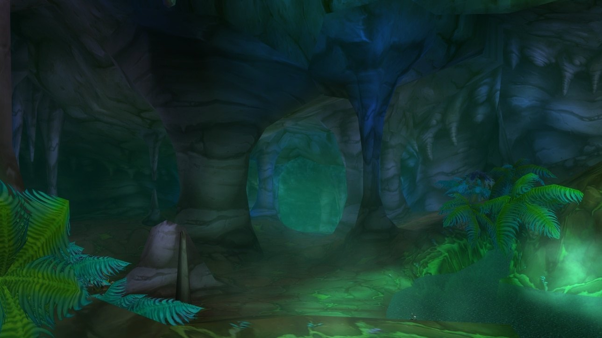
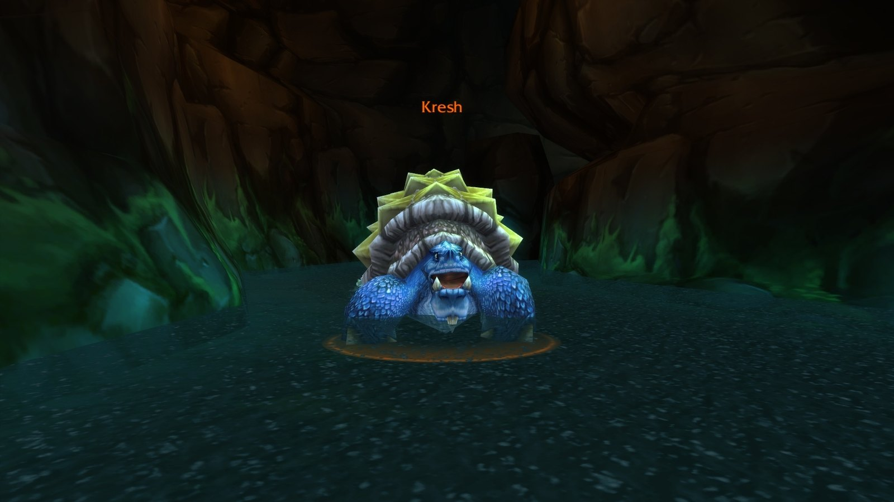
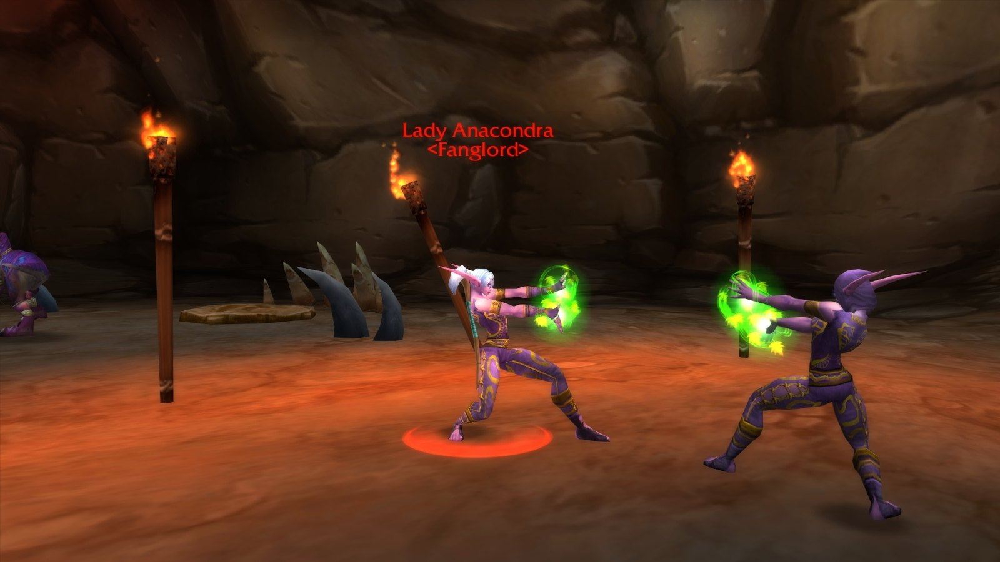
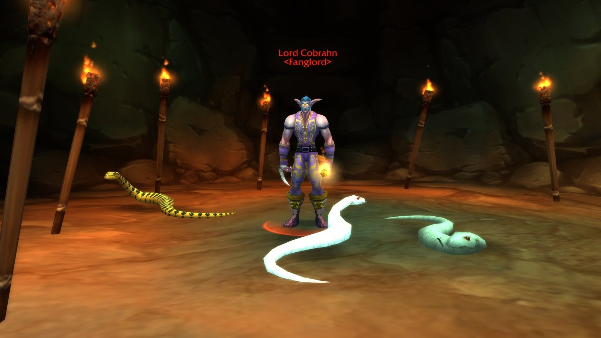
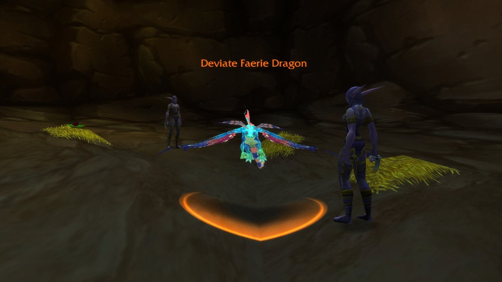
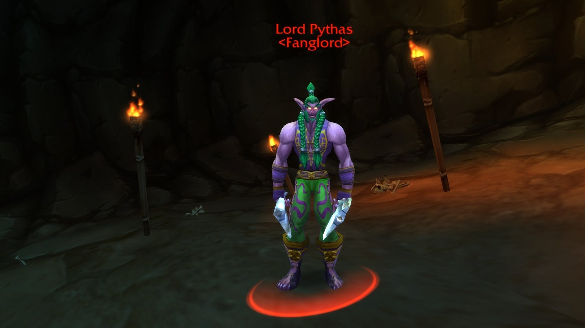
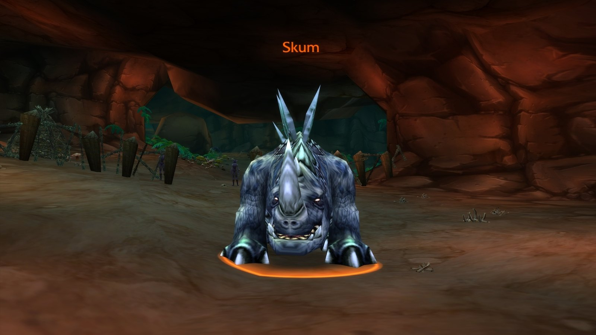
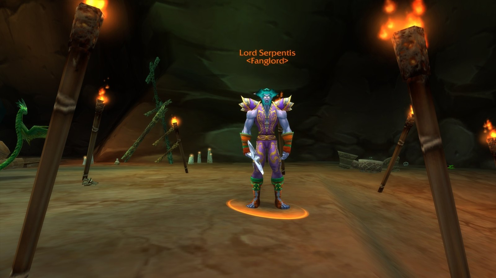
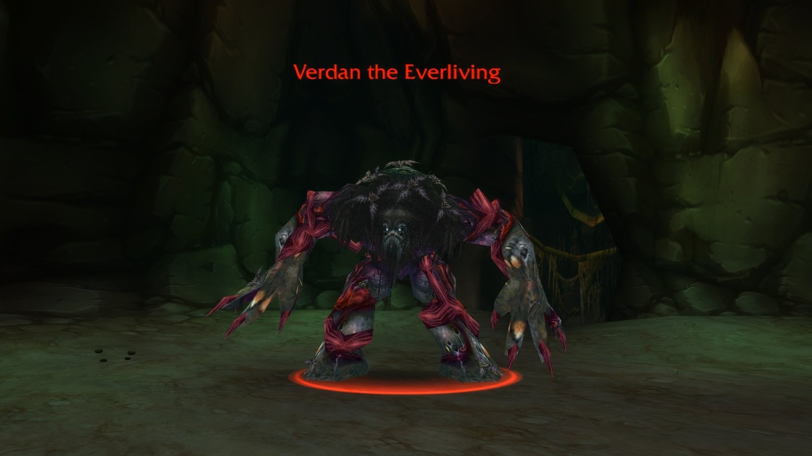

Wailing Caverns ist ein Höhlenlabyrinth unter The Barrens, in dem der Druide Naralex das Land mit Hilfe des Emerald Dream heilen wollte und sich in einem Albtraum verlor. Seine Anhänger wurden zu den Druids of the Fang. Es ist der erste Dungeon, der nicht geradeaus verläuft, und seine Ausrüstung mit Agility macht einen Besuch lohnend.

## Auf einen Blick

| | |
|---|---|
| Stufen | 15-24, Bosse der Stufe 20 bis 22 |
| Eingang | Die Lushwater Oasis in The Barrens, südwestlich der Crossroads |
| Bosse | 8, dazu Mutanus the Devourer im Event von Naralex |
| Quests | 7, davon fünf für beide Fraktionen |
| Set | Embrace of the Viper, mit neuen Boni |
| Kurzname | WC |

## Der Weg dorthin

**Horde.** Reise von den Crossroads nach Südwesten zur Lushwater Oasis. Der Eingang liegt in einem Höhlensystem im Hügel.

**Alliance.** Reise von Astranaar in Ashenvale nach Osten, überquere den Fluss, nimm die Straße nach Süden nach The Barrens und halte dich dann südlich und westlich. Das Schiff von Booty Bay nach Ratchet geht auch; von Ratchet aus nach Westen.

## Die Quests

| Quest | Wo sie beginnt | Stufe | Belohnung |
|---|---|---|---|
| <a href="https://www.wowhead.com/forever/quest=1487">Deviate Eradication</a> Beide | The Barrens, die Höhle über dem Eingang: Ebru /way 46 35 | 15 | <a class="wf-wh wf-q2" href="https://www.wowhead.com/forever/item=6476">Pattern: Deviate Scale Belt</a>, <a class="wf-wh wf-q3" href="https://www.wowhead.com/forever/item=8071">Sizzle Stick</a> oder <a class="wf-wh wf-q3" href="https://www.wowhead.com/forever/item=6481">Dagmire Gauntlets</a> |
| <a href="https://www.wowhead.com/forever/quest=1486">Deviate Hides</a> Beide | The Barrens, die Höhle über dem Eingang: Nalpak /way 46 35 | 13 | <a class="wf-wh wf-q3" href="https://www.wowhead.com/forever/item=6480">Slick Deviate Leggings</a> oder <a class="wf-wh wf-q1" href="https://www.wowhead.com/forever/item=918">Deviate Hide Pack</a> |
| <a href="https://www.wowhead.com/forever/quest=1491">Smart Drinks</a> Beide | The Barrens, Ratchet: Mebok Mizzyrix /way 62 37 <em>Erledige zuerst Raptor Horns bei ihm.</em> | 13 | Erfahrung und Silber |
| <a href="https://www.wowhead.com/forever/quest=959">Trouble at the Docks</a> Beide | The Barrens, Ratchet: Crane Operator Bigglefuzz /way 63 37 | 14 | Erfahrung und Silber |
| <a href="https://www.wowhead.com/forever/quest=6981">The Glowing Shard</a> Beide | Im Dungeon: Glowing Shard, eine Beute von Mutanus the Devourer | 10 | <a class="wf-wh wf-q3" href="https://www.wowhead.com/forever/item=10657">Talbar Mantle</a> oder <a class="wf-wh wf-q3" href="https://www.wowhead.com/forever/item=10658">Quagmire Galoshes</a> |
| <a href="https://www.wowhead.com/forever/quest=914">Leaders of the Fang</a> Horde | Thunder Bluff, Elder Rise: Nara Wildmane /way 45 23 <em>Erledige zuerst 5 Quests, beginnend mit The Forgotten Pools von Tonga Runetotem in den Crossroads.</em> | 15 | <a class="wf-wh wf-q3" href="https://www.wowhead.com/forever/item=6505">Crescent Staff</a> oder <a class="wf-wh wf-q3" href="https://www.wowhead.com/forever/item=6504">Wingblade</a> |
| <a href="https://www.wowhead.com/forever/quest=962">Serpentbloom</a> Horde | Thunder Bluff, Pools of Vision: Apothecary Zamah /way 34 21 | 14 | <a class="wf-wh wf-q2" href="https://www.wowhead.com/forever/item=10919">Apothecary Gloves</a> |

Die Stufe ist die niedrigste Stufe, ab der man die Quest annehmen kann, laut Wowhead.

- **Deviate Eradication.** Töte eine Liste von Monstern überall im Dungeon.
- **Deviate Hides.** Sammle 20 Deviate Hides; die meisten Monster drinnen lassen sie fallen.
- **Smart Drinks.** 6 Wailing Essences von den Devouring, Evolving und Nightmare Ectoplasms.
- **Trouble at the Docks.** <a class="wf-wh wf-plain" href="https://www.wowhead.com/forever/npc=3655">Mad Magglish</a> trägt den 99-Year-Old Port. Er versteckt sich in einer kleinen Höhle außerhalb der Instanz.
- **The Glowing Shard.** Erst wenn Mutanus im Event von Naralex stirbt. Bring die Scherbe zu Sputtervalve in Ratchet, neben dem Flugmeister. Er schickt dich zu Falla Sagewind auf dem Hügel über dem Eingang, die In Nightmares für Arch Druid Hamuul Runetotem in Thunder Bluff vergibt.
- **Leaders of the Fang.** Die Edelsteine der vier Lords of the Fang: Lady Anacondra, Lord Cobrahn, Lord Pythas und Lord Serpentis.
- **Serpentbloom.** 10 Serpentbloom von den Wänden des Dungeons und aus den Höhlen vor dem Portal. Es gibt nur wenige, also wird nicht jeder in einem Durchgang fertig.

## Die Druids of the Fang

Die Druids of the Fang sind der Trash, auf den du achten musst. Ihr Druid's Slumber lässt einen Spieler bis zu 15 Sekunden schlafen, auch den Heiler. Kämpf gegen einen nach dem anderen, kontrolliere den Rest und unterbrich den Schlaf. Sobald sie Serpent Form annehmen, sind sie zum Schweigen gebracht.

## Die Bosse und ihre Beute

Die Beute pro Boss stammt von Wowhead, mit den Werten aus den Dateien der Beta.

### Kresh

Eine Schildkröte der Stufe 20 mit viel Rüstung und einer einzigen Benommenheit. Ein leichter Kampf, der mit einer Nahkampfgruppe etwas dauert.

| Gegenstand | Neu in Forever |
|---|---|
| <a class="wf-wh wf-q3" href="https://www.wowhead.com/forever/item=6447">Worn Turtle Shell Shield</a> | Von grau zu blau, mit 40 zusätzlicher Rüstung und 2 Mana alle 5 Sekunden |
| <a class="wf-wh wf-q3" href="https://www.wowhead.com/forever/item=13245">Kresh's Back</a> | Defense +5 statt +4, verlangt Stufe 18 |

### Lady Anacondra

Meist der erste Lord of the Fang. Unterbrich jedes Mal ihren Sleep; einen zweiten Druiden im Pull kontrollierst du sofort.

| Gegenstand | Neu in Forever |
|---|---|
| <a class="wf-wh wf-q3" href="https://www.wowhead.com/forever/item=10412">Belt of the Fang</a> | Blau, mehr Agility und Stamina, Teil von Embrace of the Viper |
| <a class="wf-wh wf-q3" href="https://www.wowhead.com/forever/item=5404">Serpent's Shoulders</a> | Von weiß zu blau, mit 5 Agility |

### Lord Cobrahn

Drei nicht-elitäre Deviate Pythons stehen um ihn herum; töte sie zuerst mit Flächenschaden. Später im Kampf verwandelt er sich in eine Schlange und schlägt härter und schneller zu.

| Gegenstand | Neu in Forever |
|---|---|
| <a class="wf-wh wf-q3" href="https://www.wowhead.com/forever/item=6465">Robe of the Moccasin</a> | Blau, mehr Spirit und bis zu 9 Heilung |
| <a class="wf-wh wf-q3" href="https://www.wowhead.com/forever/item=10410">Leggings of the Fang</a> | Teil von Embrace of the Viper, jetzt Stufe 17 |
| <a class="wf-wh wf-q3" href="https://www.wowhead.com/forever/item=6460">Cobrahn's Grasp</a> | Stufe 17 statt 19, etwas weniger Strength |

### Deviate Faerie Dragon, ein Rare

Ein Rare-Elite der Stufe 20, der in einem Pull von vier kommt, darunter zwei Druids of the Fang. Kontrolliere einen Druiden und töte zuerst den anderen.

| Gegenstand | Neu in Forever |
|---|---|
| <a class="wf-wh wf-q3" href="https://www.wowhead.com/forever/item=5243">Firebelcher</a> | Trifft das Ziel bei Treffer für 25 bis 31 zusätzlichen Feuerschaden |
| <a class="wf-wh wf-q3" href="https://www.wowhead.com/forever/item=6632">Feyscale Cloak</a> | Blau, Stamina und bis zu 3 Zauberschaden und Heilung |

### Lord Pythas

Mit einem Druid of the Fang und einem Deviate Shambler. Kontrolliere den Druiden, töte den Shambler und lass jemanden auf Pythas seinen Sleep unterbrechen.

| Gegenstand | Neu in Forever |
|---|---|
| <a class="wf-wh wf-q3" href="https://www.wowhead.com/forever/item=6473">Armor of the Fang</a> | Blau, mehr Strength und 4 Stamina, Teil von Embrace of the Viper |
| <a class="wf-wh wf-q3" href="https://www.wowhead.com/forever/item=6472">Stinging Viper</a> | Das Gift hält 12 statt 15 Sekunden |

### Skum

Ein optionaler, einfacher Kampf. Sein Chained Bolt springt zwischen Nahkämpfern, die nah beieinander stehen.

| Gegenstand | Neu in Forever |
|---|---|
| <a class="wf-wh wf-q3" href="https://www.wowhead.com/forever/item=6448">Tail Spike</a> | Blau, mehr Schaden, Strength und Agility |
| <a class="wf-wh wf-q3" href="https://www.wowhead.com/forever/item=6449">Glowing Lizardscale Cloak</a> | Unverändert, jetzt Stufe 18 |

### Lord Serpentis

Der letzte Lord of the Fang, und der einzige ohne Trash im Pull. Unterbrich seinen Sleep.

| Gegenstand | Neu in Forever |
|---|---|
| <a class="wf-wh wf-q3" href="https://www.wowhead.com/forever/item=6469">Venomstrike</a> | Der Giftschuss ist jetzt eine Chance bei Treffer, für 23 bis 33 Naturschaden |
| <a class="wf-wh wf-q3" href="https://www.wowhead.com/forever/item=10411">Footpads of the Fang</a> | Blau, mehr Agility und Stamina, Teil von Embrace of the Viper |
| <a class="wf-wh wf-q3" href="https://www.wowhead.com/forever/item=5970">Serpent Gloves</a> | Blau, Agility und bis zu 6 Zauberschaden und Heilung |
| <a class="wf-wh wf-q3" href="https://www.wowhead.com/forever/item=6459">Savage Trodders</a> | Blau, 6 Gesundheit alle 5 Sekunden |

### Verdan the Everliving

Seine Grasping Vines fesseln alle im Umkreis von 10 Metern und werfen sie um. Fernkämpfer stehen auf maximaler Distanz. Töte ihn, um die Abkürzung hinter dem Wasserfall zu öffnen.

| Gegenstand | Neu in Forever |
|---|---|
| <a class="wf-wh wf-q3" href="https://www.wowhead.com/forever/item=6631">Living Root</a> | Jetzt ein Stab für Heiler: bis zu 45 Heilung, und 9 Nature Resistance |
| <a class="wf-wh wf-q3" href="https://www.wowhead.com/forever/item=6630">Seedcloud Buckler</a> | Bis zu 4 Zauberschaden und Heilung und 5 Nature Resistance |
| <a class="wf-wh wf-q3" href="https://www.wowhead.com/forever/item=6629">Sporid Cape</a> | Blau, mehr Stamina, und fügt Angreifern 1 Naturschaden zu |

### Das Event von Naralex: Mutanus the Devourer

Sobald alle vier Lords of the Fang tot sind, bittet der Disciple of Naralex um Geleit zum Stein, auf dem Naralex schläft. Während des Rituals greifen Wellen von Monstern den Disciple an. Nach der zweiten Welle erscheint <a class="wf-wh wf-plain" href="https://www.wowhead.com/forever/npc=3654">Mutanus the Devourer</a>, ein Elite-Murloc der Stufe 22. Sein Thundercrack trifft alle in der Nähe hart, und er schläfert Spieler ein und versetzt sie in Furcht. Nimm Fernkampfschaden und wenn möglich einen zweiten Heiler mit. Stirbt der Disciple oder wipet die Gruppe, ist das Event vorbei, bis der Dungeon zurückgesetzt wird.

| Gegenstand | Neu in Forever |
|---|---|
| <a class="wf-wh wf-q3" href="https://www.wowhead.com/forever/item=6461">Slime-encrusted Pads</a> | 10 Gesundheit und 3 Mana alle 5 Sekunden, verlangt Stufe 20 statt 22 |
| <a class="wf-wh wf-q3" href="https://www.wowhead.com/forever/item=6463">Deep Fathom Ring</a> | Spell Penetration statt Intellect, verlangt Stufe 19 statt 21 |
| <a class="wf-wh wf-q3" href="https://www.wowhead.com/forever/item=6627">Mutant Scale Breastplate</a> | Verlangt Stufe 18 statt 23, etwas weniger Strength |

## Embrace of the Viper

Die fünf Lederteile der Druids of the Fang sind jetzt blau, und das Set hat in den Dateien der Beta neue Boni.

| Teile | Bonus |
|---|---|
| 2 | +10 Intellect |
| 3 | +10 Attack Power |
| 4 | Schaden bei 25 % Gesundheit oder weniger stellt in 5 Sekunden 100 Gesundheit und Mana wieder her, einmal alle 5 Minuten |
| 5 | Nahkampfangriffe haben eine Chance auf Dream Venom, das das Ziel 1 Sekunde betäubt |

Die Teile: <a class="wf-wh wf-q3" href="https://www.wowhead.com/forever/item=10412">Belt of the Fang</a> von Lady Anacondra, <a class="wf-wh wf-q3" href="https://www.wowhead.com/forever/item=10410">Leggings of the Fang</a> von Lord Cobrahn, <a class="wf-wh wf-q3" href="https://www.wowhead.com/forever/item=6473">Armor of the Fang</a> von Lord Pythas, <a class="wf-wh wf-q3" href="https://www.wowhead.com/forever/item=10411">Footpads of the Fang</a> von Lord Serpentis, und <a class="wf-wh wf-q3" href="https://www.wowhead.com/forever/item=10413">Gloves of the Fang</a>.

## Was noch nicht bekannt ist

- **Die Dropchancen** der Bossbeute, und wo die Gloves of the Fang fallen.
- **Die Belohnungen der Quests** können sich in der Beta noch ändern.
