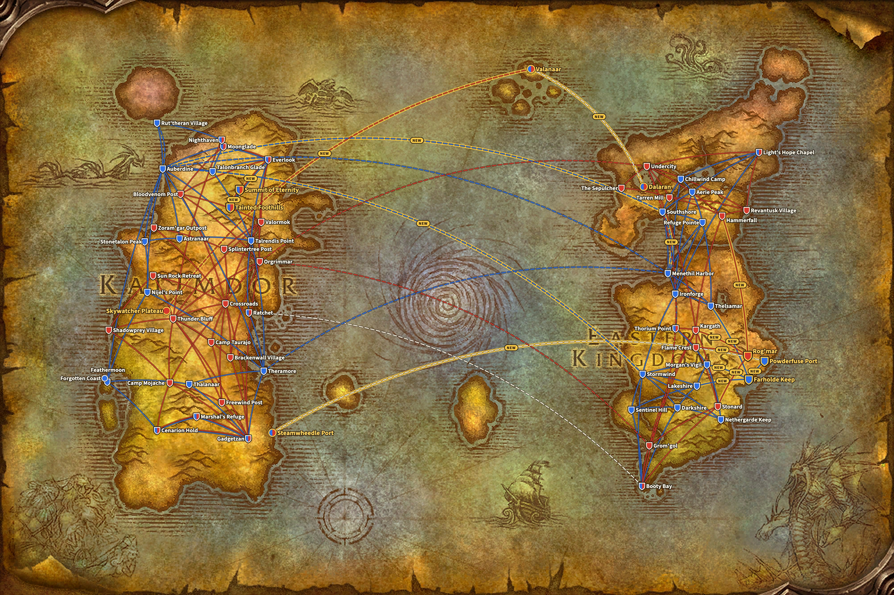
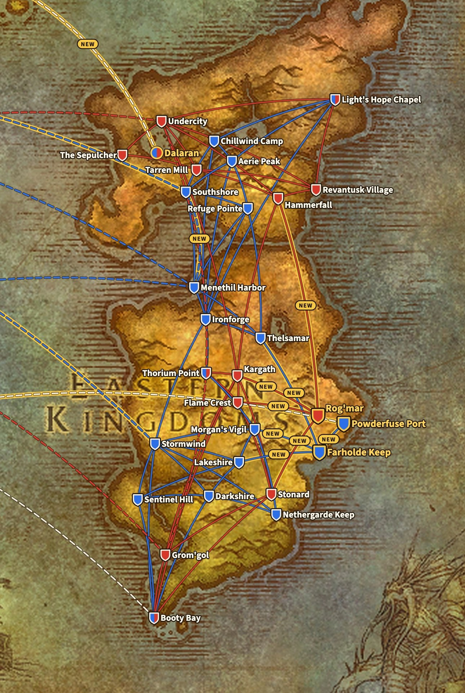
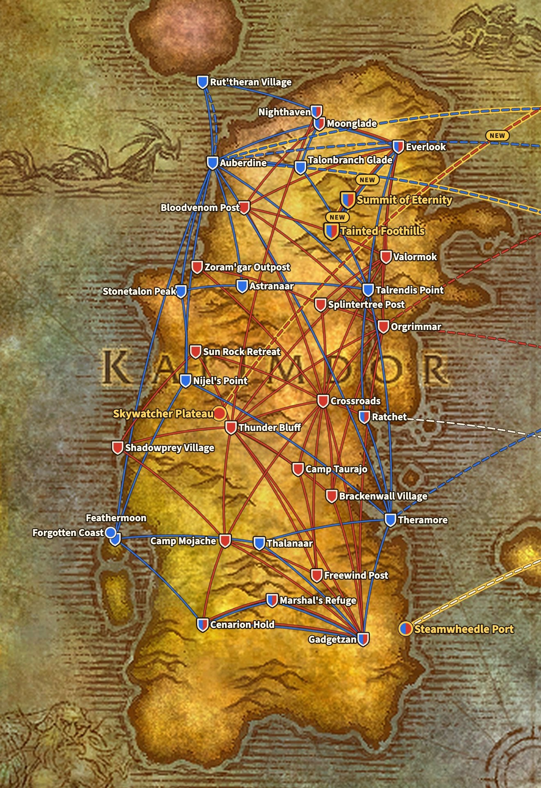

Flugmeister bringen Spieler für eine Handvoll Silber von einer Stadt Azeroths zur nächsten. WoW Forever behält jede Flugroute aus Classic und fügt fünf Flugpunkte hinzu, in The Riverglades und auf Mount Hyjal. Dieser Guide listet jeden Flugpunkt mit seinem Flugmeister, den Koordinaten und den Zielen.

## Auf einen Blick

| | Alliance | Horde |
|---|---|---|
| **Eastern Kingdoms** | 18 Flugpunkte, 39 Routen | 13 Flugpunkte, 26 Routen |
| **Kalimdor** | 19 Flugpunkte, 33 Routen | 22 Flugpunkte, 49 Routen |
| **Neu in Forever** | 4 Flugpunkte, 6 Routen | 3 Flugpunkte, 6 Routen |

Die Flugpunkte und Routen stammen aus den Dateien der Beta, Build 1.60.1.70245. Sie haben sich seit Ende September nicht verändert. Eine Stadt mit einem Flugmeister für jede Fraktion, etwa Everlook, zählt einmal pro Fraktion.

Auf der Karte ist eine blaue Linie eine Route der Alliance und eine rote Linie eine Route der Horde. Eine gestrichelte Linie ist ein Schiff oder ein Zeppelin, weiß, wenn beide Fraktionen ihn nutzen können. Ein goldener Rand und das Wort NEW markieren eine neue Route. Ein Schild ist ein Flugmeister, ein runder Punkt ein Anleger oder Zeppelinturm.

## Die fünf neuen Flugpunkte

| Flugpunkt | Für | Flugmeister | /way | Fliegt nach |
|---|---|---|---|---|
| Farholde Keep | Alliance | <a class="wf-wh wf-plain" href="https://www.wowhead.com/forever/npc=257087">Gretchen Mayberry</a> | 60.6 81.4 | Lakeshire, Morgan's Vigil, Powderfuse Port, Thelsamar |
| Powderfuse Port | Alliance | noch nicht bekannt | noch nicht bekannt | Farholde Keep |
| Rog'mar | Horde | <a class="wf-wh wf-plain" href="https://www.wowhead.com/forever/npc=255993">Grakna</a> | 59.6 45.2 | Flame Crest, Hammerfall, Kargath, Stonard |
| Summit of Eternity | beide Fraktionen | <a class="wf-wh wf-plain" href="https://www.wowhead.com/forever/npc=41861">Fayran Elthas</a> | 68.6 44.0 | Tainted Foothills |
| Tainted Foothills | beide Fraktionen | <a class="wf-wh wf-plain" href="https://www.wowhead.com/forever/npc=260626">Bluebell</a> | 55.0 82.8 | Everlook, Summit of Eternity |

[The Riverglades](/de/forever/) ist die neue Zone für die Stufen 30 bis 45. Beide Fraktionen bekommen dort einen Flugpunkt, der sie mit den Zonen ringsum verbindet. Die Alliance fliegt weiter nach Redridge Mountains, Loch Modan und Burning Steppes, die Horde nach Swamp of Sorrows, Arathi Highlands, Badlands und Burning Steppes. Powderfuse Port, wo das [Black Market Auction House](/de/guides/bmah/) steht, liegt einen kurzen Flug von Farholde Keep entfernt.

Mount Hyjal ist der Abschluss des Levelns, mit einem Lager, in dem Horde und Alliance zusammensitzen. Beide Flugpunkte auf dem Berg dienen beiden Fraktionen, und Tainted Foothills ist für jede Seite mit Everlook in Winterspring verbunden.

## Eastern Kingdoms

### Alliance

| Flugpunkt | Zone | Flugmeister | /way | Fliegt nach |
|---|---|---|---|---|
| Aerie Peak | The Hinterlands | <a class="wf-wh wf-plain" href="https://www.wowhead.com/forever/npc=8018">Guthrum Thunderfist</a> | 11.0 46.0 | Chillwind Camp, Ironforge, Light's Hope Chapel, Refuge Pointe, Southshore |
| Booty Bay | Stranglethorn Vale | <a class="wf-wh wf-plain" href="https://www.wowhead.com/forever/npc=2859">Gyll</a> | 27.4 77.8 | Darkshire, Sentinel Hill, Stormwind |
| Chillwind Camp | Western Plaguelands | <a class="wf-wh wf-plain" href="https://www.wowhead.com/forever/npc=12596">Bibilfaz Featherwhistle</a> | 42.8 85.0 | Aerie Peak, Ironforge, Light's Hope Chapel, Southshore |
| Darkshire | Duskwood | <a class="wf-wh wf-plain" href="https://www.wowhead.com/forever/npc=2409">Felicia Maline</a> | 77.4 44.4 | Booty Bay, Lakeshire, Nethergarde Keep, Sentinel Hill, Stormwind |
| Farholde Keep (neu) | The Riverglades | <a class="wf-wh wf-plain" href="https://www.wowhead.com/forever/npc=257087">Gretchen Mayberry</a> | 60.6 81.4 | Lakeshire, Morgan's Vigil, Powderfuse Port, Thelsamar |
| Ironforge | Ironforge | <a class="wf-wh wf-plain" href="https://www.wowhead.com/forever/npc=1573">Gryth Thurden</a> | 55.8 48.0 | Aerie Peak, Chillwind Camp, Light's Hope Chapel, Menethil Harbor, Refuge Pointe, Southshore, Stormwind, Thelsamar, Thorium Point |
| Lakeshire | Redridge Mountains | <a class="wf-wh wf-plain" href="https://www.wowhead.com/forever/npc=931">Ariena Stormfeather</a> | 30.6 59.4 | Darkshire, Farholde Keep, Morgan's Vigil, Sentinel Hill, Stormwind |
| Light's Hope Chapel | Eastern Plaguelands | <a class="wf-wh wf-plain" href="https://www.wowhead.com/forever/npc=12617">Khaelyn Steelwing</a> | 81.6 59.2 | Aerie Peak, Chillwind Camp, Ironforge |
| Menethil Harbor | Wetlands | <a class="wf-wh wf-plain" href="https://www.wowhead.com/forever/npc=1571">Shellei Brondir</a> | 9.4 59.6 | Ironforge, Refuge Pointe, Southshore, Thelsamar |
| Morgan's Vigil | Burning Steppes | <a class="wf-wh wf-plain" href="https://www.wowhead.com/forever/npc=2299">Borgus Stoutarm</a> | 84.4 68.2 | Farholde Keep, Lakeshire, Nethergarde Keep, Stormwind, Thorium Point |
| Nethergarde Keep | Blasted Lands | <a class="wf-wh wf-plain" href="https://www.wowhead.com/forever/npc=8609">Alexandra Constantine</a> | 65.4 24.4 | Darkshire, Morgan's Vigil, Stormwind |
| Powderfuse Port (neu) | The Riverglades | noch nicht bekannt | noch nicht bekannt | Farholde Keep |
| Refuge Pointe | Arathi Highlands | <a class="wf-wh wf-plain" href="https://www.wowhead.com/forever/npc=2835">Cedrik Prose</a> | 45.6 46.0 | Aerie Peak, Ironforge, Menethil Harbor, Southshore, Thelsamar |
| Sentinel Hill | Westfall | <a class="wf-wh wf-plain" href="https://www.wowhead.com/forever/npc=523">Thor</a> | 56.4 52.6 | Booty Bay, Darkshire, Lakeshire, Stormwind |
| Southshore | Hillsbrad Foothills | <a class="wf-wh wf-plain" href="https://www.wowhead.com/forever/npc=2432">Darla Harris</a> | 49.4 52.2 | Aerie Peak, Chillwind Camp, Ironforge, Menethil Harbor, Refuge Pointe |
| Stormwind | Stormwind City | <a class="wf-wh wf-plain" href="https://www.wowhead.com/forever/npc=352">Dungar Longdrink</a> | 66.2 62.4 | Booty Bay, Darkshire, Ironforge, Lakeshire, Morgan's Vigil, Nethergarde Keep, Sentinel Hill |
| Thelsamar | Loch Modan | <a class="wf-wh wf-plain" href="https://www.wowhead.com/forever/npc=1572">Thorgrum Borrelson</a> | 33.8 50.8 | Farholde Keep, Ironforge, Menethil Harbor, Refuge Pointe |
| Thorium Point | Searing Gorge | <a class="wf-wh wf-plain" href="https://www.wowhead.com/forever/npc=2941">Lanie Reed</a> | 37.8 30.6 | Ironforge, Morgan's Vigil |

Ironforge hat die meisten Routen der Alliance, neun. Farholde Keep bekommt gleich vier, so viele wie Thelsamar.

### Horde

| Flugpunkt | Zone | Flugmeister | /way | Fliegt nach |
|---|---|---|---|---|
| Booty Bay | Stranglethorn Vale | <a class="wf-wh wf-plain" href="https://www.wowhead.com/forever/npc=2858">Gringer</a> | 26.8 77.0 | Grom'gol, Kargath, Stonard |
| Flame Crest | Burning Steppes | <a class="wf-wh wf-plain" href="https://www.wowhead.com/forever/npc=13177">Vahgruk</a> | 65.6 24.2 | Kargath, Rog'mar, Stonard, Thorium Point |
| Grom'gol | Stranglethorn Vale | <a class="wf-wh wf-plain" href="https://www.wowhead.com/forever/npc=1387">Thysta</a> | 32.4 29.2 | Booty Bay, Kargath, Stonard |
| Hammerfall | Arathi Highlands | <a class="wf-wh wf-plain" href="https://www.wowhead.com/forever/npc=2851">Urda</a> | 73.0 32.6 | Kargath, Revantusk Village, Rog'mar, Tarren Mill, Undercity |
| Kargath | Badlands | <a class="wf-wh wf-plain" href="https://www.wowhead.com/forever/npc=2861">Gorrik</a> | 4.0 44.8 | Booty Bay, Flame Crest, Grom'gol, Hammerfall, Rog'mar, Stonard, Thorium Point, Undercity |
| Light's Hope Chapel | Eastern Plaguelands | <a class="wf-wh wf-plain" href="https://www.wowhead.com/forever/npc=12636">Georgia</a> | 80.2 57.0 | Revantusk Village, Undercity |
| Revantusk Village | The Hinterlands | <a class="wf-wh wf-plain" href="https://www.wowhead.com/forever/npc=4314">Gorkas</a> | 81.6 81.8 | Hammerfall, Light's Hope Chapel, Tarren Mill, Undercity |
| Rog'mar (neu) | The Riverglades | <a class="wf-wh wf-plain" href="https://www.wowhead.com/forever/npc=255993">Grakna</a> | 59.6 45.2 | Flame Crest, Hammerfall, Kargath, Stonard |
| Stonard | Swamp of Sorrows | <a class="wf-wh wf-plain" href="https://www.wowhead.com/forever/npc=6026">Breyk</a> | 46.0 54.6 | Booty Bay, Flame Crest, Grom'gol, Kargath, Rog'mar |
| Tarren Mill | Hillsbrad Foothills | <a class="wf-wh wf-plain" href="https://www.wowhead.com/forever/npc=2389">Zarise</a> | 60.2 18.6 | Hammerfall, Revantusk Village, The Sepulcher, Undercity |
| The Sepulcher | Silverpine Forest | <a class="wf-wh wf-plain" href="https://www.wowhead.com/forever/npc=2226">Karos Razok</a> | 45.6 42.4 | Tarren Mill, Undercity |
| Thorium Point | Searing Gorge | <a class="wf-wh wf-plain" href="https://www.wowhead.com/forever/npc=3305">Grisha</a> | 34.8 30.8 | Flame Crest, Kargath |
| Undercity | Undercity | <a class="wf-wh wf-plain" href="https://www.wowhead.com/forever/npc=4551">Michael Garrett</a> | 63.4 48.6 | Hammerfall, Kargath, Light's Hope Chapel, Revantusk Village, Tarren Mill, The Sepulcher |

Kargath hat die meisten Routen der Horde in den Eastern Kingdoms, acht. Rog'mar verbindet vier Städte der Horde rund um The Riverglades: Stonard, Kargath, Flame Crest und Hammerfall.

## Kalimdor

### Alliance

| Flugpunkt | Zone | Flugmeister | /way | Fliegt nach |
|---|---|---|---|---|
| Astranaar | Ashenvale | <a class="wf-wh wf-plain" href="https://www.wowhead.com/forever/npc=4267">Daelyshia</a> | 34.4 48.0 | Auberdine, Stonetalon Peak, Talrendis Point |
| Auberdine | Darkshore | <a class="wf-wh wf-plain" href="https://www.wowhead.com/forever/npc=3841">Caylais Moonfeather</a> | 36.4 45.6 | Astranaar, Feathermoon, Moonglade, Nijel's Point, Rut'theran Village, Stonetalon Peak, Talonbranch Glade, Talrendis Point, Theramore |
| Cenarion Hold | Silithus | <a class="wf-wh wf-plain" href="https://www.wowhead.com/forever/npc=15177">Cloud Skydancer</a> | 50.6 34.4 | Feathermoon, Gadgetzan, Marshal's Refuge |
| Everlook | Winterspring | <a class="wf-wh wf-plain" href="https://www.wowhead.com/forever/npc=11138">Maethrya</a> | 62.2 36.6 | Moonglade, Tainted Foothills, Talonbranch Glade, Talrendis Point |
| Feathermoon | Feralas | <a class="wf-wh wf-plain" href="https://www.wowhead.com/forever/npc=8019">Fyldren Moonfeather</a> | 30.2 43.2 | Auberdine, Cenarion Hold, Nijel's Point, Thalanaar |
| Gadgetzan | Tanaris | <a class="wf-wh wf-plain" href="https://www.wowhead.com/forever/npc=7823">Bera Stonehammer</a> | 51.0 29.2 | Cenarion Hold, Marshal's Refuge, Thalanaar, Theramore |
| Marshal's Refuge | Un'Goro Crater | <a class="wf-wh wf-plain" href="https://www.wowhead.com/forever/npc=10583">Gryfe</a> | 45.2 5.8 | Cenarion Hold, Gadgetzan |
| Moonglade | Moonglade | <a class="wf-wh wf-plain" href="https://www.wowhead.com/forever/npc=10897">Sindrayl</a> | 48.0 67.2 | Auberdine, Everlook, Talonbranch Glade |
| Nighthaven | Moonglade | nur Druids | noch nicht bekannt | Rut'theran Village |
| Nijel's Point | Desolace | <a class="wf-wh wf-plain" href="https://www.wowhead.com/forever/npc=6706">Baritanas Skyriver</a> | 64.6 10.4 | Auberdine, Feathermoon, Stonetalon Peak, Theramore |
| Ratchet | The Barrens | <a class="wf-wh wf-plain" href="https://www.wowhead.com/forever/npc=16227">Bragok</a> | 63.0 37.2 | Talrendis Point, Theramore |
| Rut'theran Village | Teldrassil | <a class="wf-wh wf-plain" href="https://www.wowhead.com/forever/npc=3838">Vesprystus</a> | 58.4 94.0 | Auberdine, Nighthaven |
| Stonetalon Peak | Stonetalon Mountains | <a class="wf-wh wf-plain" href="https://www.wowhead.com/forever/npc=4407">Teloren</a> | 36.4 7.2 | Astranaar, Auberdine, Nijel's Point |
| Summit of Eternity (neu) | Mount Hyjal | <a class="wf-wh wf-plain" href="https://www.wowhead.com/forever/npc=41861">Fayran Elthas</a> | 68.6 44.0 | Tainted Foothills |
| Tainted Foothills (neu) | Mount Hyjal | <a class="wf-wh wf-plain" href="https://www.wowhead.com/forever/npc=260626">Bluebell</a> | 55.0 82.8 | Everlook, Summit of Eternity |
| Talonbranch Glade | Felwood | <a class="wf-wh wf-plain" href="https://www.wowhead.com/forever/npc=12578">Mishellena</a> | 62.4 24.2 | Auberdine, Everlook, Moonglade, Talrendis Point |
| Talrendis Point | Azshara | <a class="wf-wh wf-plain" href="https://www.wowhead.com/forever/npc=12577">Jarrodenus</a> | 11.8 77.4 | Astranaar, Auberdine, Everlook, Ratchet, Talonbranch Glade, Theramore |
| Thalanaar | Feralas | <a class="wf-wh wf-plain" href="https://www.wowhead.com/forever/npc=4319">Thyssiana</a> | 89.4 45.8 | Feathermoon, Gadgetzan, Theramore |
| Theramore | Dustwallow Marsh | <a class="wf-wh wf-plain" href="https://www.wowhead.com/forever/npc=4321">Baldruc</a> | 67.4 51.2 | Auberdine, Gadgetzan, Nijel's Point, Ratchet, Talrendis Point, Thalanaar |

### Horde

| Flugpunkt | Zone | Flugmeister | /way | Fliegt nach |
|---|---|---|---|---|
| Bloodvenom Post | Felwood | <a class="wf-wh wf-plain" href="https://www.wowhead.com/forever/npc=11900">Brakkar</a> | 34.4 53.8 | Crossroads, Everlook, Moonglade, Orgrimmar, Valormok |
| Brackenwall Village | Dustwallow Marsh | <a class="wf-wh wf-plain" href="https://www.wowhead.com/forever/npc=11899">Shardi</a> | 35.6 31.8 | Crossroads, Gadgetzan, Orgrimmar, Thunder Bluff |
| Camp Mojache | Feralas | <a class="wf-wh wf-plain" href="https://www.wowhead.com/forever/npc=8020">Shyn</a> | 75.4 44.2 | Cenarion Hold, Crossroads, Freewind Post, Gadgetzan, Shadowprey Village, Thunder Bluff |
| Camp Taurajo | The Barrens | <a class="wf-wh wf-plain" href="https://www.wowhead.com/forever/npc=10378">Omusa Thunderhorn</a> | 44.4 59.0 | Crossroads, Freewind Post, Thunder Bluff |
| Cenarion Hold | Silithus | <a class="wf-wh wf-plain" href="https://www.wowhead.com/forever/npc=15178">Runk Windtamer</a> | 48.8 36.6 | Camp Mojache, Gadgetzan, Marshal's Refuge |
| Crossroads | The Barrens | <a class="wf-wh wf-plain" href="https://www.wowhead.com/forever/npc=3615">Devrak</a> | 51.4 30.2 | Bloodvenom Post, Brackenwall Village, Camp Mojache, Camp Taurajo, Freewind Post, Gadgetzan, Orgrimmar, Ratchet, Splintertree Post, Sun Rock Retreat, Thunder Bluff, Valormok, Zoram'gar Outpost |
| Everlook | Winterspring | <a class="wf-wh wf-plain" href="https://www.wowhead.com/forever/npc=11139">Yugrek</a> | 60.4 36.4 | Bloodvenom Post, Moonglade, Orgrimmar, Tainted Foothills, Valormok |
| Freewind Post | Thousand Needles | <a class="wf-wh wf-plain" href="https://www.wowhead.com/forever/npc=4317">Nyse</a> | 45.0 49.2 | Camp Mojache, Camp Taurajo, Crossroads, Gadgetzan, Thunder Bluff |
| Gadgetzan | Tanaris | <a class="wf-wh wf-plain" href="https://www.wowhead.com/forever/npc=7824">Bulkrek Ragefist</a> | 51.6 25.4 | Brackenwall Village, Camp Mojache, Cenarion Hold, Crossroads, Freewind Post, Marshal's Refuge, Orgrimmar, Thunder Bluff |
| Marshal's Refuge | Un'Goro Crater | <a class="wf-wh wf-plain" href="https://www.wowhead.com/forever/npc=10583">Gryfe</a> | 45.2 5.8 | Cenarion Hold, Gadgetzan |
| Moonglade | Moonglade | <a class="wf-wh wf-plain" href="https://www.wowhead.com/forever/npc=12740">Faustron</a> | 32.2 66.4 | Bloodvenom Post, Everlook |
| Nighthaven | Moonglade | nur Druids | noch nicht bekannt | Thunder Bluff |
| Orgrimmar | Orgrimmar | <a class="wf-wh wf-plain" href="https://www.wowhead.com/forever/npc=3310">Doras</a> | 45.2 63.8 | Bloodvenom Post, Brackenwall Village, Crossroads, Everlook, Gadgetzan, Splintertree Post, Thunder Bluff, Valormok |
| Ratchet | The Barrens | <a class="wf-wh wf-plain" href="https://www.wowhead.com/forever/npc=16227">Bragok</a> | 63.0 37.2 | Crossroads |
| Shadowprey Village | Desolace | <a class="wf-wh wf-plain" href="https://www.wowhead.com/forever/npc=6726">Thalon</a> | 21.6 74.0 | Camp Mojache, Sun Rock Retreat, Thunder Bluff |
| Splintertree Post | Ashenvale | <a class="wf-wh wf-plain" href="https://www.wowhead.com/forever/npc=12616">Vhulgra</a> | 73.2 61.6 | Crossroads, Orgrimmar, Valormok, Zoram'gar Outpost |
| Summit of Eternity (neu) | Mount Hyjal | <a class="wf-wh wf-plain" href="https://www.wowhead.com/forever/npc=41861">Fayran Elthas</a> | 68.6 44.0 | Tainted Foothills |
| Sun Rock Retreat | Stonetalon Mountains | <a class="wf-wh wf-plain" href="https://www.wowhead.com/forever/npc=4312">Tharm</a> | 45.2 59.8 | Crossroads, Shadowprey Village, Thunder Bluff |
| Tainted Foothills (neu) | Mount Hyjal | <a class="wf-wh wf-plain" href="https://www.wowhead.com/forever/npc=260626">Bluebell</a> | 55.0 82.8 | Everlook, Summit of Eternity |
| Thunder Bluff | Thunder Bluff | <a class="wf-wh wf-plain" href="https://www.wowhead.com/forever/npc=2995">Tal</a> | 46.8 50.0 | Brackenwall Village, Camp Mojache, Camp Taurajo, Crossroads, Freewind Post, Gadgetzan, Nighthaven, Orgrimmar, Shadowprey Village, Sun Rock Retreat, Valormok |
| Valormok | Azshara | <a class="wf-wh wf-plain" href="https://www.wowhead.com/forever/npc=8610">Kroum</a> | 22.0 49.6 | Bloodvenom Post, Crossroads, Everlook, Orgrimmar, Splintertree Post, Thunder Bluff |
| Zoram'gar Outpost | Ashenvale | <a class="wf-wh wf-plain" href="https://www.wowhead.com/forever/npc=11901">Andruk</a> | 12.2 33.8 | Crossroads, Splintertree Post |

Nighthaven in Moonglade ist nur für Druids. Sie fliegen von Rut'theran Village (Alliance) und von Thunder Bluff (Horde) dorthin. Ratchet, Gadgetzan, Marshal's Refuge, Everlook, Cenarion Hold und Moonglade haben einen Flugmeister für jede Fraktion oder einen, der beiden dient.

## Schiffe und Zeppeline

| Route | Art | Für | Neu |
|---|---|---|---|
| Dalaran nach Valanaar | Zeppelin | beide Fraktionen | ja |
| Menethil Harbor nach Southshore | Schiff | Alliance | ja |
| Powderfuse Port nach Steamwheedle Port | Schiff | beide Fraktionen | ja |
| Southshore nach Auberdine | Schiff | Alliance | ja |
| Stormwind nach Auberdine | Schiff | Alliance | ja |
| Valanaar nach Skywatcher Plateau | Zeppelin | Horde | ja |
| Auberdine nach Rut'theran Village | Schiff | Alliance |  |
| Booty Bay nach Ratchet | Schiff | beide Fraktionen |  |
| Feathermoon nach Forgotten Coast | Schiff | Alliance |  |
| Grom'gol nach Orgrimmar | Zeppelin | Horde |  |
| Menethil Harbor nach Theramore | Schiff | Alliance |  |
| Menethil Harbor nach Auberdine | Schiff | Alliance |  |
| Undercity nach Grom'gol | Zeppelin | Horde |  |
| Undercity nach Orgrimmar | Zeppelin | Horde |  |

Sechs dieser Routen sind neu. Stormwind Harbor bekommt ein Schiff nach Auberdine, und ein Schiff aus Menethil Harbor legt auf dem Weg nach Auberdine in Southshore an. Ein Schiff verbindet Powderfuse Port in The Riverglades mit Steamwheedle Port. Zwei neue Zeppeline fliegen nach Valanaar auf Zephras Isle, der Heimat der Skyborne: einer aus Dalaran für beide Fraktionen, einer vom Skywatcher Plateau für die Horde. Mehr im [Beitrag über die neuen Schiffsrouten](/de/news/wow-forever-three-new-ship-routes/).

## Tipps

- **Lerne jeden Flugpunkt, an dem du vorbeikommst.** Ein Flugmeister fliegt nur zu Orten, die du schon besucht hast, also sprich unterwegs jeden an.
- **Frequent Flier** ist ein Legacy-Vorteil der Kategorie Adventure. Er gibt 50 % Rabatt auf jede Flugroute und macht den Flug 20 % schneller. Mehr zu Legacy im [Talentrechner](/de/talents/legacy/).
- **Crossroads** ist der meistgenutzte Flugpunkt des Spiels, mit dreizehn Routen für die Horde. Bei der Alliance haben Ironforge und Auberdine je neun.

## Was nicht sicher ist

- **Powderfuse Port hat eine Route**, nach Farholde Keep. Der Flugpunkt trägt in den Dateien keine Fraktion, aber seine einzige Route führt zu einer Festung der Alliance, und das Reittier ist ein Greif. Ein Flugmeister ist dort noch nicht bekannt.
- **Ein sechster neuer Flugpunkt wartet**: Tidegear Coast in Dun Morogh steht ohne eine einzige Route in den Dateien. Wofür er gedacht ist, ist nicht bekannt.
- **Die Routen können sich bis zum Start am 4. November noch ändern.**
- **Zephras Isle hat keinen festen Platz** auf der Weltkarte in den Dateien. Die Karte setzt Valanaar auf die Inselgruppe nördlich des Maelstrom.
- **Wie lange ein Flug dauert**, steht nicht in den Dateien. Die Karte zeigt, wo eine Route verläuft, nicht wie lange sie dauert.
