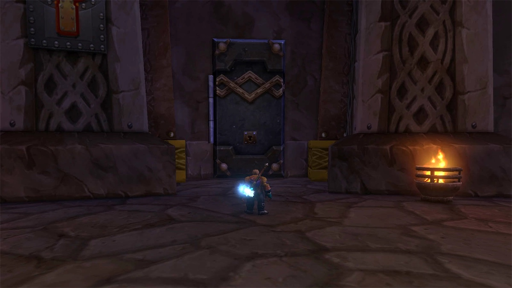

Die Hall of Thanes ist der Dungeon unter Old Ironforge, für Level 13 bis 18, und fünf Quests gehören dazu. Jede bringt zwischen 3.900 und 4.900 Erfahrung, laut Wowhead, also ist ein Durchlauf mit allen fünf einer der größten frühen Schübe in WoW Forever. Warcraft Tavern hat erfasst, wo jede Quest beginnt.

## Die fünf Quests auf einen Blick

| Quest | Wo sie beginnt |
|---|---|
| [Important Heirlooms](https://www.wowhead.com/forever/quest=96403) | Thom Filch, direkt vor dem Dungeon |
| [The Restless Dead](https://www.wowhead.com/forever/quest=96394) | Afadra Dunwall, die Treppe hinauf vom Eingang |
| [Old Ironforge Incursion](https://www.wowhead.com/forever/quest=96393) | Earthseer Farsen in Dun Morogh, nach einer kurzen Questreihe |
| [An Ancient Grudge](https://www.wowhead.com/forever/quest=96395) | Ein Ghostly Attendant im Dungeon |
| [The Treaty of Understanding](https://www.wowhead.com/forever/quest=98423) | Eine Tafel in einem Tresor im Raum des Endbosses |

Beginne mit der Questreihe in Dun Morogh. Sie ist die einzige Quest, die nicht am Dungeon beginnt, und sie verlangt den Endboss. Man hat sie also am besten vor dem ersten Pull.

## Vor dem Aufbruch: die Questreihe in Dun Morogh

Earthseer Farsen steht bei /way 64.8 58.5 in Dun Morogh. Er gibt [Nip 'Em in the Bud](https://www.wowhead.com/forever/quest=96390): 10 Dark Iron Spies töten, zu finden um /way 76.7 60.7. Wowhead ergänzt, dass der Weg zu Farsen mit A Visitor to Dun Morogh beginnt, von Beldin Steelgrill am Steelgrill's Depot.

Einer der Spione lässt eine [Dark Iron Map](https://www.wowhead.com/forever/item=274268) fallen. Aus den Taschen benutzt, startet sie eine kurze Quest, die zurück zu Farsen schickt. Er gibt dann Old Ironforge Incursion: die Hall of Thanes betreten und den Kopf von Durgen Dirgehammer zurückbringen.

## Important Heirlooms

Thom Filch wartet an der Brücke, die in die Hall of Thanes führt. Er will 8 [Dwarven Heirlooms](https://www.wowhead.com/forever/item=274289).

Die Heirlooms liegen überall im Dungeon, die meisten auf erhöhten Plattformen mit Kerzen in den Gängen. Man muss sich nicht mit der Gruppe darum streiten. Die Tresore im letzten Raum, dem Reliquary of Kings, haben genug für alle, schreibt Warcraft Tavern.

## The Restless Dead

Afadra Dunwall, eine Lorekeeper von Ironforge, steht eine Treppe hinauf auf dem Weg zum Eingang. Sie will 15 Enraged Apparitions und 10 Tormented Souls tot sehen. Das sind die Geister in den ersten Hallen des Dungeons. Der Questtext verlangt auch, den Geist von Anvilmar zur Ruhe zu bringen.

## An Ancient Grudge

Ein Ghostly Attendant wartet im zweiten Raum des Dungeons, Anvilmar's Rest. Sie bittet darum, den Geist von Faldrim Anvilmar, dem ersten Boss, zur Ruhe zu bringen.

Mit der Abgabe eilt es nicht. Wer ohne Hearthstone hinausgeht, trifft sie auf dem Rückweg wieder, schreibt Warcraft Tavern.

## Der Endboss und der Tresor

Durgen Dirgehammer wartet im Reliquary of Kings, dem letzten Raum. Von ihm kommt [Durgen Dirgehammer's Head](https://www.wowhead.com/forever/item=274286) für Old Ironforge Incursion. Wie der Kampf abläuft, steht in [der Anleitung zu den vier Bossen](/de/news/the-hall-of-thanes-has-four-bosses-and-five-quests/).

Hinter einer Tresortür im selben Raum liegt eine Tafel, die The Treaty of Understanding startet. Die Quest bringt nur Erfahrung: den Vertrag zu King Magni Bronzebeard in Ironforge bringen. Der Kopf geht ebenfalls an ihn. Nach dem Boss öffnet ein Schalter im hinteren Tresor die verschlossenen Türen, der Weg hinaus ist also kurz, schreibt Wowhead.

## Belohnungen

| Belohnung | Art | Quest |
|---|---|---|
| Ironforge Greathammer | Zweihandstreitkolben | Old Ironforge Incursion |
| Deepblaze | Zauberstab | Old Ironforge Incursion |
| Dwarven Tome | Nebenhand | Important Heirlooms |
| Catacomb Cloak | Umhang | An Ancient Grudge |

Wowhead nennt keinen Gegenstand für The Restless Dead und The Treaty of Understanding.

## Der Weg dorthin

Die Tür nach Old Ironforge liegt links, gleich hinter dem Eingang zum High Seat in Ironforge, schreibt Wowhead. Ein Pfad führt hinunter zum Portal. Der Dungeon ist das Gegenstück der Allianz zu Ragefire Chasm. Die Horde kommt hinein, hat aber einen langen Weg durch die Wetlands und Loch Modan und an den Wachen von Ironforge vorbei.

Wer die Quests annehmen darf, ist nicht klar. Der Newsartikel von Wowhead nennt alle fünf nur für die Allianz. Der Dungeonguide derselben Seite macht eine Ausnahme für Important Heirlooms und An Ancient Grudge.
