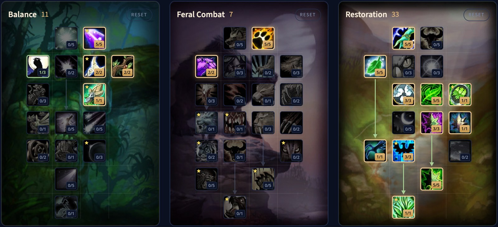

Der Restoration Druid in WoW Forever bleibt ein Heiler, der dem Schaden zuvorkommt, mit HoTs auf vielen Spielern gleichzeitig. Neue Werkzeuge lassen die Spezialisierung auch reagieren: Wild Growth, ein Swiftmend, das den HoT stehen lässt, und ein kostenloses Omen of Clarity. Dieser Guide behandelt die Änderungen, den Standardbuild, Makros und die häufigsten Fragen.

| | |
|---|---|
| Rolle | Heiler, am stärksten in der Raidheilung |
| Standardbuild | 11 Balance, 7 Feral Combat, 33 Restoration |
| Kerntalente | Gift of the Earthmother, Improved Regrowth, Wild Growth |
| Stärken | Raidheilung, Mobilität, Utility |
| Schwächen | Kein Bann für Magie oder Krankheiten, keine Schilde |
| Werte und BiS | Vor dem Launch nicht bekannt |

## Was sich für den Heiler ändert

- **Omen of Clarity ist Grundausstattung** und kann jetzt bei Zaubern auslösen, etwa zweimal pro Minute. Der Proc macht den nächsten Zauber kostenlos, er lohnt sich also am meisten bei einer teuren Heilung.
- **Wild Growth** ist das neue Abschlusstalent des Baums: eine starke Heilung auf die ganze Gruppe des Ziels.
- **<a class="wf-wh wf-spell" href="https://www.wowhead.com/forever/spell=18562">Swiftmend</a> verbraucht** den HoT, den es nutzt, nicht mehr.
- **HoTs können kritisch treffen.** Die zusätzliche kritische Chance von Improved Regrowth gilt wahrscheinlich auch für den HoT-Teil von <a class="wf-wh wf-spell" href="https://www.wowhead.com/forever/spell=8936">Regrowth</a>. Das stammt aus den Spieldaten und lässt sich auf der Beta noch nicht testen.
- **HoTs mehrerer Druiden stapeln** auf einem Ziel. Ein Bug verhindert das in manchen Fällen noch.
- **<a class="wf-wh wf-spell" href="https://www.wowhead.com/forever/spell=770">Faerie Fire</a>** stapelt seine Rüstungssenkung nicht mehr mit <a class="wf-wh wf-spell" href="https://www.wowhead.com/forever/spell=704">Curse of Recklessness</a> der Warlocks.
- **Die Manakosten** wurden angepasst, und Regrowth heilt deutlich mehr als früher.
- **Feral Swiftness und <a class="wf-wh wf-spell" href="https://www.wowhead.com/forever/spell=339">Entangling Roots</a>** wirken jetzt auch in Innenräumen.
- **Gestaltwandel** stört weniger. Mehrere Gegenstände, Fähigkeiten und Aktionen funktionieren jetzt in Gestalt, und viele Aktionen, die früher scheiterten, holen euch jetzt automatisch aus der Gestalt.

## Stärken und Schwächen

| Stärken | Schwächen |
|---|---|
| Sehr starke Raidheilung | Konkurriert mit den anderen Druiden-Spezialisierungen um Raidplätze |
| Starke Burstheilung auf ein Ziel | Keine externe Schadensreduktion und keine Schilde |
| Eine breite Auswahl an Utility | Mana braucht aktives Management |
| Viel Gesamtheilung | Raidheilung braucht Zeit, um anzulaufen |
| Die beste Mobilität aller Heiler | Kein Bann für Magie oder Krankheiten |
| Raid-Debuffs | |

## Der Standardbuild

Die meisten Restoration Druids werden in fast jeder Situation einen Build spielen, der diesem sehr ähnelt, so eine Umfrage unter Spielern der Spezialisierung. Öffnet ihn im [Talentrechner](/de/talents/druid/?t=05102201-052-5050035103113051): 11 Punkte in Balance, 7 in Feral Combat und 33 in Restoration, zusammen 51 Punkte für Level 60.



| Baum | Talente |
|---|---|
| **Restoration (33)** | Nature's Focus 5, Naturalist 5, Reflection 3, Gift of Nature 5, Gift of the Earthmother 1, Improved Rejuvenation 3, Swiftmend 1, Nature's Swiftness 1, Living Spirit 3, Improved Regrowth 5, Wild Growth 1 |
| **Balance (11)** | Genesis 5, Moonglow 1, Nature's Majesty 2, Nature's Reach 2, Nature's Splendor 1 |
| **Feral Combat (7)** | Heart of the Wild 5, Feral Swiftness 2 |

**Gift of the Earthmother** ist das erste Meilensteintalent von Restoration, bei 11 Punkten. Es senkt die globale Abklingzeit von <a class="wf-wh wf-spell" href="https://www.wowhead.com/forever/spell=774">Rejuvenation</a>, Wild Growth und Swiftmend um 0,5 Sekunden. So kann ein Druide einen ganzen Raid mit HoTs abdecken, der Heilstil, in dem die Spezialisierung schon immer am stärksten war.

**Improved Regrowth** ist jetzt eines der Talente mit dem meisten Wert pro Punkt.

**<a class="wf-wh wf-spell" href="https://www.wowhead.com/forever/spell=24968">Tranquil Spirit</a>** hat zusammen mit <a class="wf-wh wf-spell" href="https://www.wowhead.com/forever/spell=5185">Healing Touch</a> an Wert verloren: das stärkere Regrowth und die Strafe auf niedrigere Ränge machen Healing Touch weniger attraktiv. **<a class="wf-wh wf-spell" href="https://www.wowhead.com/forever/spell=17123">Improved Tranquility</a>** ist ein kleiner Buff für einen Knopf, der schon schwach war, und wird kaum genutzt werden.

**Balance** lässt sich frei füllen. Entscheidend ist Nature's Splendor beim elften Punkt, das Moonfire, Rejuvenation und Regrowth verlängert. Manche Spieler nehmen die Verbesserungen von <a class="wf-wh wf-spell" href="https://www.wowhead.com/forever/spell=5176">Wrath</a> zusammen mit <a class="wf-wh wf-spell" href="https://www.wowhead.com/forever/spell=16845">Moonglow</a>, für mehr Schaden und mehr Chancen auf Omen of Clarity.

## Dual Specialization und andere Builds

Mit Dual Specialization und Wild Growth als starkem Abschlusstalent werden die alten Hybridbuilds für Restoration kaum noch gespielt werden. Eine Ausnahme ist wahrscheinlich: ein Build, der ein paar starke Punkte in Feral Combat aufgibt, um Insect Swarm in Balance zu erreichen, bei 16 Punkten. Insect Swarm dürfte ein starker Debuff auf Bossen bleiben.

Die Änderung an <a class="wf-wh wf-spell" href="https://www.wowhead.com/forever/spell=16880">Nature's Grace</a> verändert den Wert dieses Talents stark, für Restoration wie für Balance. Die meisten Punkte in Restoration stehen fest: Wer sie weglässt, verliert mehr, als die Punkte anderswo bringen. Andere Builds können trotzdem in allen Inhalten funktionieren, und ein Build für einen bestimmten Zweck ist eine gültige Wahl.

## Makros

Manche Makrobedingungen funktionieren auf der Beta noch nicht wie erwartet. Der moderne Client kann auch viel ohne Makros oder Addons: Mouseover-Zauber, Klick-Zauber und das Verschieben von Interface-Elementen stehen in den Spieleinstellungen.

**Mouseover.** Wirkt den Zauber auf die verbündete, lebende Einheit unter der Maus, sonst auf das verbündete Ziel, sonst auf euch selbst. Entfernt `nodead`, wenn ihr es für <a class="wf-wh wf-spell" href="https://www.wowhead.com/forever/spell=20484">Rebirth</a> oder Revive nutzt.

```
#showtooltip
/use [@mouseover,help,nodead][@target,help,nodead][@player] SpellName
```

**Notheilung.** Bricht ab, was ihr gerade tut, und wirkt ein sofortiges Healing Touch mit <a class="wf-wh wf-spell" href="https://www.wowhead.com/forever/spell=17116">Nature's Swiftness</a>. Wegen eines Bugs auf der Beta braucht es vorerst manchmal mehr als einen Druck.

```
#showtooltip
/stopcasting
/stopattack
/cancelform [noform:0]
/use Nature's Swiftness
/use Healing Touch
```

**Ein Knopf für Utility.** Rebirth auf einen toten Verbündeten im Kampf, Revive auf einen toten Verbündeten außerhalb des Kampfes und <a class="wf-wh wf-spell" href="https://www.wowhead.com/forever/spell=29166">Innervate</a> auf einen lebenden Verbündeten.

```
#showtooltip
/cancelform [noform:0]
/use [@mouseover,help,dead,combat][help,dead,combat] Rebirth; [@mouseover,help,dead][help,dead] Revive; [@mouseover,help][] Innervate
```

**Zauber auf den Boden.** <a class="wf-wh wf-spell" href="https://www.wowhead.com/forever/spell=16914">Hurricane</a> am Mauszeiger oder ein Gegenstand wie der Advanced Target Dummy zu euren Füßen.

```
#showtooltip
/use [@cursor] Hurricane
```

```
#showtooltip
/use [@player] Advanced Target Dummy
```

**Gestalten.** Ein Makro kann etwas nur in einer bestimmten Gestalt tun, mit `[form:N]`:

| Bedingung | Gestalt |
|---|---|
| **form:0** | Normale Gestalt |
| **form:1** | Bear Form |
| **form:2** | Aquatic Form |
| **form:3** | Cat Form |
| **form:4** | Travel Form |
| **form:5** | Moonkin Form |

## Unit Frames und der Cooldown Manager

Die Standard-Unit-Frames lassen sich weniger anpassen, als Spieler älterer Versionen des Spiels gewohnt sind. Manche Addons ergänzen Filter für Buffs und Debuffs, was einer Klasse, die mit HoTs heilt, sehr hilft. EllesmereUI ist das zugänglichste und anpassbarste Addon für Unit Frames.

Der eingebaute Cooldown Manager ersetzt eine zentrale Gruppe von WeakAuras, und Addons können sein Aussehen ändern. Auf der Beta wird er noch schrittweise eingeführt. Mehr im [Beitrag über den Cooldown Manager](/de/news/cooldown-manager-arrives-in-forever-from-midnight/).
