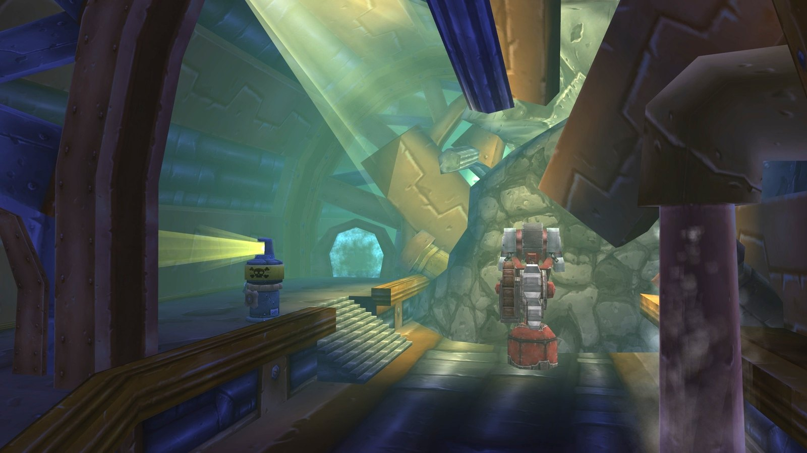

Gnomeregan was the capital of the gnomes in Dun Morogh, until troggs invaded it and the venting of the radioactive waste drove the gnomes out. Mekgineer Thermaplugg, who betrayed his people, still rules the ruins. It is one of the hardest dungeons to find your way in. Six bosses and thirteen quests wait inside.

## At a glance

| | |
|---|---|
| Levels | 25-38, bosses of level 30 to 34 |
| Entrance | The Train Depot in Dun Morogh, west of Ironforge; two doors |
| Bosses | 6, of which the Dark Iron Ambassador is a rare |
| Quests | 13, for both factions |
| Horde | Teleports in with the Goblin Transponder |
| Short name | Gnomer |

## Getting there

**Alliance.** Ride west from Ironforge to the Train Depot.

**Horde.** Pick up Rig Wars from Nogg in Orgrimmar, then Chief Engineer Scooty from Sovik in the engineering shop next to him. Take the boat from Ratchet to Booty Bay, where Scooty stands on the docks near the inn. His Gnomer-gooooone! gives the <a class="wf-wh wf-q1" href="https://www.wowhead.com/forever/item=9173">Goblin Transponder</a>, which beams you to Gnomeregan. Keep it for later runs.

**Two doors.** The front entrance on the west side of the Train Depot leads to The Clockwork Run near Viscous Fallout. The back door on the north side leads to the Engineering Labs and Crowd Pummeler 9-60; it needs the <a class="wf-wh wf-q1" href="https://www.wowhead.com/forever/item=6893">Workshop Key</a> or a Rogue with Lockpicking 150. The Horde arrives near the elevator.

## The quests

| Quest | Where it starts | Level | Reward |
|---|---|---|---|
| <a href="https://www.wowhead.com/forever/quest=2904">A Fine Mess</a> Both | Inside the dungeon: escort <a class="wf-wh wf-plain" href="https://www.wowhead.com/forever/npc=7850">Kernobee</a>, after The Clean Room | 20 | <a class="wf-wh wf-q3" href="https://www.wowhead.com/forever/item=9535">Fire-welded Bracers</a> or <a class="wf-wh wf-q3" href="https://www.wowhead.com/forever/item=9536">Fairywing Mantle</a> |
| <a href="https://www.wowhead.com/forever/quest=2951">The Sparklematic 5200!</a> Both | Inside the dungeon: The Sparklematic 5200 in The Clean Room | 25 | <a class="wf-wh wf-q1" href="https://www.wowhead.com/forever/item=9363">Sparklematic-Wrapped Box</a> |
| <a href="https://www.wowhead.com/forever/quest=2945">Grime-Encrusted Ring</a> Both | Inside the dungeon: Grime-Encrusted Ring, a drop from Dark Iron Agents | 28 | <a class="wf-wh wf-q3" href="https://www.wowhead.com/forever/item=9538">Talvash's Gold Ring</a> or <a class="wf-wh wf-q3" href="https://www.wowhead.com/forever/item=9588">Nogg's Gold Ring</a> |
| <a href="https://www.wowhead.com/forever/quest=2922">Save Techbot's Brain!</a> Alliance | Ironforge, Tinker Town: Tinkmaster Overspark /way 69 50 | 20 | Experience and money |
| <a href="https://www.wowhead.com/forever/quest=2926">Gnogaine</a> Alliance | Dun Morogh, Kharanos: Ozzie Togglevolt /way 45 49 <em>Continues with <a href="https://www.wowhead.com/forever/quest=2962">The Only Cure is More Green Glow</a>.</em> | 20 | Experience and money |
| <a href="https://www.wowhead.com/forever/quest=2928">Gyrodrillmatic Excavationators</a> Alliance | Stormwind, Dwarven District: Shoni the Shilent /way 55 12 | 20 | <a class="wf-wh wf-q3" href="https://www.wowhead.com/forever/item=9608">Shoni's Disarming Tool</a> or <a class="wf-wh wf-q3" href="https://www.wowhead.com/forever/item=9609">Shilly Mitts</a> |
| <a href="https://www.wowhead.com/forever/quest=2924">Essential Artificials</a> Alliance | Ironforge, Tinker Town: Klockmort Spannerspan /way 47 64 | 24 | Experience |
| <a href="https://www.wowhead.com/forever/quest=2930">Data Rescue</a> Alliance | Ironforge, Tinker Town: Master Mechanic Castpipe /way 69 48 | 25 | <a class="wf-wh wf-q3" href="https://www.wowhead.com/forever/item=9605">Repairman's Cape</a> or <a class="wf-wh wf-q3" href="https://www.wowhead.com/forever/item=9604">Mechanic's Pipehammer</a> |
| <a href="https://www.wowhead.com/forever/quest=2929">The Grand Betrayal</a> Alliance | Ironforge, Tinker Town: High Tinker Mekkatorque /way 68 49 | 25 | <a class="wf-wh wf-q3" href="https://www.wowhead.com/forever/item=9623">Civinad Robes</a>, <a class="wf-wh wf-q3" href="https://www.wowhead.com/forever/item=9624">Triprunner Dungarees</a> or <a class="wf-wh wf-q3" href="https://www.wowhead.com/forever/item=9625">Dual Reinforced Leggings</a> |
| <a href="https://www.wowhead.com/forever/quest=2841">Rig Wars</a> Horde | Orgrimmar, Valley of Honor: Nogg /way 76 25 | 25 | <a class="wf-wh wf-q3" href="https://www.wowhead.com/forever/item=9623">Civinad Robes</a>, <a class="wf-wh wf-q3" href="https://www.wowhead.com/forever/item=9624">Triprunner Dungarees</a> or <a class="wf-wh wf-q3" href="https://www.wowhead.com/forever/item=9625">Dual Reinforced Leggings</a> |
| <a href="https://www.wowhead.com/forever/quest=2842">Chief Engineer Scooty</a> Horde | Orgrimmar, Valley of Honor: Sovik /way 76 25 <em>Pick up Rig Wars first; continues with <a href="https://www.wowhead.com/forever/quest=2843">Gnomer-gooooone!</a>.</em> | 20 | <a class="wf-wh wf-q1" href="https://www.wowhead.com/forever/item=9173">Goblin Transponder</a> |

The level is the lowest level at which the quest can be picked up, according to Wowhead. The Alliance quests also give reputation with Gnomeregan Exiles.

- **A Fine Mess.** Kernobee waits in The Dormitory, just after The Clean Room. Escort him to the entrance and hand in to Scooty in Booty Bay.
- **The Sparklematic 5200!** Put 3 Grime-Encrusted Objects into a Sparklematic machine in The Clean Room. Repeatable, with experience only the first time.
- **Grime-Encrusted Ring.** Clean the ring in the same machine. Return of the Ring then goes to Talvash del Kissel in Ironforge or Nogg in Orgrimmar, who make a better ring from a Silver Bar and a Moss Agate.
- **Save Techbot's Brain!** Techbot stands in the Loading Room of the Train Depot, outside the instance.
- **Gnogaine and The Only Cure is More Green Glow.** Use the phial next to a living irradiated trogg, and later next to irradiated slimes, lurkers and horrors. The second phial has to be back with Ozzie within 2 hours.
- **Gyrodrillmatic Excavationators.** 24 Robo-mechanical Guts, from most monsters inside.
- **Essential Artificials.** 12 Essential Artificials, scattered through the dungeon and sometimes tucked behind pillars.
- **Data Rescue.** The White Punch Card drops outside; machines A to D, from Techbot to below Crowd Pummeler 9-60, turn it into the Prismatic Punch Card.
- **The Grand Betrayal and Rig Wars.** Kill Mekgineer Thermaplugg. For Rig Wars, also take the Rig Blueprints from the black and white chest in his room.

## The bosses and their loot

The loot per boss comes from Wowhead, with the stats from the files of the beta.

### Grubbis

Near the entrance, in the cave by the Hall of Gears. Talk to <a class="wf-wh wf-plain" href="https://www.wowhead.com/forever/npc=7998">Blastmaster Emi Shortfuse</a> to start the event: troggs pour out of the caves before Emi blows them shut, and Grubbis comes out of the second one.

| Item | New in Forever |
|---|---|
| <a class="wf-wh wf-q3" href="https://www.wowhead.com/forever/item=9445">Grubbis Paws</a> | Unchanged |

### Viscous Fallout

On the irradiated ground floor of the Hall of Gears. Clear the trash around him first.

| Item | New in Forever |
|---|---|
| <a class="wf-wh wf-q3" href="https://www.wowhead.com/forever/item=9452">Hydrocane</a> | Up to 36 spell damage and healing; Underwater Breath lasts 50% longer instead of water breathing |
| <a class="wf-wh wf-q3" href="https://www.wowhead.com/forever/item=9453">Toxic Revenger</a> | The poison cloud hits harder: 14 every 3 seconds |
| <a class="wf-wh wf-q3" href="https://www.wowhead.com/forever/item=9454">Acidic Walkers</a> | Almost unchanged |

### Electrocutioner 6000

On the raised launch pad in the Launch Bay. He casts Chain Bolt, Megavolt and Shock, and drops the Workshop Key for the back door.

| Item | New in Forever |
|---|---|
| <a class="wf-wh wf-q3" href="https://www.wowhead.com/forever/item=9446">Electrocutioner Leg</a> | More Nature damage per hit, and double damage to Mechanical targets |
| <a class="wf-wh wf-q3" href="https://www.wowhead.com/forever/item=9447">Electrocutioner Lagnut</a> | Up to 8 healing, a little less Spirit |
| <a class="wf-wh wf-q3" href="https://www.wowhead.com/forever/item=9448">Spidertank Oilrag</a> | Blue, up to 8 spell damage and healing |

### Crowd Pummeler 9-60

On the upper south ledge of the Engineering Labs. Arcing Smash, Crowd Pummel and Trample hit the whole melee group.

| Item | New in Forever |
|---|---|
| <a class="wf-wh wf-q3" href="https://www.wowhead.com/forever/item=9449">Manual Crowd Pummeler</a> | The attack speed use now has a cooldown of 3 minutes, and the mace is unique |
| <a class="wf-wh wf-q3" href="https://www.wowhead.com/forever/item=9450">Gnomebot Operating Boots</a> | Blue, more Stamina and up to 10 healing |

### Dark Iron Ambassador, a rare

Patrols the north side of the tunnel to Thermaplugg, if he spawns. Fire Shield, Fireball and a Burning Servant.

| Item | New in Forever |
|---|---|
| <a class="wf-wh wf-q3" href="https://www.wowhead.com/forever/item=9457">Royal Diplomatic Scepter</a> | A healer's mace now: up to 75 healing |
| <a class="wf-wh wf-q3" href="https://www.wowhead.com/forever/item=9456">Glass Shooter</a> | 12 Attack Power |
| <a class="wf-wh wf-q3" href="https://www.wowhead.com/forever/item=9455">Emissary Cuffs</a> | 6 Arcane Resistance instead of a random enchantment |

### Mekgineer Thermaplugg

The final boss, in the Tinkers' Court. Walking Bombs come out of six dispensers during the fight. Kill them before they reach the group, or send one player to press the button on the right of each dispenser.

| Item | New in Forever |
|---|---|
| <a class="wf-wh wf-q3" href="https://www.wowhead.com/forever/item=9458">Thermaplugg's Central Core</a> | Its Nature damage when struck goes from 35-65 to 65-121 |
| <a class="wf-wh wf-q3" href="https://www.wowhead.com/forever/item=9461">Charged Gear</a> | No random enchantment any more, level 31 |

Wowhead also lists Thermaplugg's Left Arm and the Electromagnetic Gigaflux Reactivator for him. Neither is in the Forever data of Wowhead yet.

## Boxes and chests

The **Box of Assorted Parts** holds engineering materials, such as Bronze Tubes and blasting powder. Three of them: in the upper centre of the Hall of Gears, in the cave of Blastmaster Emi Shortfuse, and in one of the bunkers of The Dormitory. A **Large Solid Chest** stands in the upper centre of the Hall of Gears, in the upper east of the Engineering Labs and in a bunker of The Dormitory.

## What is not known yet

- **Thermaplugg's Left Arm and the Electromagnetic Gigaflux Reactivator**: whether they still drop in Forever.
- **The drop rates** of the boss loot.
- **The quest rewards** may still change during the beta.
