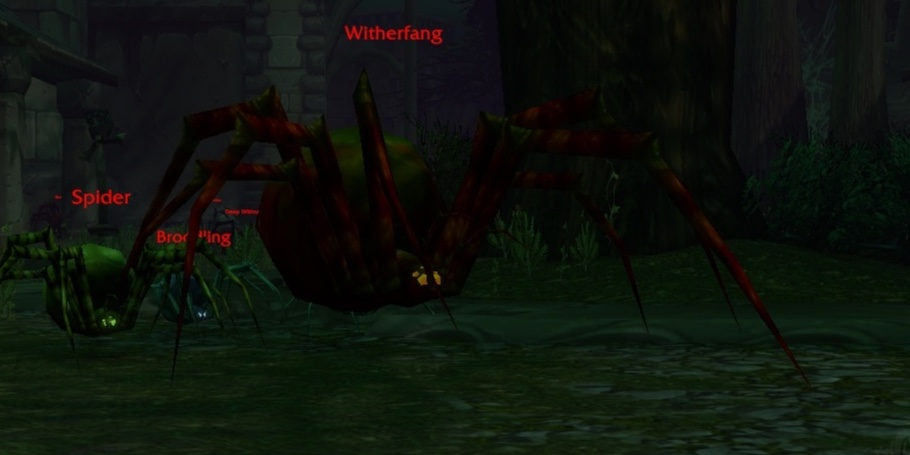
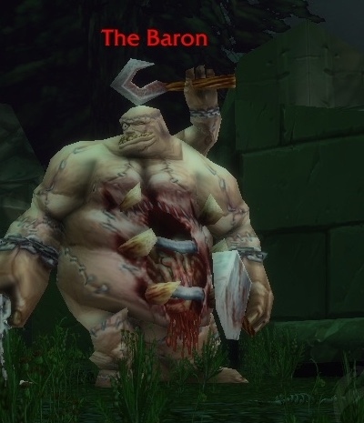
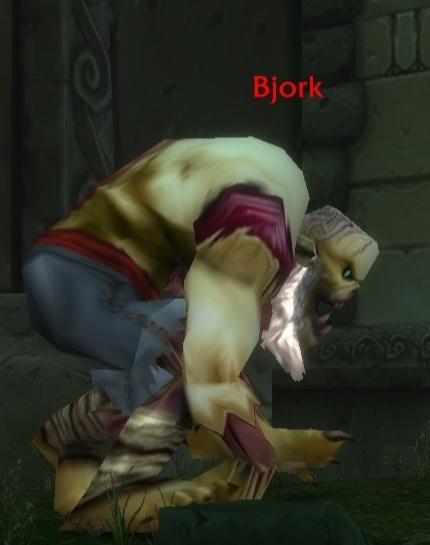
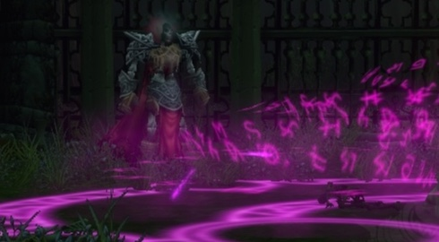
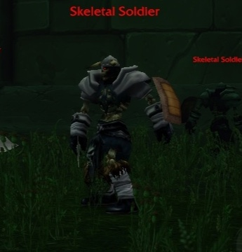
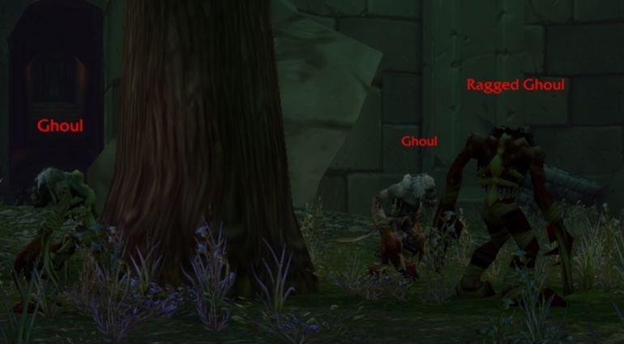

The Ruins of Lordaeron is a new dungeon in the ruined capital above the Undercity, for levels 15 to 20. The Scourge still holds the streets, and the Forsaken want them back. Six bosses wait there in any order, with six quests for the Horde and four for the Alliance.

## At a glance

| | |
|---|---|
| Levels | 15 to 20 according to Blizzard, 16 to 22 recommended |
| Entrance | The open ruins of Lordaeron above the Undercity, Tirisfal Glades |
| Bosses | 6, in any order |
| Quests | 6 for the Horde, 4 for the Alliance |
| Loot | Blue items that require level 15 to 19 |
| Spirit Healer | Just outside the entrance |

The dungeon is not a straight line. Viktor the Vile and the Crest of Lordaeron are easy to miss, and a repeat run gives much less experience from monsters, so it pays to do everything in one go.

## Getting there

**Horde.** Walk from Brill to the Undercity and go into the ruins of Lordaeron above it, not down the elevators. The portal is immediately to the left after the gate.

**Alliance.** A long way:

1. Take the boat from Stormwind Harbor to Auberdine.
2. In Auberdine, take the boat to Menethil Harbor, and stay on board until Southshore in Hillsbrad Foothills.
3. Follow the road north from Southshore past Hillsbrad Fields and around Dalaran.
4. Swim north through Lordamere Lake in Silverpine Forest to Tirisfal Glades.
5. Follow the road to the ruins of Lordaeron.

Skyborne on the Alliance side can take a portal from the Mage Tower in Stormwind to Dalaran and start at step 3.

## The quests at a glance

| Quest | Side | Where it starts | Experience |
|---|---|---|---|
| [The Wrath of Rath'mael](https://www.wowhead.com/forever/quest=92422) | Horde | Deathguard Kristof, Tirisfal Glades, /way 65.2 60.2 | not listed |
| [A Frightened Request](https://www.wowhead.com/forever/quest=92401) | Horde | Tabitha Heartweaver, The Sepulcher, Silverpine Forest, /way 44.6 42.8 | 7,050 |
| [Light's Justice](https://www.wowhead.com/forever/quest=92421) | Horde | Morbin Lightbane, Undercity, /way 57.8 89.8 | 7,050 |
| [The New Plague](https://www.wowhead.com/forever/quest=95216) | Horde | Theodore Griffs, the Apothecarium, Undercity, /way 47.0 72.6 | 8,300 |
| [Unending Torment](https://www.wowhead.com/forever/quest=97288) | Horde | The Abominable Head, a drop from The Baron | 5,300 for the first step |
| [Crest of Lordaeron](https://www.wowhead.com/forever/quest=95204) | Horde | The Crest of Lordaeron, inside | 8,300 |
| [Abominable Creatures](https://www.wowhead.com/forever/quest=95250) | Alliance | Captain Truman, near the entrance | 6,200 |
| [Bloodied Insignia](https://www.wowhead.com/forever/quest=95195) | Alliance | Bloodied Insignias, a drop from undead | 9,750 |
| [Crest of Lordaeron](https://www.wowhead.com/forever/quest=95189) | Alliance | The Crest of Lordaeron, inside | 9,750 |
| [Remember That I Love You](https://www.wowhead.com/forever/quest=92415) | Alliance | The Blood-Stained Letter, near Rath'mael | 9,750 |

All quests require level 15 or 16, but the quests themselves are level 21 and 22. That is why they show up red at level 17, while the dungeon can be cleared at that level.

## Horde quests

Pick up the four quests outside before the first pull. They lie on the way: Brill, the Undercity, and a detour to Silverpine Forest.

**The Wrath of Rath'mael.** Deathguard Kristof stands at the caravan between Brill and the Undercity. He wants Rath'mael dead. Scouts report an unholy fog in Lordamere Overlook, in the streets and the graveyard. Reward: the Forsaken Greataxe or the Gnarled Necromancer's Staff, plus 150 reputation with Undercity.

**A Frightened Request.** Tabitha Heartweaver at The Sepulcher misses her husband Edward, who went to the graveyard of Lordaeron and never came back. Find him next to Rath'mael. Reward: Edward's Knife or Tabitha's Cuffs, plus 150 reputation with Undercity.

**Light's Justice.** Morbin Lightbane, a Forsaken Paladin in the Royal Quarter of the Undercity, asks for 25 Intact Limbs from the Scourge in the dungeon. Reward: The Stitcher or Spare Part Bindings, plus 150 reputation with Undercity.

**The New Plague.** Theodore Griffs in the Apothecarium wants the Highly Toxic Strain from Witherfang. Reward: Plaguefang or Blight Gloves.

**Unending Torment.** When The Baron falls, his head comes off: the Abominable Head starts a chain of five steps in the Undercity. Bring the head to Master Apothecary Faranell, take it to the body of Othmar, report back, collect a Toxic Skullcap, Blisterweed and Essence of Agony in the city, and inject the Hissing Serum above Othmar's body. The first step gives 5,300 experience, the last 1,650. The chain also leads to Slain Baron's Signet; at which step is not known.

**Crest of Lordaeron.** The crest lies on one of several spots in the dungeon. Take it to Oran Snakewrithe in the Undercity. Reward: a Small Sack of Gems.

## Alliance quests

The Alliance finds all four quests inside. Three of them are handed in at Stormwind, so a Hearthstone set to Stormwind saves the long trip back.

**Abominable Creatures.** Captain Truman, friendly to the Alliance and hostile to the Horde, waits near the entrance. He wants the Head of the Baron. Reward: a choice of the Monstrous Cleaver, the Grave Shroud or Slain Baron's Signet.

**Bloodied Insignia.** The undead in the dungeon drop old Alliance insignias of the soldiers of Lordaeron. Take 10 to General Marcus Jonathan in Stormwind. Reward: Duty Bound Leggings or Remembrance Armor.

**Crest of Lordaeron.** The same crest as for the Horde, but it goes to Lady Dena Kennedy in Stormwind. Reward: a Small Sack of Gems.

**Remember That I Love You.** A Blood-Stained Letter lies near Rath'mael. It mentions a missing child of the Heartweaver family; bring it to Orphan Matron Nightingale in Stormwind. It is the first of two steps and cannot be shared. The reward of the chain is the Tarnished Locket.

## Quest rewards

For the Horde, in the order of the quests above:

<a class="wf-item__name wf-q3" href="https://www.wowhead.com/forever/item=251485">Edward's Knife</a>Item Level 24Binds when picked upOne-HandDagger17 - 33 DamageSpeed 1.60(15.63 damage per second)+4 Agility+4 StaminaDurability 50 / 50

<a class="wf-item__name wf-q3" href="https://www.wowhead.com/forever/item=251486">Tabitha's Cuffs</a>Item Level 24Binds when picked upWristCloth18 Armor+3 Stamina+6 IntellectDurability 20 / 20

<a class="wf-item__name wf-q3" href="https://www.wowhead.com/forever/item=251533">Forsaken Greataxe</a>Item Level 24Binds when picked upTwo-HandAxe49 - 74 DamageSpeed 3.00(20.50 damage per second)+8 Strength+4 StaminaDurability 90 / 90Equip: Movement speed increased by 2% in Silverpine Forest and Hillsbrad Foothills.

<a class="wf-item__name wf-q3" href="https://www.wowhead.com/forever/item=251534">Gnarled Necromancer's Staff</a>Item Level 24Binds when picked upTwo-HandStaff34 - 51 DamageSpeed 2.80(15.18 damage per second)+10 IntellectDurability 90 / 90Equip: Increases damage and healing done by magical spells and effects by up to 26.Equip: Movement speed increased by 2% in Silverpine Forest and Hillsbrad Foothills.

<a class="wf-item__name wf-q3" href="https://www.wowhead.com/forever/item=279876">Plaguefang</a>Item Level 24Binds when picked upUnique-EquippedOne-HandSword23 - 43 DamageSpeed 2.10(15.71 damage per second)Durability 75 / 75Chance on hit: Poisons target for 4 Nature damage every 1 sec for 10 sec.

<a class="wf-item__name wf-q3" href="https://www.wowhead.com/forever/item=279877">Blight Gloves</a>Item Level 24Binds when picked upHandsCloth26 Armor+7 Intellect+5 Spirit+3 Nature ResistanceDurability 20 / 20

<a class="wf-item__name wf-q3" href="https://www.wowhead.com/forever/item=279874">The Stitcher</a>Item Level 24Binds when picked upMain HandMace17 - 33 DamageSpeed 2.40(10.42 damage per second)+6 StaminaDurability 75 / 75Equip: Increases healing done by up to 48 and damage done by up to 16 for all magical spells and effects.

<a class="wf-item__name wf-q3" href="https://www.wowhead.com/forever/item=279875">Spare Part Bindings</a>Item Level 24Binds when picked upWristLeather40 Armor+3 Agility+5 Stamina+3 SpiritDurability 30 / 30

For the Alliance: the three choices of Abominable Creatures, the two of Bloodied Insignia, and the locket.

<a class="wf-item__name wf-q3" href="https://www.wowhead.com/forever/item=279864">Monstrous Cleaver</a>Item Level 23Binds when picked upTwo-HandSword52 - 78 DamageSpeed 3.30(19.70 damage per second)+9 Stamina+10 Attack PowerDurability 80 / 80

<a class="wf-item__name wf-q3" href="https://www.wowhead.com/forever/item=279865">Grave Shroud</a>Item Level 23Binds when picked upBack20 Armor+3 Strength+2 Agility+5 Stamina

<a class="wf-item__name wf-q3" href="https://www.wowhead.com/forever/item=279867">Slain Baron's Signet</a>Item Level 23Binds when picked upFinger+5 StaminaEquip: Increases defense skill by 2.

<a class="wf-item__name wf-q3" href="https://www.wowhead.com/forever/item=279868">Duty Bound Leggings</a>Item Level 24Binds when picked upLegsLeather81 Armor+6 Agility+9 Stamina+6 IntellectDurability 70 / 70

<a class="wf-item__name wf-q3" href="https://www.wowhead.com/forever/item=279869">Remembrance Armor</a>Item Level 24Binds when picked upChestMail198 Armor+5 Strength+9 Stamina+6 SpiritDurability 105 / 105

<a class="wf-item__name wf-q3" href="https://www.wowhead.com/forever/item=279870">Tarnished Locket</a>Item Level 24Binds when picked upNeck+5 Stamina+4 Spirit"Some memories are best forgotten."

## The six bosses

Any order works. Every boss drops blue items; three per boss are known from the beta.

### Witherfang

A big spider that patrols King's Alley with two smaller spiders. Clear the trash along its path first, so it comes alone, and kill the small spiders fast. Its [Leech Poison](https://www.wowhead.com/forever/spell=3358) drains 15 health every 5 seconds for 40 seconds; a player who removes poison takes it off the tank. Witherfang also drops the Highly Toxic Strain for The New Plague.

<a class="wf-item__name wf-q3" href="https://www.wowhead.com/forever/item=271201">Atrophic Girdle</a>Item Level 20Binds when picked upWaistMail104 Armor+5 Strength+5 StaminaDurability 35 / 35Requires Level 15

<a class="wf-item__name wf-q3" href="https://www.wowhead.com/forever/item=271203">Segmented Spider Leg</a>Item Level 20Binds when picked upTwo-HandStaff50 - 76 DamageSpeed 3.60(17.50 damage per second)+5 Strength+9 AgilityDurability 75 / 75Requires Level 15

<a class="wf-item__name wf-q3" href="https://www.wowhead.com/forever/item=271202">Witherbite Bracers</a>Item Level 20Binds when picked upWristLeather37 Armor+4 Agility+3 Intellect+3 SpiritDurability 30 / 30Requires Level 15

### The Baron

An abomination with one ability that matters: [Knockout](https://www.wowhead.com/forever/spell=17307), heavy instant damage that knocks the target back, stuns it and drops threat. A tank that is not at full health can die from it. Stun him as often as possible. He drops the Head of the Baron for the Alliance and the Abominable Head for the Horde.

<a class="wf-item__name wf-q3" href="https://www.wowhead.com/forever/item=271204">Meathook Slicer</a>Item Level 20Binds when picked upOne-HandDagger17 - 32 DamageSpeed 1.80(13.61 damage per second)+4 Agility+3 StaminaDurability 45 / 45Requires Level 15

<a class="wf-item__name wf-q3" href="https://www.wowhead.com/forever/item=271205">Abomination Bones</a>Item Level 20Binds when picked upChestMail184 Armor+9 Strength+2 Stamina+4 IntellectDurability 95 / 95Requires Level 15

<a class="wf-item__name wf-q3" href="https://www.wowhead.com/forever/item=271206">Leftover Abomination Skin</a>Item Level 20Binds when picked upChestCloth37 Armor+7 SpiritDurability 70 / 70Requires Level 15Equip: Increases damage and healing done by magical spells and effects by up to 7.

### Viktor the Vile

The boss most groups miss. Light the Kindled Flame in the chimney of a building in the southwest of Lordamere Overlook, near the graveyard. Five waves of adds follow before Viktor comes. He hits hard and has the same Leech Poison as Witherfang, so let the tank take aggro first. On the beta Viktor sometimes does not spawn.

<a class="wf-item__name wf-q3" href="https://www.wowhead.com/forever/item=271218">Vileblood Scimitar</a>Item Level 22Binds when picked upOne-HandSword26 - 50 DamageSpeed 2.60(14.62 damage per second)+4 Strength+2 AgilityDurability 70 / 70Requires Level 17

<a class="wf-item__name wf-q3" href="https://www.wowhead.com/forever/item=271212">Bloodied Chestwraps</a>Item Level 22Binds when picked upChestLeather89 Armor+9 Agility+4 Stamina+4 IntellectDurability 90 / 90Requires Level 17

<a class="wf-item__name wf-q3" href="https://www.wowhead.com/forever/item=271211">Vilewalkers</a>Item Level 22Binds when picked upFeetMail131 Armor+7 Strength+5 StaminaDurability 50 / 50Requires Level 17

### The Abandoned

He waits in Market Street, on the way from Lordamere Overlook. A statue there starts three waves of adds, and then he comes out. He casts [Frost Nova](https://www.wowhead.com/forever/spell=1220855), chills whoever hits him in melee, and drains the tank with [Life Drain](https://www.wowhead.com/forever/spell=1266011), a cast of 2 seconds. A stun before the cast ends stops it.

<a class="wf-item__name wf-q3" href="https://www.wowhead.com/forever/item=271216">Scepter of the Abandoned</a>Item Level 22Binds when picked upMain HandMace17 - 33 DamageSpeed 2.60(9.62 damage per second)Durability 70 / 70Requires Level 17Equip: Increases damage and healing done by magical spells and effects by up to 24.

<a class="wf-item__name wf-q3" href="https://www.wowhead.com/forever/item=271208">Grip of Fear</a>Item Level 22Binds when picked upHandsMail119 Armor+5 Strength+4 Agility+5 StaminaDurability 35 / 35Requires Level 17

<a class="wf-item__name wf-q3" href="https://www.wowhead.com/forever/item=271207">Rotmender's Leggings</a>Item Level 22Binds when picked upLegsCloth35 Armor+5 Stamina+8 Intellect+5 SpiritDurability 50 / 50Requires Level 17Rotmender's Raiment (0/5)(2) Set: +10 Intellect.(3) Set: Reduces all threat generated by 5%.(4) Set: When your Mana falls below 15% restore 600 Mana over 15 sec. This effect can only trigger once every 5 min. (5m cooldown)(5) Set: Grant your healing spells a chance to apply Rotmending, restoring 40 Health every 3 sec for 15 sec. (Proc chance: 10%)

### Bjork

A quick fight. His only ability is a short [Anti-Magic Shield](https://www.wowhead.com/forever/spell=1301635), which makes him immune to magic for 3 seconds. Casters wait it out.

<a class="wf-item__name wf-q3" href="https://www.wowhead.com/forever/item=271217">Corpse Chopper</a>Item Level 21Binds when picked upTwo-HandAxe52 - 79 DamageSpeed 3.60(18.19 damage per second)+11 StrengthDurability 75 / 75Requires Level 16

<a class="wf-item__name wf-q3" href="https://www.wowhead.com/forever/item=271209">Bonerust Leggings</a>Item Level 21Binds when picked upLegsMail164 Armor+7 Strength+6 Agility+3 SpiritDurability 75 / 75Requires Level 16

<a class="wf-item__name wf-q3" href="https://www.wowhead.com/forever/item=271210">Tuskwrap Belt</a>Item Level 21Binds when picked upWaistCloth22 Armor+5 Stamina+5 IntellectDurability 20 / 20Requires Level 16

### Rath'mael

Rath'mael stands at the graveyard, with Edward Heartweaver and the Blood-Stained Letter nearby. His one ability is [Flamestrike](https://www.wowhead.com/forever/spell=1279983), always on the spot where the tank stood when the cast started. Move out and fight on at a new spot, or stun him before he casts. His loot requires level 19, the highest in the dungeon.

<a class="wf-item__name wf-q3" href="https://www.wowhead.com/forever/item=271213">Mirror of Rath'mael</a>Item Level 24Binds when picked upOff HandShield547 Armor11 Block+4 Strength+4 Stamina+3 IntellectDurability 90 / 90Requires Level 19

<a class="wf-item__name wf-q3" href="https://www.wowhead.com/forever/item=271215">Coldspire Staff</a>Item Level 24Binds when picked upTwo-HandStaff43 - 66 DamageSpeed 3.60(15.14 damage per second)Durability 90 / 90Requires Level 19Equip: Increases damage and healing done by magical spells and effects by up to 26.

<a class="wf-item__name wf-q3" href="https://www.wowhead.com/forever/item=271214">Rotmender's Treads</a>Item Level 24Binds when picked upFeetCloth29 Armor+7 Stamina+4 Intellect+4 SpiritDurability 35 / 35Requires Level 19Rotmender's Raiment (0/5)(2) Set: +10 Intellect.(3) Set: Reduces all threat generated by 5%.(4) Set: When your Mana falls below 15% restore 600 Mana over 15 sec. This effect can only trigger once every 5 min. (5m cooldown)(5) Set: Grant your healing spells a chance to apply Rotmending, restoring 40 Health every 3 sec for 15 sec. (Proc chance: 10%)

## Rotmender's Raiment

Rotmender's Leggings from The Abandoned and Rotmender's Treads from Rath'mael belong to a new cloth set of five pieces. Two pieces give +10 Intellect, three reduce threat by 5%, four restore 600 mana when mana drops below 15%, and five give healing spells a chance to heal over time. The Robes, the Sash and the Gloves bind when equipped; where they drop is not known yet.

## Trash

The trash hits less hard than in the Hall of Thanes, but the packs stand close together and some patrol. Pulling two packs at once is the main danger. Crowd control and stuns such as [Hammer of Justice](https://www.wowhead.com/forever/spell=853) help, and Paladins do well from level 20 with [Exorcism](https://www.wowhead.com/forever/spell=879), which hits undead hard.

**Spiders.** Venom Lurkers, Spiders and Tarantulas at the start. Not strong on their own, but some packs patrol. Pull them back to a cleared spot.

**Skeletal Soldiers and Shrieking Banshees.** Near The Baron. The soldiers hit hard in large packs and the banshees silence.

**Flesh Golems.** They patrol Lordamere Overlook, deal heavy damage and use Knock Away, which drops threat. Mind where the tank lands, so nobody flies into another pack.

**Ghouls and Ragged Ghouls.** Packs of three or four with strong melee swings, close to other packs.

## What is not known yet

- Which boss is the final boss. The final boss is level 20, but the dungeon has no fixed order.
- Whether Viktor the Vile always spawns at launch. On the beta he sometimes does not.
- Where the rest of Rotmender's Raiment drops, and at which step Unending Torment gives Slain Baron's Signet.
- How much experience The Wrath of Rath'mael gives

The news about the dungeon is in the post [Six bosses wait in any order in the Ruins of Lordaeron](/news/six-bosses-in-any-order-in-the-ruins-of-lordaeron/). All dungeons are in the [dungeon guide](/guides/dungeons/).
