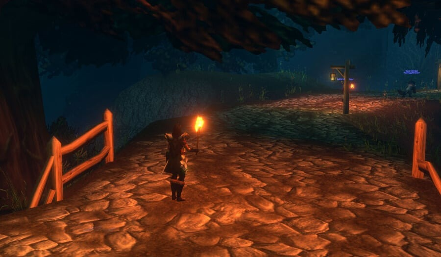
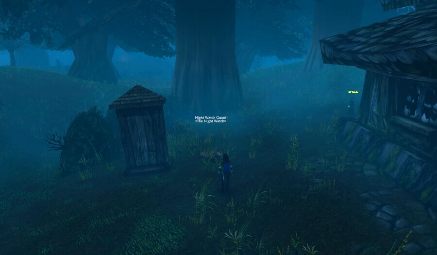

The [Night Watchman's Torch](https://www.wowhead.com/forever/item=280612/night-watchmans-torch) is a torch your character holds to light up the dark. The new lighting of WoW Forever makes some zones truly dark at night, and this item helps there. It comes from a dead guard in Duskwood who only appears at night. Players found it on the beta.

| | |
|---|---|
| Item | Night Watchman's Torch, unique, binds when picked up |
| Where | Duskwood, a dead Night Watch Guard |
| When | At night, best from 20:00 game time |
| Faction | Alliance and Horde |
| Light | 5 minutes, 30 second cooldown |

## What the torch does

Use it and your character holds a burning torch for 5 minutes. The light goes out as soon as you take any combat action, when you walk into water and inside the major cities. After that the item has a cooldown of 30 seconds.

Where it helps: Duskwood itself, Tirisfal Glades and Silverpine Forest at night, and Stranglethorn Vale in the early hours, when the forest floor turns black.

Druids can use the torch in their animal forms too. Since a beta update in October, Cat Form and Travel Form hold it in their mouth ([news](/news/druid-forms-carry-the-torch-in-their-mouth/)).

## How to get it

1. **Go to Duskwood at night.** The Night Watch Guard only appears at night; from 20:00 game time the odds are best.
2. **Look for the guard.** Start at Raven Hill, /way Duskwood 18.1 55.2, the spot where he turns up most often. The macro `/target Night Watch Guard` helps to find him in the dark.
3. **Take the quest.** A yellow exclamation mark hangs above the body. Accept the quest and complete it on the spot; the torch goes into your bags.

Several players can do the quest on the same guard. Once you have the torch, the quest disappears for you, but the guard stays in the world.

## Where the guard lies

He has no fixed spot. Players on the beta found him in these places:

| Place | Where |
|---|---|
| **Raven Hill** | Just south of the graveyard, /way 18.1 55.2, the most frequent spot |
| **Crossroads** | South of the Twilight Grove, where the roads meet |
| **South road** | On the road south to Stranglethorn Vale |
| **Northeast** | Between the Twilight Grove and Darkshire, north of the road |

## For the Horde

The Horde can get the torch too. Take the zeppelin from Orgrimmar to Grom'gol in Stranglethorn Vale and travel north into Duskwood.

## If you lose it

The torch is unique, so you carry only one. Whoever deletes it can go back to Duskwood and find the guard again for a new one.

The night spawn and the places come from players on the beta. Whether they stay the same until launch, is not known.
