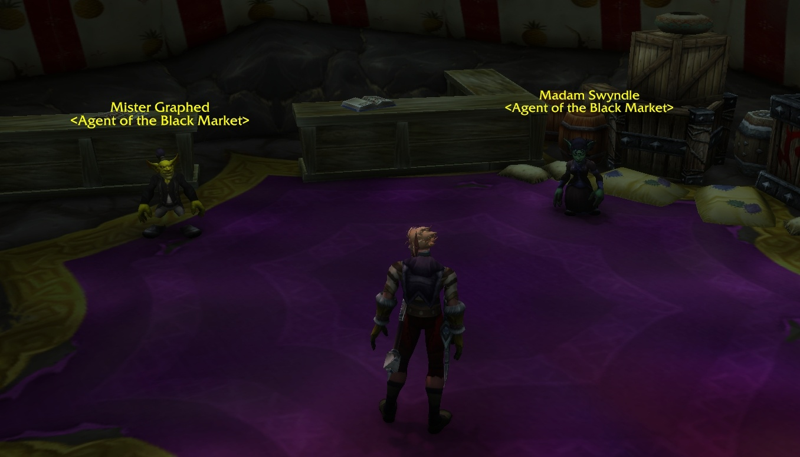
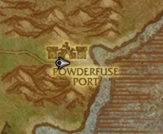

La Black Market Auction House, BMAH para abreviar, vende objetos raros por mucho oro. Apareció por primera vez en Mists of Pandaria, en el parche 5.0.4. WoW Forever la lleva al mundo antiguo, a la nueva zona The Riverglades, y Wowhead la encontró en la beta.

## Dónde encontrar la BMAH

| | Dónde |
|---|---|
| Zona | The Riverglades, niveles 30 a 45 |
| Lugar | Powderfuse Port, un pequeño puesto goblin junto al río |
| Coordenadas | /way 78.1 51.9 |
| No está en | Farholde Keep, la nueva fortaleza de la zona |

The Riverglades están al norte de Redridge Mountains. Un desvío de Redridge que antes no llevaba a ninguna parte ahora conduce allí, y un barco une la zona con Steamwheedle Port. La zona se describe en [la página de Forever](/es/forever/).

## Los dos agentes

| PNJ | Qué venden |
|---|---|
| [Madam Swyndle](https://www.wowhead.com/forever/npc=263326) | El Black Market en sí: equipo, mascotas y coleccionables |
| [Mister Graphed](https://www.wowhead.com/forever/npc=263384) | Componentes de artesanía y otros artículos |

Los dos son goblins de nivel 60 con el título Agent of the Black Market. Wowhead escribe que Forever tiene "aún más agentes" del Black Market, pero no dónde están los demás.

## Equipo: el Dungeon Set 1

La mayor parte de lo que ofrece Madam Swyndle es equipo del Dungeon Set 1, los sets azules de las mazmorras del Classic original. Cada pieza cuesta 100 de oro o más y es Binds when picked up. Estas cuatro piezas se encontraron en la beta.

<a class="wf-item__name wf-q3" href="https://www.wowhead.com/forever/item=16670">Boots of Elements</a>Item Level 59Binds when picked upFeetMail240 Armor+9 Agility+17 SpiritDurability 60 / 60Requires Level 54Equip: Increases damage and healing done by magical spells and effects by up to 14.The Elements (0/8)(2) Set: +8 All Resistances.(3) Set: Increases damage and healing done by magical spells and effects by up to 18.(4) Set: When struck in melee combat has a 5% chance of Disarming the attacker for 4 sec. Can only occur once every 60 sec. (Proc chance: 5%, 1m cooldown)(5) Set: Chance on melee autoattack and spellcast to increase your damage and healing done by magical spells and effects by up to 65 for 10 sec.(6) Set: Restores 8 mana per 5 sec.

<a class="wf-item__name wf-q3" href="https://www.wowhead.com/forever/item=16688">Magister's Robes</a>Item Level 63Binds when picked upChestCloth89 Armor+9 Stamina+28 Intellect+8 SpiritDurability 80 / 80Requires Level 58Equip: Increases damage and healing done by magical spells and effects by up to 11.Magister's Regalia (0/8)(2) Set: +8 All Resistances.(3) Set: Increases damage and healing done by magical spells and effects by up to 18.(4) Set: When struck in combat has a 2% chance of freezing the attacker in place for 3 sec. Can only occur once every 60 sec. (Proc chance: 2%, 1m cooldown)(5) Set: Your spellcasts have a 5% chance to energize you for 200 mana. (Proc chance: 5%)(6) Set: Restores 8 mana per 5 sec.

<a class="wf-item__name wf-q3" href="https://www.wowhead.com/forever/item=16701">Dreadmist Mantle</a>Item Level 60Binds when picked upShoulderCloth64 Armor+14 Stamina+15 IntellectDurability 50 / 50Requires Level 55Equip: Increases damage and healing done by magical spells and effects by up to 10.Dreadmist Raiment (0/8)(2) Set: +8 All Resistances.(3) Set: Increases damage and healing done by magical spells and effects by up to 18.(4) Set: When struck in combat has a 2% chance of causing the attacker to flee in terror for 2 sec. Can only occur once every 60 sec. (Proc chance: 2%, 1m cooldown)(5) Set: Your spellcasts have a 5% chance to heal you for 270 to 330. (Proc chance: 5%)(6) Set: Restores 8 mana per 5 sec.

<a class="wf-item__name wf-q3" href="https://www.wowhead.com/forever/item=16686">Magister's Crown</a>Item Level 62Binds when picked upHeadCloth71 Armor+10 Stamina+30 IntellectDurability 50 / 50Requires Level 57Equip: Increases damage and healing done by magical spells and effects by up to 10.Magister's Regalia (0/8)(2) Set: +8 All Resistances.(3) Set: Increases damage and healing done by magical spells and effects by up to 18.(4) Set: When struck in combat has a 2% chance of freezing the attacker in place for 3 sec. Can only occur once every 60 sec. (Proc chance: 2%, 1m cooldown)(5) Set: Your spellcasts have a 5% chance to energize you for 200 mana. (Proc chance: 5%)(6) Set: Restores 8 mana per 5 sec.

### En qué se diferencian los sets de Classic

Los nombres de los sets se quedaron, las bonificaciones cambiaron. Esto sale de los tooltips de Wowhead para Forever y para Classic Era.

| Piezas | Classic Era | WoW Forever |
|---|---|---|
| cada pieza | sin spell power propio | 10 a 14 de spell power |
| 2 | +200 Armor | +8 All Resistances |
| 3 | nada | hasta 18 de spell power |
| 4 | hasta 23 de spell power | un efecto al recibir un golpe, 2% o 5% de probabilidad, 1 min de reutilización |
| 5 | nada | un efecto al lanzar hechizos |
| 6 | un efecto del set | 8 de maná cada 5 s |
| 8 | +8 All Resistances | ya no es una bonificación |

Los efectos por set en Forever:

| Set | 4 piezas | 5 piezas |
|---|---|---|
| Magister's Regalia | 2% de probabilidad de congelar al atacante 3 s | 5% de probabilidad al lanzar hechizos de recuperar 200 de maná |
| Dreadmist Raiment | 2% de probabilidad de hacer huir al atacante 2 s | 5% de probabilidad al lanzar hechizos de curar entre 270 y 330 |
| The Elements | 5% de probabilidad de desarmar a un atacante cuerpo a cuerpo 4 s | probabilidad de ganar hasta 65 de spell power durante 10 s |

Algunas stats bajaron para compensarlo. Magister's Robes tiene 28 de Intellect en lugar de 31. Dreadmist Mantle perdió sus 9 de Spirit, y Magister's Crown 5 de Spirit y 1 de Stamina. Boots of Elements mantuvo sus stats.

## Mascotas

<a class="wf-item__name wf-q1" href="https://www.wowhead.com/forever/item=11474">Sprite Darter Egg</a>Item Level 47Use: Right Click to summon and dismiss your sprite darter hatchling.

<a class="wf-item__name wf-q1" href="https://www.wowhead.com/forever/item=23713">Hippogryph Hatchling</a>Item Level 1Use: Right Click to summon and dismiss your hippogryph hatchling.

<a class="wf-item__name wf-q1" href="https://www.wowhead.com/forever/item=249897">Flowery Lashling Bud</a>Item Level 50Binds when usedUse: Right Click to summon and dismiss a lashling.

<a class="wf-item__name wf-q1" href="https://www.wowhead.com/forever/item=249898">Wilted Lashling Bud</a>Item Level 50Binds when usedUse: Right Click to summon and dismiss a lashling.

En el juego original, el Hippogryph Hatchling venía de una carta de botín del World of Warcraft Trading Card Game. El Flowery Lashling Bud y el Wilted Lashling Bud son objetos nuevos que invocan un lashling.

Las cuatro tienen página en la [guía de mascotas](/es/guides/pets/): el [Sprite Darter Hatchling](/es/guides/pets/sprite-darter-hatchling/), el [Hippogryph Hatchling](/es/guides/pets/hippogryph-hatchling/), el [Flowery Lashling](/es/guides/pets/flowery-lashling/) y el [Wilted Lashling](/es/guides/pets/wilted-lashling/).

## Tabardo y juguete

<a class="wf-item__name wf-q4" href="https://www.wowhead.com/forever/item=23705">Tabard of Flame</a>Item Level 1Binds when picked upUniqueTabard

<a class="wf-item__name wf-q1" href="https://www.wowhead.com/forever/item=23716">Carved Ogre Idol</a>Item Level 1Binds when picked upUniqueTrinketUse: Become a hulking purple ogre for 10 min! (1 Hour Cooldown)

Esos dos también vienen de cartas de botín del juego de cartas. El Carved Ogre Idol convierte a un jugador en un enorme ogro morado durante 10 minutos, con una hora de reutilización.

## Lo que aún no se sabe

- Si los jugadores pujan como en el Black Market de retail o pagan un precio fijo.
- Cada cuánto cambia el surtido y si aparecen otras piezas del Dungeon Set 1 o monturas.
- Dónde están los demás agentes del Black Market.
- Qué vende exactamente Mister Graphed.
- Si los precios se mantienen en el lanzamiento del 4 de noviembre.

La noticia sobre el Black Market está en la publicación [El Black Market vende el Dungeon Set 1 desde 100 de oro](/es/news/black-market-sells-dungeon-set-1-from-100-gold/).
