El Excavation Site es una de las mazmorras nuevas de WoW Forever. La Explorers' League encontró ruinas titánicas al sureste de Whelgar's Excavation Site, en los Wetlands, y montó allí un campamento nuevo. Raptores y un guardián titán cierran el paso. Dentro esperan cuatro jefes y doce misiones.

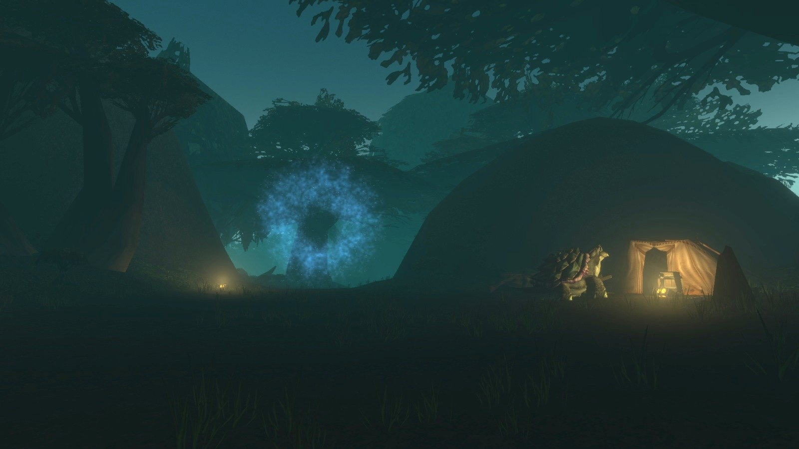

## De un vistazo

| | |
|---|---|
| Niveles | 26-31 según Blizzard |
| Entrada | Los Wetlands, en una colina al sureste de Whelgar's Excavation Site |
| Jefes | 4: Saltspine, Shadetooth, Highland Horror, Relic Guardian |
| Misiones | 4 para la Horde, 8 para la Alliance, todas desde el nivel 24 |
| Botín | Objetos azules nuevos, el Titan Relic para dos cadenas |
| Nuevo en Forever | Toda la mazmorra |

La beta de WoW Forever llega al nivel 30 desde el 1 de octubre. Wowhead actualiza su guía a medida que los probadores hacen la mazmorra, así que los detalles aún pueden cambiar.

## Cómo llegar

Caminos nuevos suben la colina hasta la entrada; en Classic no se podía llegar a esta parte de los Wetlands.

**Alliance.** Menethil Harbor está cerca y ahora tiene un barco a Stormwind vía Auberdine. También se puede ir a pie por Loch Modan.

**Horde.** Un camino más largo a pie por Hillsbrad Foothills y las Arathi Highlands. Coge los puntos de vuelo de Tarren Mill y Hammerfall por el camino.

## Las misiones

### Horde

| Misión | Dónde empieza | Nivel | Recompensa |
|---|---|---|---|
| <a href="https://www.wowhead.com/forever/quest=95697">Changing Tastes</a> | Orgrimmar, The Drag: Borstan, el Meat Vendor /way 57.3 53.3 | 24 | 5 <a class="wf-wh wf-q1" href="https://www.wowhead.com/forever/item=250077">Twice-Spiced Raptor Slice</a>, <a class="wf-wh wf-q1" href="https://www.wowhead.com/forever/item=250185">Recipe: Twice-Spiced Raptor Slice</a> y <a class="wf-wh wf-q3" href="https://www.wowhead.com/forever/item=280766">Satchel of Potions</a> 3.150 de experiencia |
| <a href="https://www.wowhead.com/forever/quest=95682">Open the Maw</a> | Los Wetlands: <a class="wf-wh wf-plain" href="https://www.wowhead.com/forever/npc=13155">Deathstalker Agent</a>, detrás de una pequeña colina /way 51.4 59.2 <em>Dragonmaw Rumors, de Zaruk en Hammerfall, Arathi Highlands /way 74.4 35.6, lleva hasta ella.</em> | 24 | <a class="wf-wh wf-q1" href="https://www.wowhead.com/forever/item=271745">Bloody Map</a>, además de <a class="wf-wh wf-q3" href="https://www.wowhead.com/forever/item=271732">Dirt-Heavy Bracers</a> o <a class="wf-wh wf-q3" href="https://www.wowhead.com/forever/item=271740">Knife-Polishing Rag</a> 3.150 de experiencia |
| <a href="https://www.wowhead.com/forever/quest=95664">Elder Knowledge</a> | Dentro de la mazmorra: <a class="wf-wh wf-q1" href="https://www.wowhead.com/forever/item=270866">Titan Relic</a>, que suelta Relic Guardian | 24 | 630 de experiencia |
| <a href="https://www.wowhead.com/forever/quest=98823">Earthen Echo</a> | Sigue a Elder Knowledge | 24 | <a class="wf-wh wf-q3" href="https://www.wowhead.com/forever/item=271719">Furs of the Earthen Ring</a>, <a class="wf-wh wf-q3" href="https://www.wowhead.com/forever/item=271766">Heavehammer</a> o <a class="wf-wh wf-q3" href="https://www.wowhead.com/forever/item=271767">Healer's Staff</a> 3.150 de experiencia |

#### Changing Tastes

Borstan vende carne en el piso de arriba de The Drag, en Orgrimmar, en la misma choza que Zamja, la instructora de Cooking. Quiere 4 <a class="wf-wh wf-q1" href="https://www.wowhead.com/forever/item=271100">Thicket Raptor Meat</a>. Cae de los raptores del Stalker's Thicket, detrás del primer jefe: Thicket Hunters, Thicket Lurkers y Thicket Stalkers. Lleva la carne de vuelta después de la mazmorra.

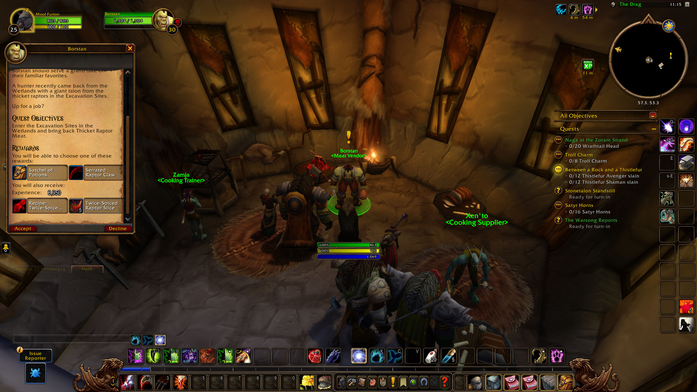

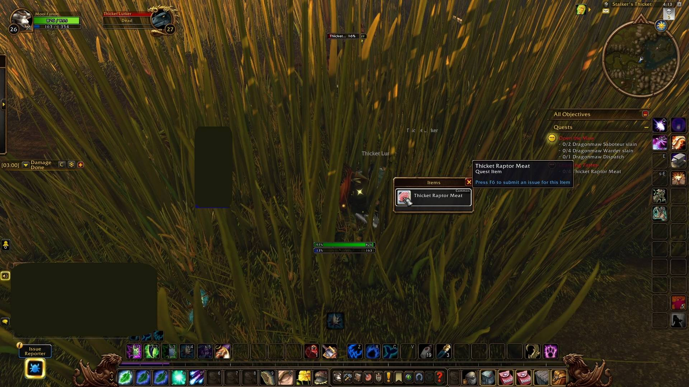

#### Open the Maw

Esta misión pide pasar antes por Hammerfall, que de todos modos queda de camino a los Wetlands. Zaruk da Dragonmaw Rumors, que te manda a la Deathstalker Agent cerca de la mazmorra. Ella se esconde detrás de una pequeña colina y da Open the Maw. Dentro, mata a 2 Dragonmaw Saboteurs y 4 Dragonmaw Warders, y despoja el <a class="wf-wh wf-q1" href="https://www.wowhead.com/forever/item=284844">Dragonmaw Dispatch</a> de un Dragonmaw Thaumaturgist. Cae el 31 % de las veces según su descripción emergente.

Entrega la misión a la Deathstalker Agent al salir. Además de la recompensa normal recibes el <a class="wf-wh wf-q1" href="https://www.wowhead.com/forever/item=271745">Bloody Map</a>, un mapa ligado con texto en Dwarvish y un lugar marcado con una X. Para qué sirve el mapa aún no se sabe.

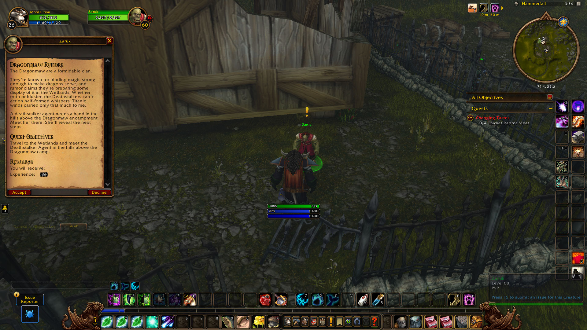

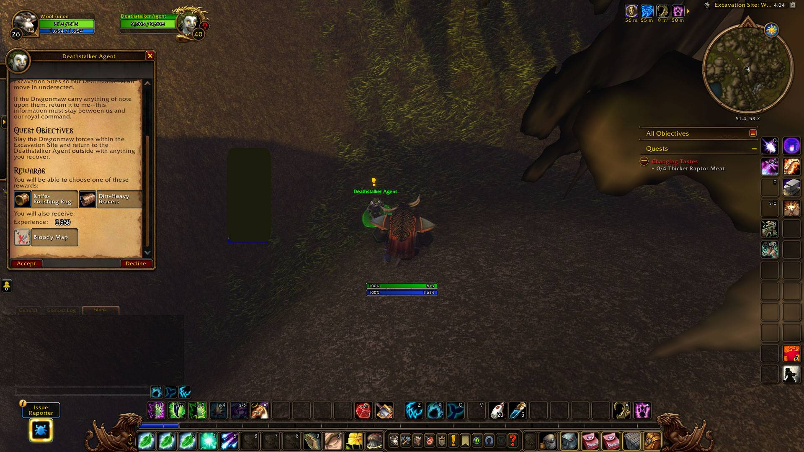

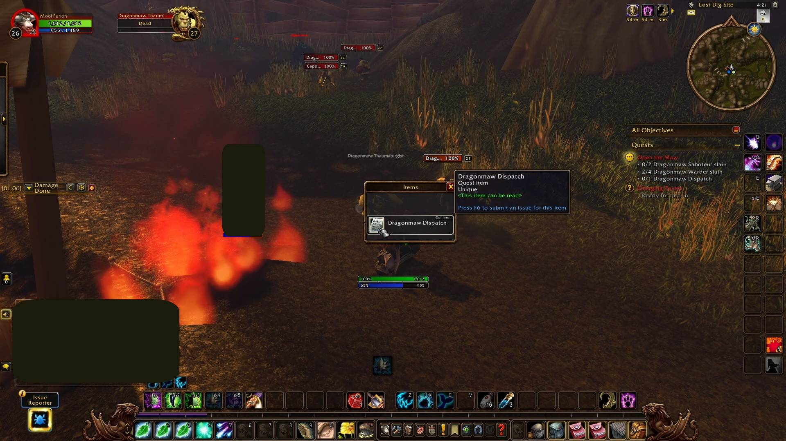

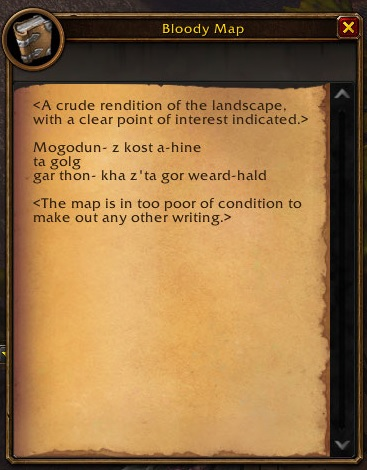

#### Elder Knowledge y Earthen Echo

La versión de la Horde del <a class="wf-wh wf-q1" href="https://www.wowhead.com/forever/item=270866">Titan Relic</a> cae de Relic Guardian, el 25 % de las veces según su descripción emergente. Inicia Elder Knowledge, que te manda a Bashana Runetotem, en una tienda del Elder Rise de Thunder Bluff, /way 70.8 33.7. Ella da después Earthen Echo: lleva la reliquia a Muln Earthfury, en el Skywatcher Plateau de Mulgore.

El Skywatcher Plateau es nuevo en Forever y une Thunder Bluff con Zephras Isle, la isla de los Skyborne. Sal de Thunder Bluff por el norte y sigue hacia el norte hasta que un camino sube a las montañas hacia /way 40.3 17.6. Muln Earthfury está en la tienda más grande de la meseta, /way 33.4 22.5.

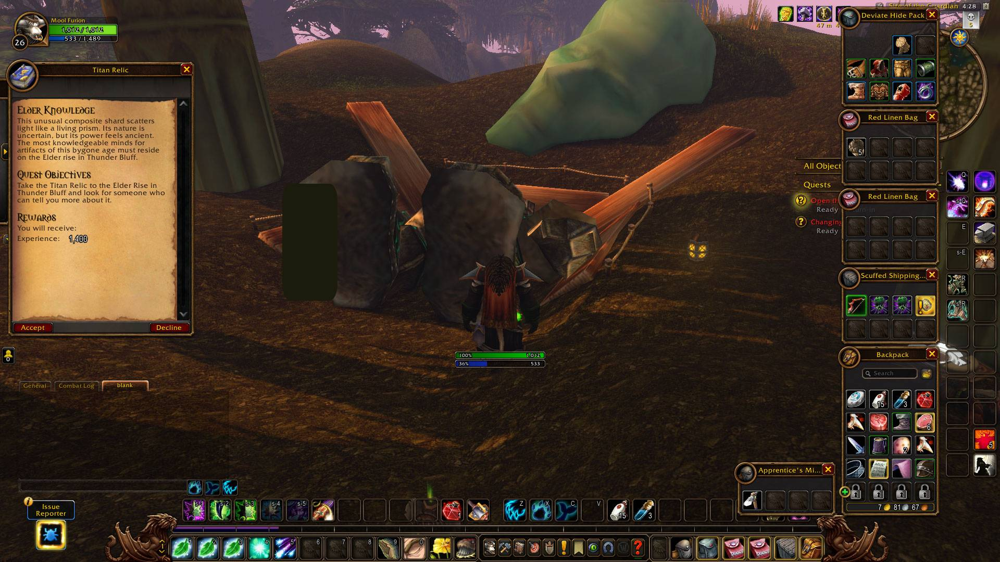

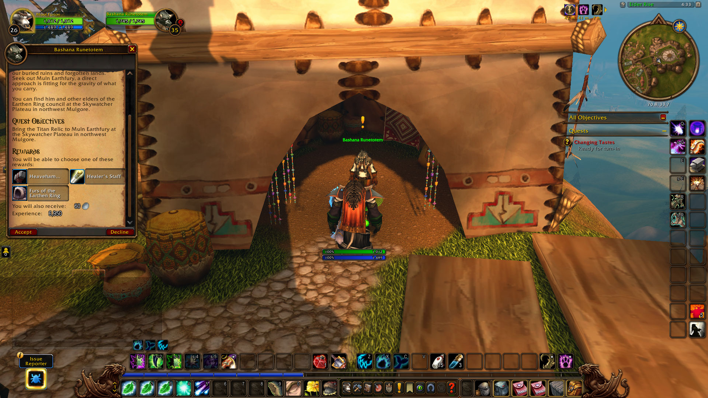

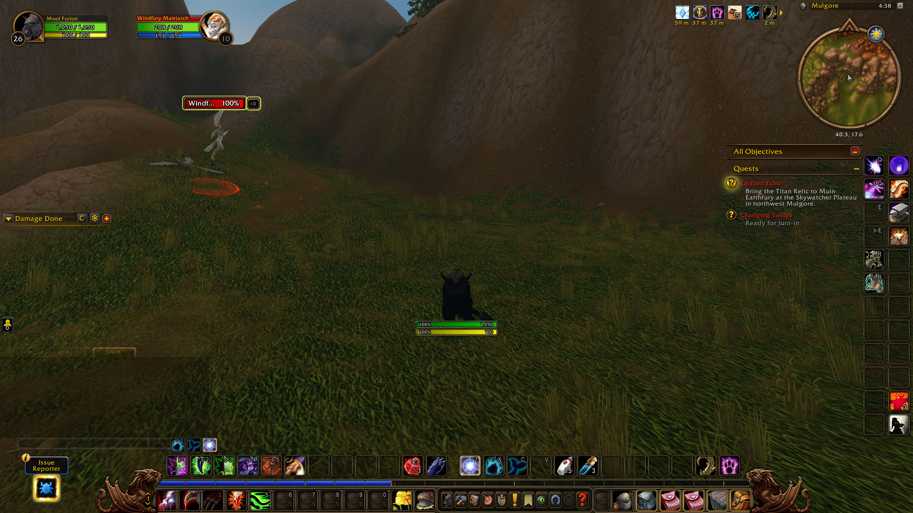

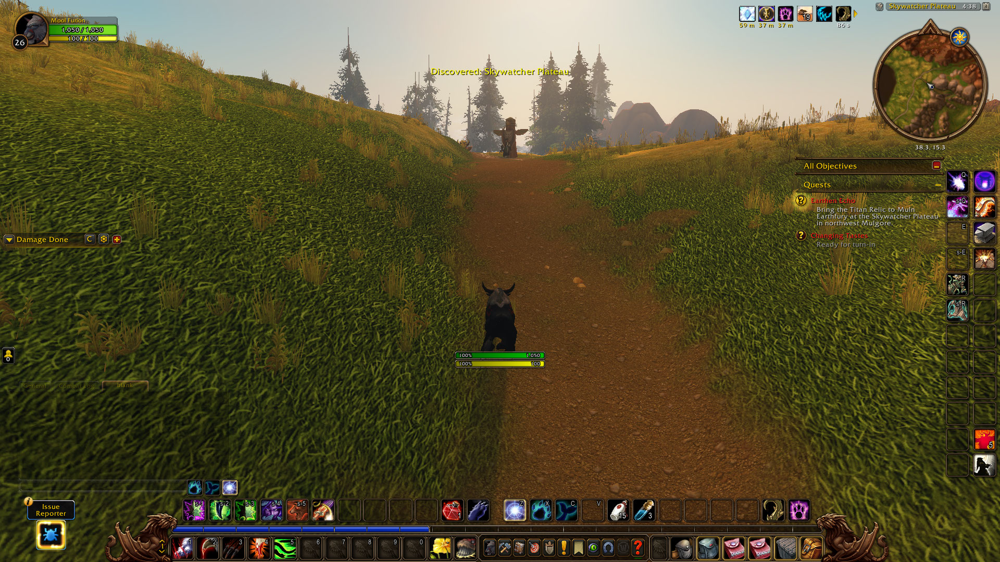

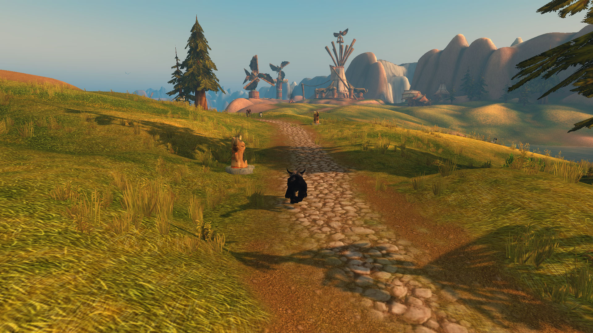

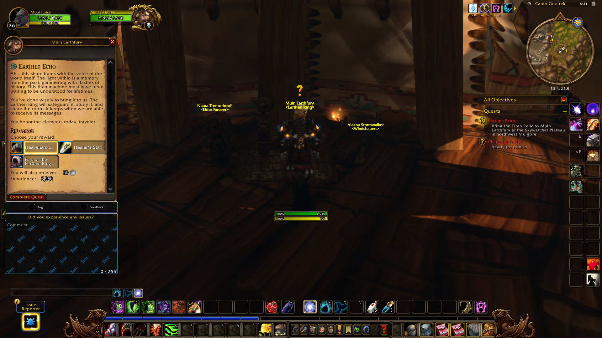

### Alliance

| Misión | Dónde empieza | Nivel | Recompensa |
|---|---|---|---|
| <a href="https://www.wowhead.com/forever/quest=95772">Songblade Search</a> | Redridge Mountains, Lakeshire: Dorin Songblade /way 25.6 46.6 | 24 | 3.150 de experiencia |
| <a href="https://www.wowhead.com/forever/quest=95795">Fallen in the Fen</a> | Dentro de la mazmorra: el cuerpo de Daewyn | 24 | <a class="wf-wh wf-q3" href="https://www.wowhead.com/forever/item=271769">Daewyn's Girdle</a> 3.150 de experiencia |
| <a href="https://www.wowhead.com/forever/quest=95647">Lost in the Thicket Things</a> | Los Wetlands, Menethil Harbor: Caitlin Grassman /way 11.9 58.8 <em><a href="https://www.wowhead.com/forever/quest=95737">Seeking Caitlin</a>, de Llana en Astranaar, Ashenvale /way 35.0 48.5, lleva hasta ella.</em> | 24 | 2.500 de experiencia |
| <a href="https://www.wowhead.com/forever/quest=95809">Heartwoven</a> | Sigue a Lost in the Thicket Things | 24 | <a class="wf-wh wf-q1" href="https://www.wowhead.com/forever/item=2459">Swiftness Potion</a> y <a class="wf-wh wf-q3" href="https://www.wowhead.com/forever/item=280766">Satchel of Potions</a>, además de 4 <a class="wf-wh wf-q1" href="https://www.wowhead.com/forever/item=1710">Greater Healing Potion</a> o 4 <a class="wf-wh wf-q1" href="https://www.wowhead.com/forever/item=3827">Mana Potion</a> 3.150 de experiencia |
| <a href="https://www.wowhead.com/forever/quest=98815">Highland Hides</a> | Los Wetlands, Menethil Harbor: James Halloran /way 8.6 55.7 <em>Completa antes <a href="https://www.wowhead.com/forever/quest=484">Young Crocolisk Skins</a>.</em> | 24 | 1.150 de experiencia, 50 de reputación con Stormwind |
| <a href="https://www.wowhead.com/forever/quest=95646">Horrors in the Highland</a> | Los Wetlands: Rethiel the Greenwarden /way 56.3 40.3 <em>Completa antes <a href="https://www.wowhead.com/forever/quest=276">Tramping Paws</a>, <a href="https://www.wowhead.com/forever/quest=277">Fire Taboo</a> y <a href="https://www.wowhead.com/forever/quest=275">Blisters on the Land</a>.</em> | 24 | <a class="wf-wh wf-q3" href="https://www.wowhead.com/forever/item=271664">Hornbeam Heft</a>, <a class="wf-wh wf-q3" href="https://www.wowhead.com/forever/item=271667">Ironwood Destroyer</a> o <a class="wf-wh wf-q3" href="https://www.wowhead.com/forever/item=271670">Curl of Life</a> 3.150 de experiencia |
| <a href="https://www.wowhead.com/forever/quest=95810">Lost Relic Carry</a> | Dentro de la mazmorra: <a class="wf-wh wf-q1" href="https://www.wowhead.com/forever/item=270865">Titan Relic</a>, que suelta Relic Guardian | 24 | 630 de experiencia |
| <a href="https://www.wowhead.com/forever/quest=98824">Prehistoric Prism</a> | Sigue a Lost Relic Carry | 24 | <a class="wf-wh wf-q3" href="https://www.wowhead.com/forever/item=271716">Explorer's League Dustcover</a>, <a class="wf-wh wf-q3" href="https://www.wowhead.com/forever/item=271766">Heavehammer</a> o <a class="wf-wh wf-q3" href="https://www.wowhead.com/forever/item=271767">Healer's Staff</a> 3.150 de experiencia |

#### Songblade Search y Fallen in the Fen

Dorin Songblade, el Armorer de Lakeshire, quiere que busques a su hermano Daewyn en lo que él llama Whelgar's Excavation Site. Se refiere a la mazmorra, no a la zona del mismo nombre en los Wetlands. Daewyn yace muerto en una tienda del campamento de los Dragonmaw, poco después de Shadetooth. Haz clic en su cuerpo para completar la misión y recoger Fallen in the Fen, que entregas a Dorin después de la mazmorra.

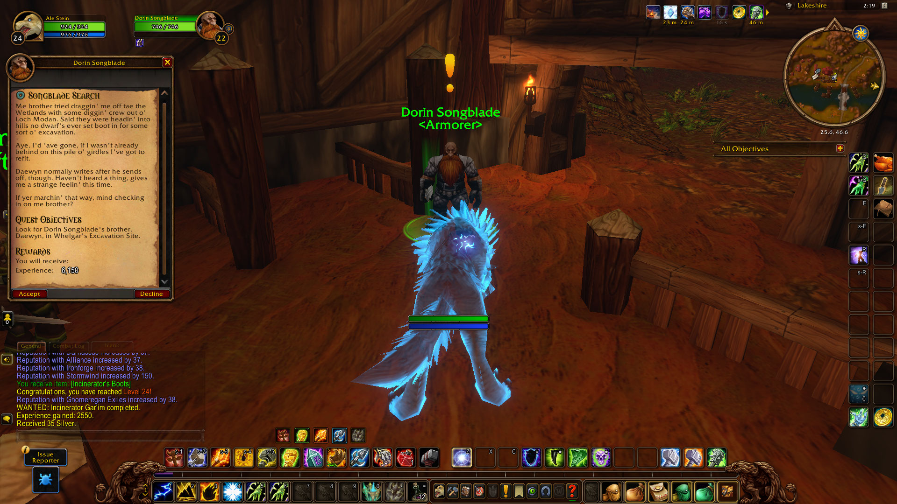

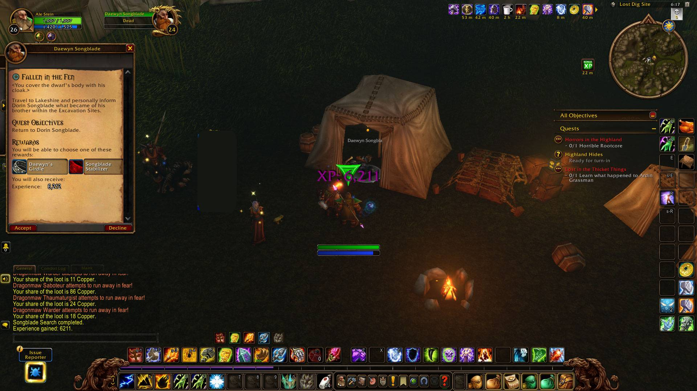

#### Lost in the Thicket Things y Heartwoven

Caitlin Grassman vive en una casa de Menethil Harbor y te pide que busques a su marido Ardin en la mazmorra. Para algo de experiencia extra, recoge antes Seeking Caitlin de Llana, la vendedora de componentes de Astranaar. Ardin está sobre una estructura de madera cerca del Site of the Guardian, la arena del último jefe. Entrégale la misión; después te da Heartwoven, que solo pide volver a ver a Caitlin.

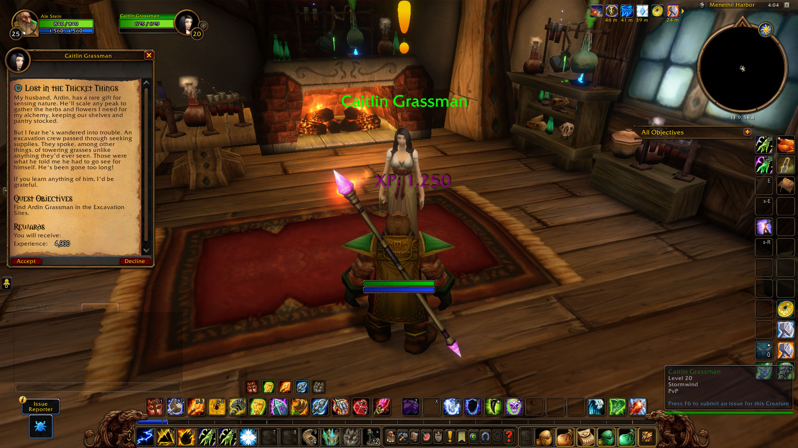

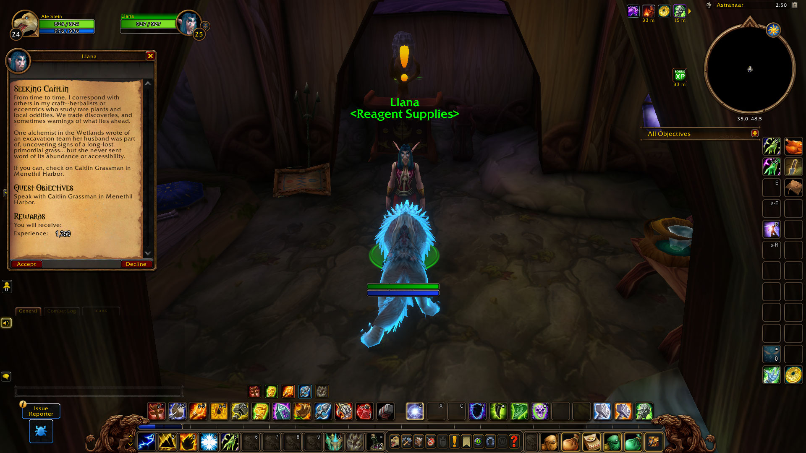

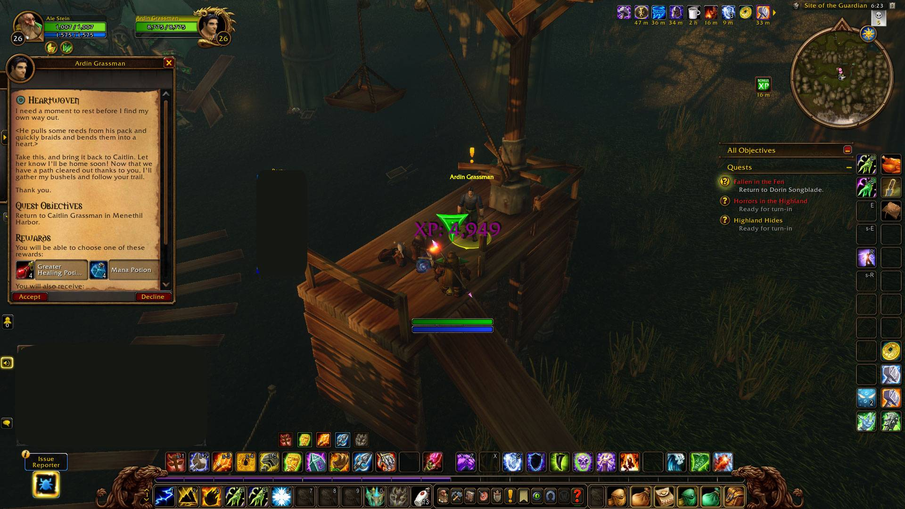

#### Highland Hides

James Halloran, en Menethil Harbor, tiene una pequeña cadena sobre pieles de crocolisco. Después de Young Crocolisk Skins quiere 4 <a class="wf-wh wf-q1" href="https://www.wowhead.com/forever/item=284845">Thicket Raptor Hide</a> de los raptores del Stalker's Thicket alrededor de Shadetooth: Thicket Hunters, Thicket Lurkers y Thicket Matriarchs.

En la beta esta misión tiene un fallo por ahora. No cuenta como misión de mazmorra y solo da algo de experiencia y unas pocas monedas de plata.

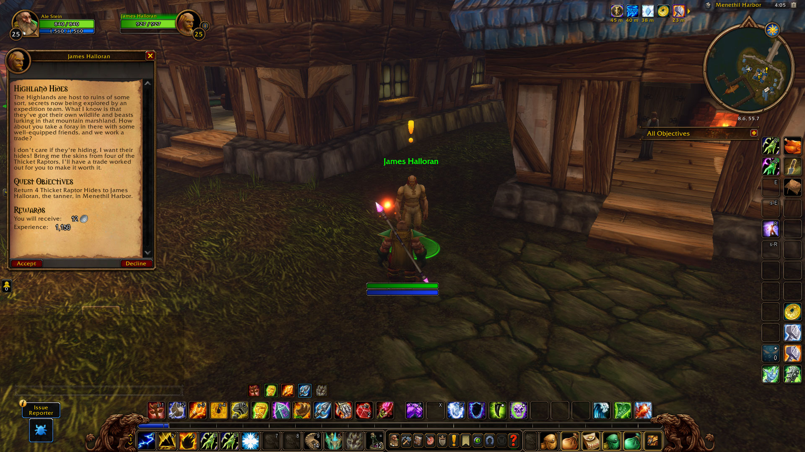

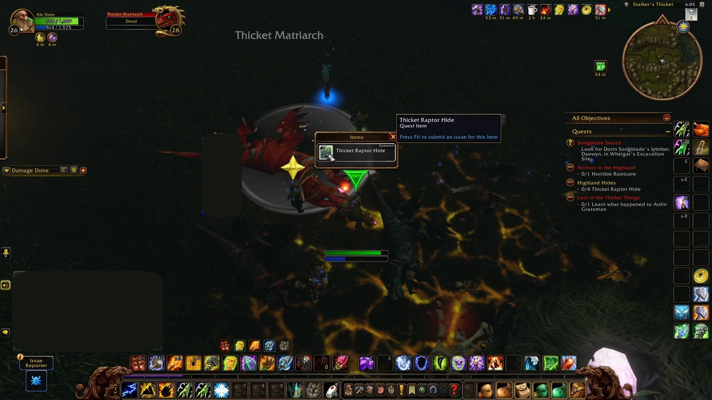

#### Horrors in the Highland

Rethiel the Greenwarden, un elemental de musgo en el centro de los Wetlands, solo da esta misión después de otras tres:

1. **Tramping Paws.** Mata a 15 Mosshide Gnolls y 10 Mosshide Mongrels en el sur de los Wetlands, a lo largo del río central.
2. **Fire Taboo.** Lleva 9 <a class="wf-wh wf-q1" href="https://www.wowhead.com/forever/item=2611">Crude Flint</a>. Caen de los gnolls más fuertes del centro de la zona, Mosshide Brutes, Trappers, Fenrunners, Mistweavers y Alphas, pero no a menudo.
3. **Blisters on the Land.** Mata a 12 Fen Creepers. Van en sigilo y se quedan junto a los ríos y charcas de los Wetlands, así que atento al sonido del sigilo.

Luego llega Horrors in the Highland: mata a Highland Horror, el tercer jefe de la mazmorra, y lleva el <a class="wf-wh wf-q1" href="https://www.wowhead.com/forever/item=270180">Horrible Rootcore</a> a Rethiel. Cae el 60 % de las veces según su descripción emergente.

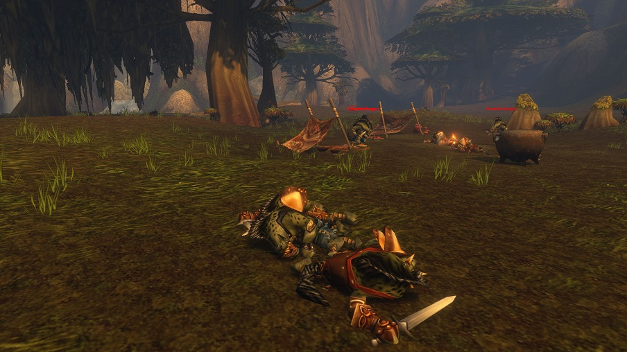

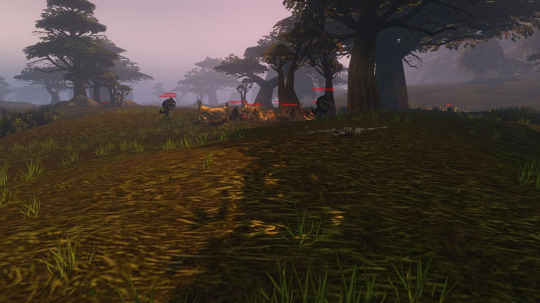

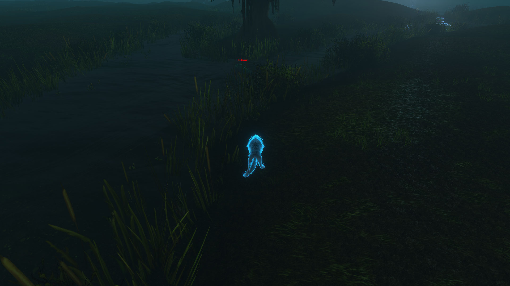

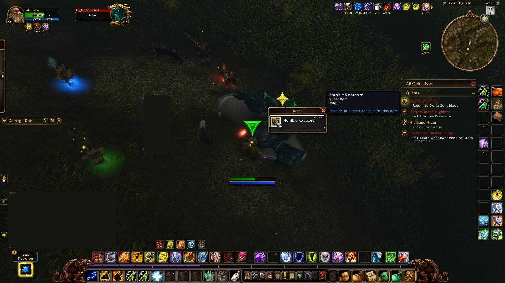

#### Lost Relic Carry y Prehistoric Prism

Despoja los restos de Relic Guardian para conseguir la versión de la Alliance del <a class="wf-wh wf-q1" href="https://www.wowhead.com/forever/item=270865">Titan Relic</a>, que cae el 28 % de las veces según su descripción emergente, y úsalo para iniciar Lost Relic Carry. Llévalo a Prospector Whelgar, en una cueva de Whelgar's Excavation Site, la excavación junto a Menethil Harbor, /way 38.8 52.3. Él da Prehistoric Prism, que te manda a High Explorer Magellas en el Hall of Explorers de Ironforge, /way 69.4 19.1.

En la beta Prehistoric Prism no se puede completar por ahora. Whelgar da la misión, pero no el objeto que pide Magellas.

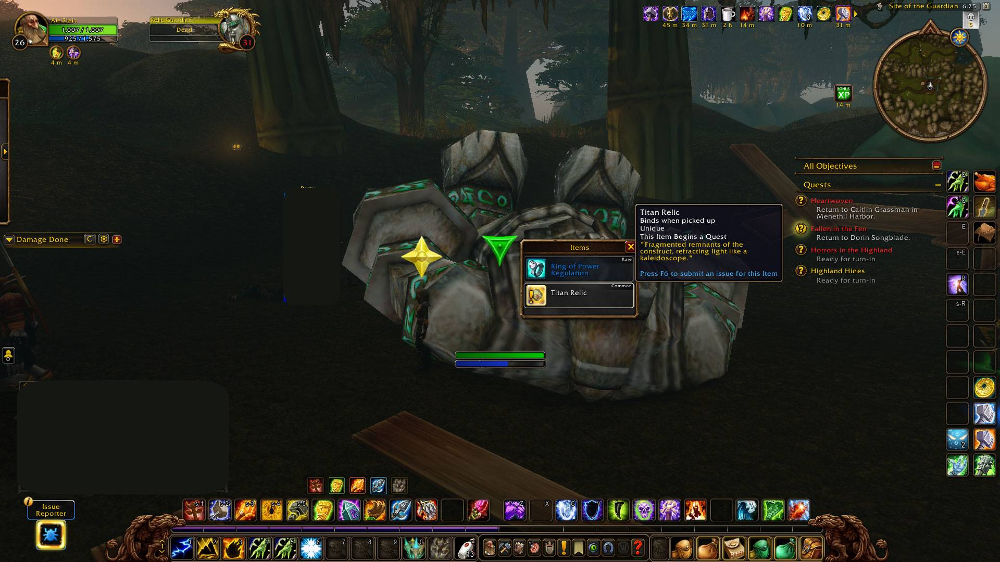

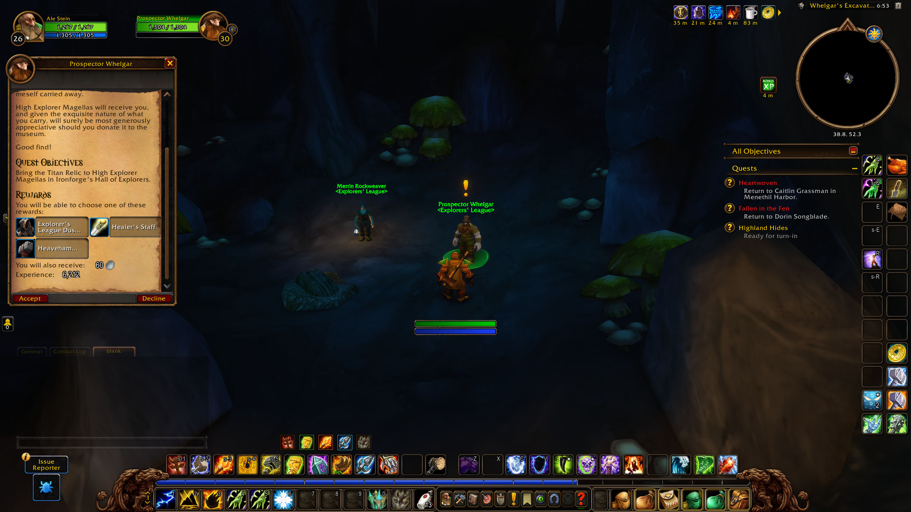

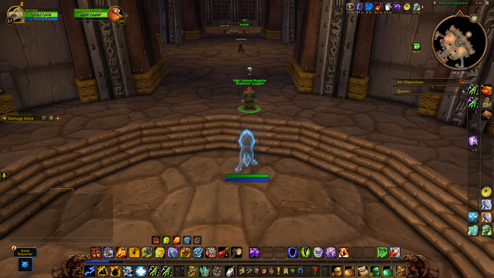

El nivel es el más bajo con el que se puede recoger la misión, según Wowhead. Las recompensas salen de los datos de misiones de la beta y aún pueden cambiar.

## La hierba alta

La parte más peligrosa de la mazmorra es la zona antes de Saltspine y Shadetooth. Los **Thicket Lurkers** no esperan en sigilo: aparecen cuando caminas bastante tiempo por la hierba alta. Las **Thicket Matriarchs** llaman a Lurkers en su ayuda cuando les baja la salud.

Quédate en el camino estrecho, fuera de la hierba, y lucha en zonas abiertas. Si hay una Matriarch en un grupo, mata primero a los demás monstruos, para que queden los menos posibles cuando lleguen los Lurkers.

## Los jefes y su botín

El botín de cada jefe viene de Wowhead.

### Saltspine

Un combate sencillo una vez limpia la zona de alrededor. <a class="wf-wh wf-spell" href="https://www.wowhead.com/forever/spell=3604">Tendon Rip</a> ralentiza mucho al tanque, y <a class="wf-wh wf-spell" href="https://www.wowhead.com/forever/spell=1316382">Dust Storm</a> reduce un 25% la probabilidad de golpear de todos en 10 metros, así que los lanzadores mantienen la distancia.

| Objeto | Ranura |
|---|---|
| <a class="wf-wh wf-q3" href="https://www.wowhead.com/forever/item=273024">Glinteye Slippers</a> | Pies de tela: Stamina, Intellect y Spirit |
| <a class="wf-wh wf-q3" href="https://www.wowhead.com/forever/item=273023">Saltscale Girdle</a> | Cinturón de malla: Strength y Stamina |
| <a class="wf-wh wf-q3" href="https://www.wowhead.com/forever/item=273022">Supple Bellyskin Leggings</a> | Piernas de cuero: Strength y Stamina |

### Shadetooth

Un combate implacable con dos Thicket Hunters a su lado. Su Infected Wound hay que disiparlo rápido. Controla a los dos adds todo el combate, o a uno mientras matas al otro. Shadetooth usa Rend y Terrifying Roar, un miedo de 5 segundos que no se puede disipar y que manda fácilmente a los jugadores a la hierba. Al 30% de salud se enfurece; se le puede ralentizar y aturdir.

Limpia primero la cala de los cocodrilos a la izquierda y lucha allí. Los Thicket Hunters no saben nadar, pero no lleves el combate a la zona del primer jefe o se reinicia.

| Objeto | Ranura |
|---|---|
| <a class="wf-wh wf-q3" href="https://www.wowhead.com/forever/item=273025">Raptorclaw Greaves</a> | Pies de malla: Strength, Stamina e Intellect |
| <a class="wf-wh wf-q3" href="https://www.wowhead.com/forever/item=273027">Raptor's Gaze</a> | Mano izquierda: Stamina, Intellect y hasta 5 de daño y sanación con hechizos |

### Highland Horror

El tercer jefe está entre Shadetooth y Relic Guardian. Los jugadores de la Alliance lo necesitan para Horrors in the Highland: suelta el Horrible Rootcore. Sus habilidades y su botín aún no se conocen.

### Relic Guardian

Empieza el combate con el Archival Panel a la derecha del guardián inactivo. Relic Guardian pone a prueba el equipo y el nivel: mucha salud y golpes fuertes al tanque. Thunderclap ralentiza a todos en 10 metros; el tanque sale despedido de vez en cuando y a veces queda aturdido 5 segundos. El guardián se puede aturdir y ralentizar.

| Objeto | Ranura |
|---|---|
| <a class="wf-wh wf-q3" href="https://www.wowhead.com/forever/item=273030">Ring of Power Regulation</a> | Anillo: Stamina y 2 de maná cada 5 segundos |
| <a class="wf-wh wf-q3" href="https://www.wowhead.com/forever/item=273029">Golemsight Long Gun</a> | Arma de fuego: Agility |
| <a class="wf-wh wf-q3" href="https://www.wowhead.com/forever/item=273028">Reliquary Mantle</a> | Hombros de malla: Stamina y Spirit |
| <a class="wf-wh wf-q1" href="https://www.wowhead.com/forever/item=270865">Titan Relic</a> | Alliance: inicia Lost Relic Carry |
| <a class="wf-wh wf-q1" href="https://www.wowhead.com/forever/item=270866">Titan Relic</a> | Horde: inicia Elder Knowledge |

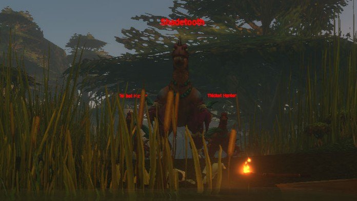

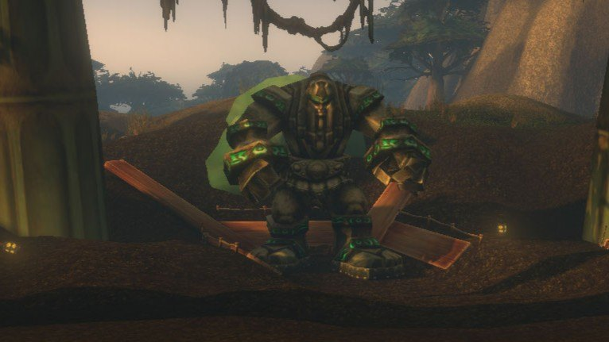

## Lo que aún no se sabe

- **Highland Horror**: sus habilidades y su botín.
- **A dónde lleva el Bloody Map**, la recompensa de Open the Maw.
- **Cuándo se arreglan Highland Hides y Prehistoric Prism**: las dos fallan en la beta.
- **La probabilidad de botín** de cada jefe, salvo la del Titan Relic.
- **Los cambios cuando suba el límite de nivel de la beta**: Wowhead mantiene su guía al día.
