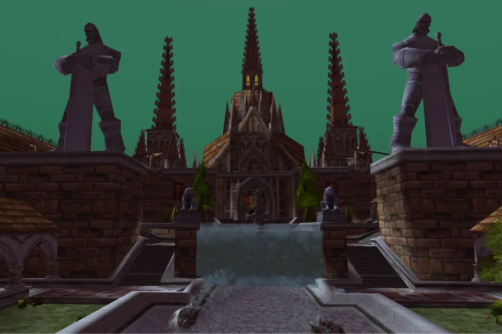

Scarlet Monastery es el bastión de la Scarlet Crusade en Tirisfal Glades, una mazmorra de cuatro alas: el Graveyard, la Library, la Armory y la Cathedral. En WoW Forever varios objetos se han renovado, y el set Chain of the Scarlet Crusade gana bonificaciones nuevas. Esta guía reúne lo que se sabe hasta ahora.

## De un vistazo

| | |
|---|---|
| Niveles | 26-45, jefes de nivel 32 a 42 |
| Entrada | El Scarlet Monastery, en el noreste de Tirisfal Glades |
| Alas | 4: Graveyard, Library, Armory, Cathedral |
| Jefes | 10, de ellos 3 raros en el Graveyard |
| Misiones | 8 |
| Llave | The Scarlet Key para la Armory y la Cathedral |

La beta de WoW Forever llega al nivel 30 desde el 1 de octubre. Los testers completan el Graveyard y la Library; la Armory y la Cathedral están por encima de ese límite, y lo que cae allí en Forever aún no está confirmado.

## Las cuatro alas

| Ala | Jefes | Nivel de los jefes |
|---|---|---|
El botín de los otros dos raros viene de Wowhead, con las estadísticas de los archivos de la beta.

**<a class="wf-wh wf-plain" href="https://www.wowhead.com/forever/npc=6488">Fallen Champion</a>**

| Objeto | Nuevo en Forever |
|---|---|
| <a class="wf-wh wf-q3" href="https://www.wowhead.com/forever/item=7691">Embalmed Shroud</a> | Hasta 24 de sanación en vez de Intellect |
| <a class="wf-wh wf-q3" href="https://www.wowhead.com/forever/item=7690">Ebon Vise</a> | Sin cambios |
| <a class="wf-wh wf-q3" href="https://www.wowhead.com/forever/item=7689">Morbid Dawn</a> | Sin cambios |

**<a class="wf-wh wf-plain" href="https://www.wowhead.com/forever/npc=6489">Ironspine</a>**

| Objeto | Nuevo en Forever |
|---|---|
| <a class="wf-wh wf-q3" href="https://www.wowhead.com/forever/item=7688">Ironspine's Ribcage</a> | Sin cambios |
| <a class="wf-wh wf-q3" href="https://www.wowhead.com/forever/item=7686">Ironspine's Eye</a> | Sin cambios, ahora único equipado |
| <a class="wf-wh wf-q3" href="https://www.wowhead.com/forever/item=7687">Ironspine's Fist</a> | Sin cambios |
| Library | <a class="wf-wh wf-plain" href="https://www.wowhead.com/forever/npc=3974">Houndmaster Loksey</a>, <a class="wf-wh wf-plain" href="https://www.wowhead.com/forever/npc=6487">Arcanist Doan</a> | 34 y 37 |
| Armory | <a class="wf-wh wf-plain" href="https://www.wowhead.com/forever/npc=3975">Herod</a> | 40 |
| Cathedral | <a class="wf-wh wf-plain" href="https://www.wowhead.com/forever/npc=4542">High Inquisitor Fairbanks</a>, <a class="wf-wh wf-plain" href="https://www.wowhead.com/forever/npc=3976">Scarlet Commander Mograine</a>, <a class="wf-wh wf-plain" href="https://www.wowhead.com/forever/npc=3977">High Inquisitor Whitemane</a> | 40 y 42 |

Los niveles salen de los datos de PNJ de la beta. El Graveyard y la Library están abiertos para todos. Las puertas de la Armory y la Cathedral piden The Scarlet Key, que está en la Library, o un pícaro con Lockpicking 175.

## Las misiones

| Misión | Ala | Dónde empieza | Recompensa |
|---|---|---|---|
| <a href="https://www.wowhead.com/forever/quest=1048">Into The Scarlet Monastery</a> Horde, nivel 33 | Todas las alas | Undercity, Royal Quarter: Varimathras /way 56 92 | Sword of Omen, Prophetic Cane o Dragon's Blood Necklace |
| <a href="https://www.wowhead.com/forever/quest=1053">In the Name of the Light</a> Alliance, nivel 34 | Todas las alas | Hillsbrad Foothills, Southshore: Raleigh the Devout /way 51 58 <em>Completa antes 3 misiones, empezando por Brother Anton.</em> | <a class="wf-wh wf-q3" href="https://www.wowhead.com/forever/item=6829">Sword of Serenity</a>, <a class="wf-wh wf-q3" href="https://www.wowhead.com/forever/item=6830">Bonebiter</a>, <a class="wf-wh wf-q3" href="https://www.wowhead.com/forever/item=6831">Black Menace</a> o <a class="wf-wh wf-q3" href="https://www.wowhead.com/forever/item=11262">Orb of Lorica</a> |
| <a href="https://www.wowhead.com/forever/quest=1051">Vorrel's Revenge</a> Horde, nivel 25 | Graveyard | Scarlet Monastery, Graveyard: Vorrel Sengutz | <a class="wf-wh wf-q3" href="https://www.wowhead.com/forever/item=7750">Mantle of Woe</a>, <a class="wf-wh wf-q3" href="https://www.wowhead.com/forever/item=4643">Grimsteel Cape</a> o <a class="wf-wh wf-q3" href="https://www.wowhead.com/forever/item=7751">Vorrel's Boots</a> |
| <a href="https://www.wowhead.com/forever/quest=1113">Hearts of Zeal</a> Horde, nivel 30 | Graveyard | Undercity, The Apothecarium: Master Apothecary Faranell /way 48 69 <em>Completa antes Going, Going, Guano! de Razorfen Kraul.</em> | Aún no se sabe |
| <a href="https://www.wowhead.com/forever/quest=1049">Compendium of the Fallen</a> Horde, nivel 28 | Library | Thunder Bluff, First Rise: Sage Truthseeker /way 36 26 <em>Los Undead no pueden aceptar esta misión.</em> | <a class="wf-wh wf-q3" href="https://www.wowhead.com/forever/item=7747">Vile Protector</a>, <a class="wf-wh wf-q3" href="https://www.wowhead.com/forever/item=17508">Forcestone Buckler</a> o <a class="wf-wh wf-q3" href="https://www.wowhead.com/forever/item=7749">Omega Orb</a> |
| <a href="https://www.wowhead.com/forever/quest=1160">Test of Lore</a> Horde, nivel 25 | Library | Undercity, The Apothecarium: Parqual Fintallas /way 57 65 <em>Completa antes 6 misiones, empezando por Test of Faith.</em> | <a class="wf-wh wf-q3" href="https://www.wowhead.com/forever/item=6804">Windstorm Hammer</a> o <a class="wf-wh wf-q3" href="https://www.wowhead.com/forever/item=6806">Dancing Flame</a> |
| <a href="https://www.wowhead.com/forever/quest=1050">Mythology of the Titans</a> Alliance, nivel 28 | Library | Ironforge, Hall of Explorers: Librarian Mae Paledust /way 75 12 | <a class="wf-wh wf-q3" href="https://www.wowhead.com/forever/item=7746">Explorers' League Commendation</a> |
| <a href="https://www.wowhead.com/forever/quest=1951">Rituals of Power</a> Ambas, nivel 30 | Library | Thousand Needles , Shimmering Flats Raceway: Magus Tirth /way 78 75 <em>Completa antes 3 misiones, empezando por Journey to the Marsh. Solo Mage.</em> | Aún no se sabe |

Las misiones salen de los datos de Classic y aún pueden cambiar. Cada misión de mazmorra de Forever está en la [guía de mazmorras](/es/guides/dungeons/). Las recompensas vienen de Wowhead; Sword of Omen, Prophetic Cane y Dragon's Blood Necklace aún no están en sus datos de Forever.

## Graveyard

### Interrogator Vishas

<a class="wf-wh wf-q3" href="https://www.wowhead.com/forever/item=7682">Torturing Poker</a> ya no hace una cantidad fija de daño de Fuego. Cada golpe cuerpo a cuerpo tortura al objetivo con 1 de daño de Fuego y sube ese daño en 1, hasta 10 acumulaciones, así que con 10 cada ataque hace 10 de daño de Fuego extra. <a class="wf-wh wf-q3" href="https://www.wowhead.com/forever/item=7683">Bloody Brass Knuckles</a> era un arma de puño blanca y ahora es azul, con 12 de Attack Power y otros 15 contra Humanoids.

### Bloodmage Thalnos

<a class="wf-wh wf-q3" href="https://www.wowhead.com/forever/item=7684">Bloodmage Mantle</a> pasa de verde a azul: 9 de Intellect, hasta 9 de daño y sanación de hechizos, y 9 de salud cada 5 segundos. Thalnos también suelta <a class="wf-wh wf-q3" href="https://www.wowhead.com/forever/item=7685">Orb of the Forgotten Seer</a>, una mano izquierda con hasta 13 de daño y sanación de hechizos.

### Azshir the Sleepless, un raro

<a class="wf-wh wf-q3" href="https://www.wowhead.com/forever/item=7731">Ghostshard Talisman</a> da ahora 9 de Stamina, 14 de Attack Power y otros 12 contra Undead, cuando antes solo daba Stamina y Spirit. <a class="wf-wh wf-q3" href="https://www.wowhead.com/forever/item=7708">Necrotic Wand</a> se convierte en una varita de sanación, con hasta 9 de sanación, 3 de daño de hechizos y 4 de Shadow Resistance. <a class="wf-wh wf-q3" href="https://www.wowhead.com/forever/item=7709">Blighted Leggings</a> es el tercer objeto azul que suelta en la beta.

Para los otros dos raros, <a class="wf-wh wf-plain" href="https://www.wowhead.com/forever/npc=6488">Fallen Champion</a> y <a class="wf-wh wf-plain" href="https://www.wowhead.com/forever/npc=6489">Ironspine</a>, aún no hay cambios confirmados.

## Library

### Houndmaster Loksey

<a class="wf-wh wf-q3" href="https://www.wowhead.com/forever/item=7710">Loksey's Training Stick</a> antes solo servía contra Beasts. El bastón da ahora 28 de Attack Power y una probabilidad al golpear de hacer 91 de daño físico; los Canines y Hyenas alcanzados quedan aturdidos 3 segundos y se sientan. Loksey también suelta un Houndmaster Boomerang nuevo, un arma arrojadiza con 4 de Stamina, 4 de Attack Power y otros 9 contra Beasts que vuelve a la mano. El bumerán aún no está en los archivos de la build 1.60.1.70178.

Wowhead también indica dos objetos más antiguos para Loksey:

| Objeto | Nuevo en Forever |
|---|---|
| <a class="wf-wh wf-q3" href="https://www.wowhead.com/forever/item=3456">Dog Whistle</a> | Ahora un abalorio con 5 de Shadow Resistance; el perro dura 3 minutos en vez de 10, sin cargas |
| <a class="wf-wh wf-q3" href="https://www.wowhead.com/forever/item=7756">Dog Training Gloves</a> | Azul, pero sin el Attack Power contra Beasts |

### Arcanist Doan

Doan es de nivel 37, por encima del límite de la beta. Su botín según Wowhead, con las estadísticas de los archivos de la beta:

| Objeto | Nuevo en Forever |
|---|---|
| <a class="wf-wh wf-q3" href="https://www.wowhead.com/forever/item=7713">Illusionary Rod</a> | Hasta 44 de daño y sanación con hechizos y 1% de crítico, menos Intellect |
| <a class="wf-wh wf-q3" href="https://www.wowhead.com/forever/item=7714">Hypnotic Blade</a> | Hasta 44 de daño y sanación con hechizos en vez de 9 |
| <a class="wf-wh wf-q2" href="https://www.wowhead.com/forever/item=7712">Mantle of Doan</a> | Hasta 6 de daño y sanación con hechizos |
| <a class="wf-wh wf-q2" href="https://www.wowhead.com/forever/item=7711">Robe of Doan</a> | Hasta 16 de daño de fuego, menos Spirit |

## Armory y Cathedral

Herod en la Armory y Fairbanks, Mograine y Whitemane en la Cathedral son de nivel 40 a 42. Nadie en la beta llega aún a ellos a nivel; su botín viene de Wowhead, con las estadísticas de los archivos de la beta.

### Herod

| Objeto | Nuevo en Forever |
|---|---|
| <a class="wf-wh wf-q3" href="https://www.wowhead.com/forever/item=7717">Ravager</a> | Su torbellino ahora también te ralentiza un 80% mientras dura |
| <a class="wf-wh wf-q3" href="https://www.wowhead.com/forever/item=7719">Raging Berserker's Helm</a> | Sin cambios |
| <a class="wf-wh wf-q3" href="https://www.wowhead.com/forever/item=10330">Scarlet Leggings</a> | Parte de la Chain of the Scarlet Crusade, ver abajo |

Wowhead también indica Herod's Shoulder, que aún no está en sus datos de Forever.

### High Inquisitor Fairbanks

| Objeto | Nuevo en Forever |
|---|---|
| <a class="wf-wh wf-q3" href="https://www.wowhead.com/forever/item=19508">Branded Leather Bracers</a> | Azul, 20 de Attack Power y más Stamina |
| <a class="wf-wh wf-q3" href="https://www.wowhead.com/forever/item=19509">Dusty Mail Boots</a> | Azul, 90 de armadura extra y más Stamina |
| <a class="wf-wh wf-q3" href="https://www.wowhead.com/forever/item=19507">Inquisitor's Shawl</a> | Azul, más Intellect y hasta 21 de sanación |

### Scarlet Commander Mograine

| Objeto | Nuevo en Forever |
|---|---|
| <a class="wf-wh wf-q3" href="https://www.wowhead.com/forever/item=7726">Aegis of the Scarlet Commander</a> | Hace 13 a 15 de daño sagrado cada vez que bloqueas, en vez de Spirit |
| <a class="wf-wh wf-q3" href="https://www.wowhead.com/forever/item=7723">Mograine's Might</a> | Strength e Intellect en vez de Spirit, más lenta pero pega más fuerte |
| <a class="wf-wh wf-q3" href="https://www.wowhead.com/forever/item=7724">Gauntlets of Divinity</a> | Sin cambios |

### High Inquisitor Whitemane

| Objeto | Nuevo en Forever |
|---|---|
| <a class="wf-wh wf-q3" href="https://www.wowhead.com/forever/item=7721">Hand of Righteousness</a> | Ahora una maza de sanador: hasta 94 de sanación |

Wowhead también indica Whitemane's Chapeau y el Triune Amulet, que aún no están en sus datos de Forever.

## Chain of the Scarlet Crusade

El set de malla de la Scarlet Crusade cae de monstruos de toda la mazmorra. En los archivos de la beta tiene dos bonificaciones nuevas, Enraging Light y Scarlet Guardian. Que sepa Icy Veins, aún no ha caído ninguna pieza en la beta.

| Piezas | Bonus |
|---|---|
| 2 | +10 Shadow Resistance |
| 3 | +30 Attack Power contra Undead |
| 4 | <a class="wf-wh wf-spell" href="https://www.wowhead.com/forever/spell=1293674">Enraging Light</a>: recibir daño da un 15 % de probabilidad de que tus ataques cuerpo a cuerpo hagan 20 de daño Sagrado durante 10 segundos, el triple contra Undead |
| 5 | +1 % de probabilidad de golpe |
| 6 | <a class="wf-wh wf-spell" href="https://www.wowhead.com/forever/spell=1293670">Scarlet Guardian</a>: recibir daño con un 20 % de salud o menos da un escudo que absorbe daño durante 10 segundos, una vez cada 4 minutos |

Las seis piezas: <a class="wf-wh wf-q3" href="https://www.wowhead.com/forever/item=10328">Scarlet Chestpiece</a>, <a class="wf-wh wf-q3" href="https://www.wowhead.com/forever/item=10329">Scarlet Belt</a>, <a class="wf-wh wf-q3" href="https://www.wowhead.com/forever/item=10330">Scarlet Leggings</a>, <a class="wf-wh wf-q3" href="https://www.wowhead.com/forever/item=10331">Scarlet Gauntlets</a>, <a class="wf-wh wf-q3" href="https://www.wowhead.com/forever/item=10332">Scarlet Boots</a> y <a class="wf-wh wf-q3" href="https://www.wowhead.com/forever/item=10333">Scarlet Wristguards</a>. Más en el [artículo sobre el botín nuevo](/es/news/scarlet-monastery-loot-gets-new-effects/).

## Lo que aún no se sabe

- **Whitemane's Chapeau, el Triune Amulet y Herod's Shoulder**: si aún caen en Forever.
- **Las recompensas de las misiones** que Wowhead aún no indica.
- **El Houndmaster Boomerang**: su ID de objeto y cada cuánto cae.
