The Deadmines es el escondite de la Defias Brotherhood bajo Moonbrook, en Westfall: una mina larga que desemboca en una caverna con un barco pirata. Edwin VanCleef espera en la cubierta superior. La mazmorra es la misma que en Classic, pero casi todo su botín es nuevo en WoW Forever.

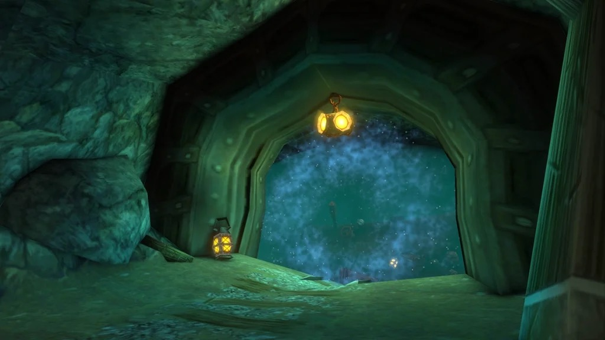

## De un vistazo

| | |
|---|---|
| Niveles | 14-24, jefes de nivel 19 a 21 |
| Entrada | La Defias Hideout en Moonbrook, Westfall, /way 42 72 |
| Jefes | 8, de los que Miner Johnson es un raro |
| Misiones | 6, todas de la Alliance |
| Botín | Casi todo lo que sueltan los jefes es azul en Forever |
| Nombre corto | DM o VC |

## Cómo llegar

La entrada es la Defias Hideout, el edificio grande de la esquina suroeste de Moonbrook, en /way 42 72. Baja por el laberinto de cuevas que hay debajo hasta llegar al portal, al fondo.

Durante la bajada, un pasadizo lateral lleva a la parte de la mina llena de no-muertos. Esa zona está fuera de la mazmorra, pero todos los monstruos son élite. Allí se hacen dos misiones de Wilder Thistlenettle, así que lleva al grupo.

La Alliance tiene Sentinel Hill cerca. La Horde no tiene misiones en The Deadmines y le toca un largo camino por Westfall, pero el botín es el mismo para las dos facciones.

## La ruta

1. **Los túneles.** Un camino recto por la mina hasta el primer jefe, <a class="wf-wh wf-plain" href="https://www.wowhead.com/forever/npc=644">Rhahk'Zor</a>, que guarda una puerta.
2. **El cruce.** Pasada la puerta, <a class="wf-wh wf-plain" href="https://www.wowhead.com/forever/npc=3586">Miner Johnson</a> puede estar a la izquierda. Es un raro y no siempre aparece.
3. **El campamento maderero.** Limpia a los Goblin Woodcarvers y luego atrae a <a class="wf-wh wf-plain" href="https://www.wowhead.com/forever/npc=642">Sneed's Shredder</a>.
4. **La fundición.** <a class="wf-wh wf-plain" href="https://www.wowhead.com/forever/npc=1763">Gilnid</a> trabaja entre Goblin Craftsmen y Engineers. Limpia antes al menos un lado de la sala.
5. **La cala.** El túnel se abre a una gran caverna. Cruza los muelles hasta el barco, donde <a class="wf-wh wf-plain" href="https://www.wowhead.com/forever/npc=646">Mr. Smite</a> espera en la cubierta inferior.
6. **El barco.** Tras Mr. Smite, <a class="wf-wh wf-plain" href="https://www.wowhead.com/forever/npc=645">Cookie</a> está a la izquierda. Sube hasta <a class="wf-wh wf-plain" href="https://www.wowhead.com/forever/npc=647">Captain Greenskin</a> y por último hasta <a class="wf-wh wf-plain" href="https://www.wowhead.com/forever/npc=639">Edwin VanCleef</a> en la cubierta superior.
7. **La salida.** Un túnel en la parte trasera del barco lleva al exterior. Muchos grupos matan a Cookie a la vuelta, desde la cubierta inferior junto a la pasarela.

## Las misiones

| Misión | Dónde empieza | Nivel | Recompensa |
|---|---|---|---|
| <a href="https://www.wowhead.com/forever/quest=168">Collecting Memories</a> Compartible | Stormwind, Dwarven District: Wilder Thistlenettle /way 65 21 | 14 | Aún no se sabe |
| <a href="https://www.wowhead.com/forever/quest=167">Oh Brother...</a> Compartible | Stormwind, Dwarven District: Wilder Thistlenettle /way 65 21 | 15 | Aún no se sabe |
| <a href="https://www.wowhead.com/forever/quest=2040">Underground Assault</a> Compartible | Stormwind, Dwarven District: Shoni the Shilent /way 55 13 <em>La cadena empieza con Gnoarn en Tinker Town, Ironforge.</em> | 15 | Aún no se sabe |
| <a href="https://www.wowhead.com/forever/quest=214">Red Silk Bandanas</a> | Westfall, Sentinel Hill: Scout Riell /way 56 47 <em>Completa antes 6 misiones, empezando por The Defias Brotherhood de Gryan Stoutmantle.</em> | 14 | Aún no se sabe |
| <a href="https://www.wowhead.com/forever/quest=166">The Defias Brotherhood</a> | Westfall, Sentinel Hill: Gryan Stoutmantle /way 56 47 <em>El final de una cadena de seis misiones con el mismo nombre.</em> | 14 | <a class="wf-wh wf-q3" href="https://www.wowhead.com/forever/item=6087">Chausses of Westfall</a>, <a class="wf-wh wf-q3" href="https://www.wowhead.com/forever/item=2042">Staff of Westfall</a> o <a class="wf-wh wf-q3" href="https://www.wowhead.com/forever/item=2041">Tunic of Westfall</a> |
| <a href="https://www.wowhead.com/forever/quest=373">The Unsent Letter</a> | Dentro de la mazmorra: An Unsent Letter, que suelta Edwin VanCleef | 16 | Aún no se sabe |

El nivel es el mínimo para aceptar la misión, según Wowhead. Las recompensas vienen de Wowhead; cuando no indica ninguna, aún no se conocen.

### Collecting Memories

Wilder Thistlenettle, en el Dwarven District de Stormwind, quiere 4 Miners' Union Cards. Las sueltan los no-muertos de fuera de la mazmorra, en la parte encantada de la mina: Undead Excavators, Skeletal Miners y Undead Dynamiters. Foreman Thistlenettle no las suelta. Todos los no-muertos de allí son élite.

### Oh Brother...

El mismo Wilder Thistlenettle pide Thistlenettle's Badge. <a class="wf-wh wf-plain" href="https://www.wowhead.com/forever/npc=626">Foreman Thistlenettle</a> la lleva en el fondo de la mina encantada, un élite de nivel 20 rodeado de otros élites. Hazla junto con Collecting Memories.

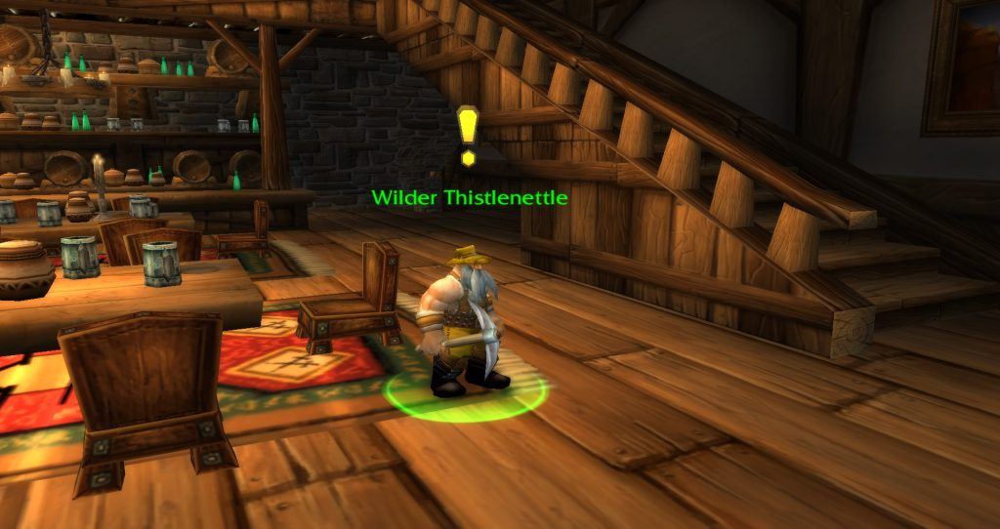

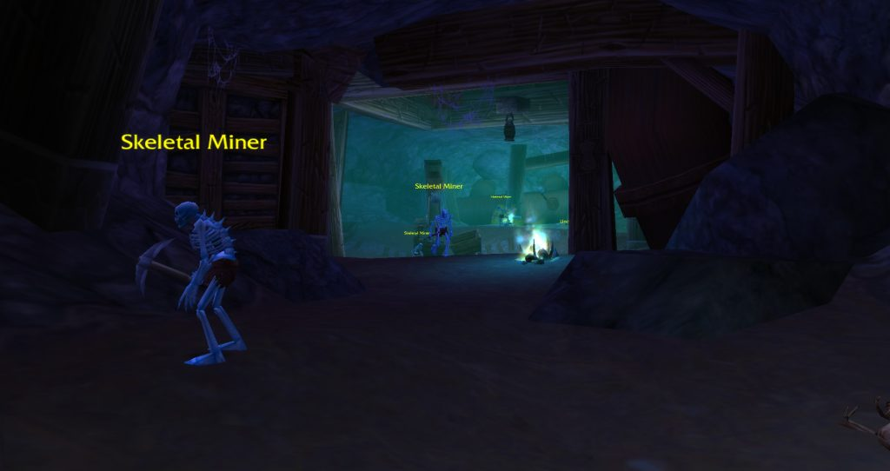

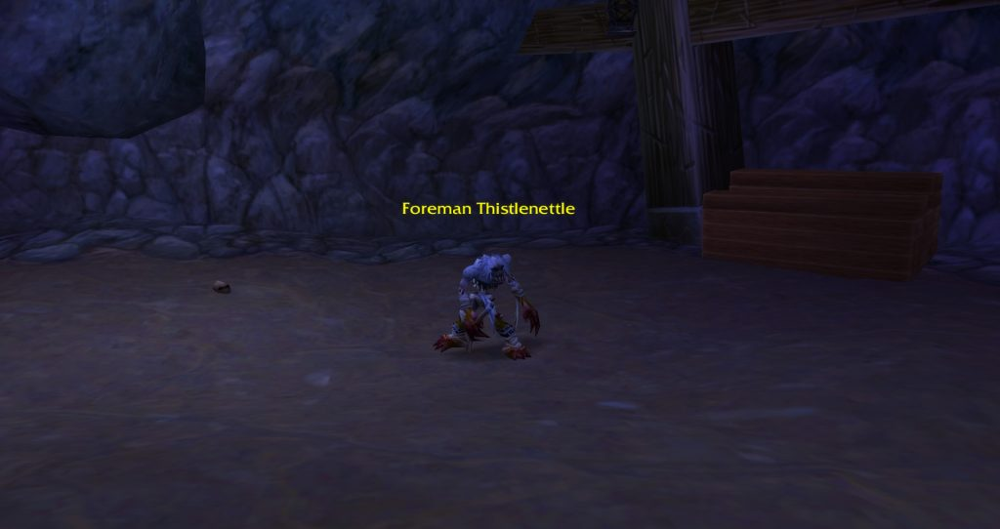

### Underground Assault

La cadena empieza con Gnoarn en Tinker Town, en Ironforge, que te envía a Shoni the Shilent en Stormwind. Ella quiere el Gnoam Sprecklesprocket, que suelta Sneed's Shredder en el campamento maderero de la mazmorra.

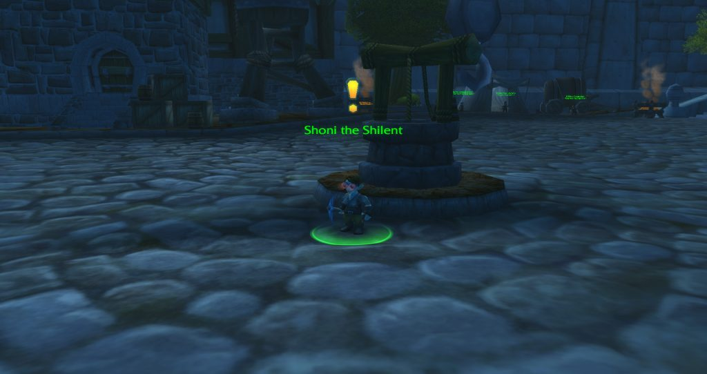

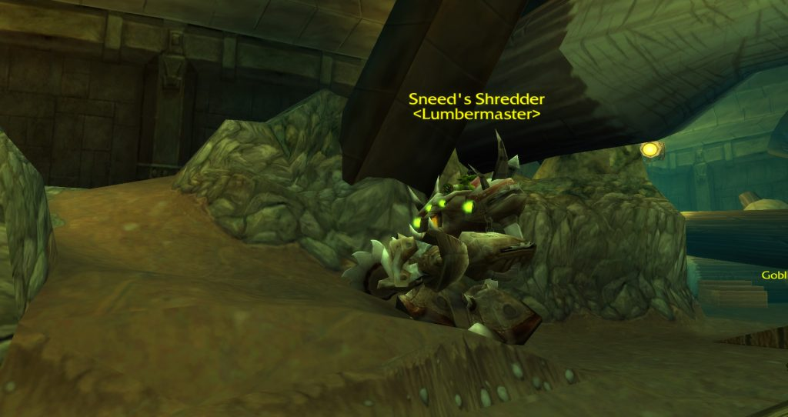

### Red Silk Bandanas

Scout Riell, en Sentinel Hill, quiere 10 Red Silk Bandanas. Cualquier monstruo con Defias en el nombre puede soltar uno, Defias Miners incluidos, pero los élites los sueltan casi siempre. Las patrullas de Evokers, Henchmen y Overseers, y los piratas de la parte profunda de la mazmorra, son la fuente más rápida. Los élites de las cuevas de fuera también los sueltan.

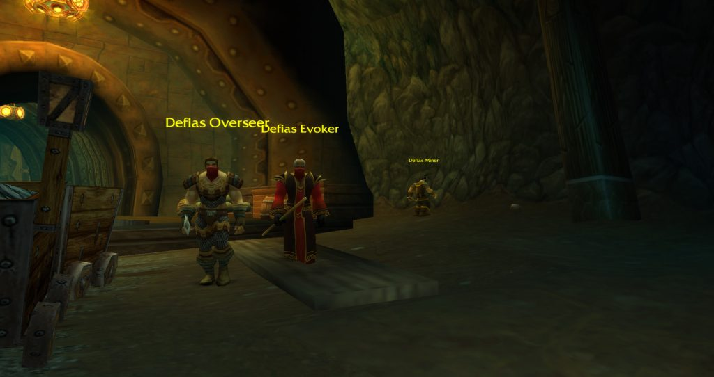

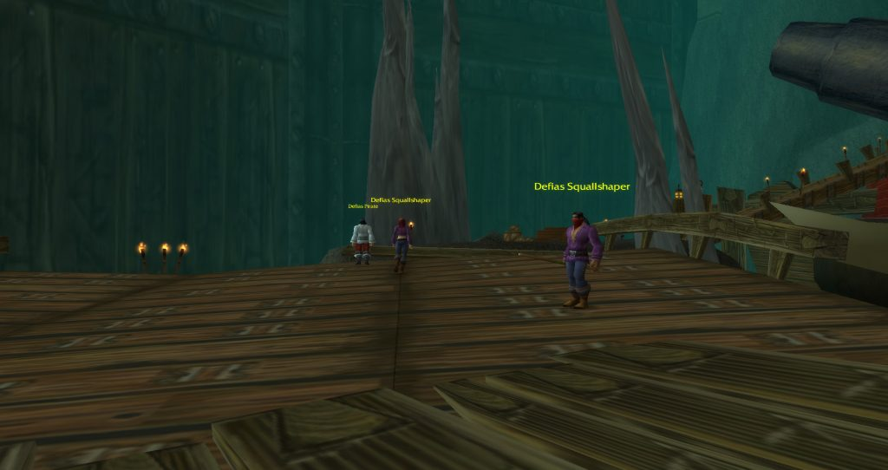

### The Defias Brotherhood

Gryan Stoutmantle, en Sentinel Hill, solo da esta misión al final de una larga cadena: seis misiones que se llaman todas The Defias Brotherhood y que te llevan por Westfall, hasta Lakeshire y de vuelta. El último paso es matar a Edwin VanCleef y llevarle su cabeza a Gryan.

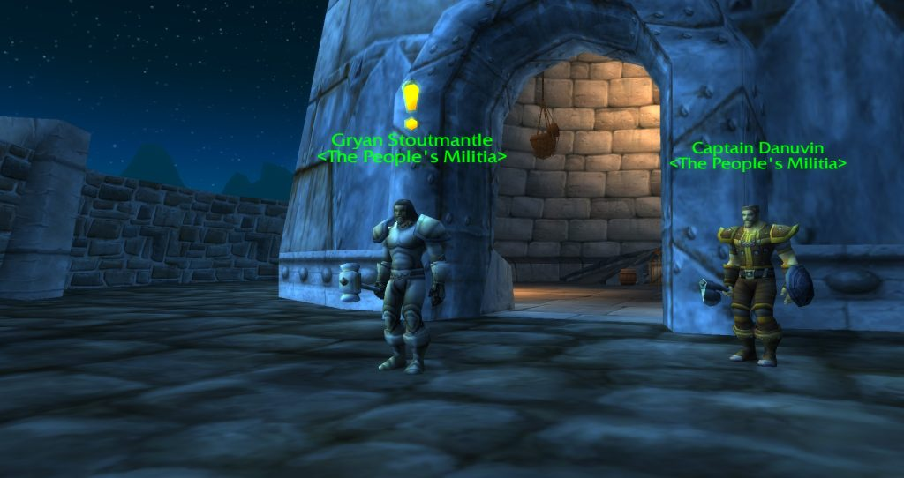

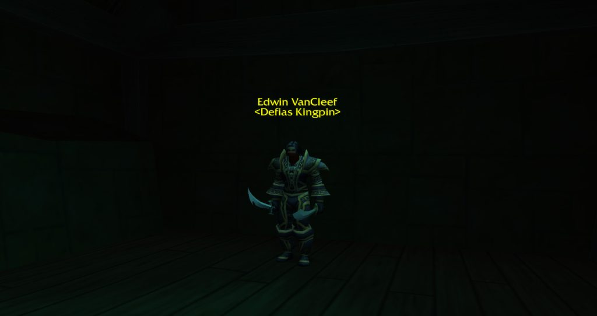

### The Unsent Letter

Edwin VanCleef suelta An Unsent Letter, que inicia esta misión desde el nivel 16. Llévala a Baros Alexston, el City Architect, en el City Hall de Cathedral Square, en Stormwind. Es el primer paso de una larga cadena que sigue con <a href="https://www.wowhead.com/forever/quest=391">The Stockade Riots</a> en [The Stockade](/es/guides/dungeons/the-stockade/).

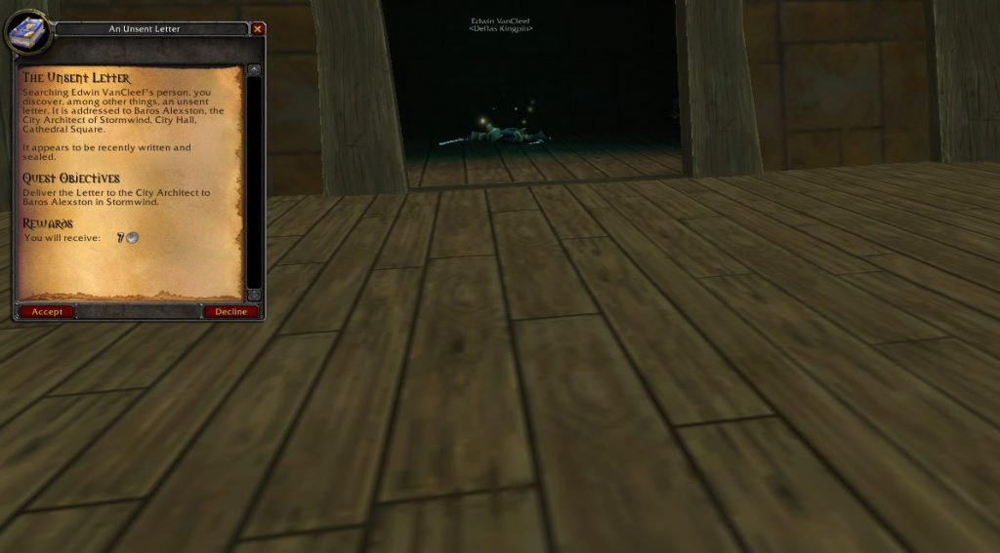

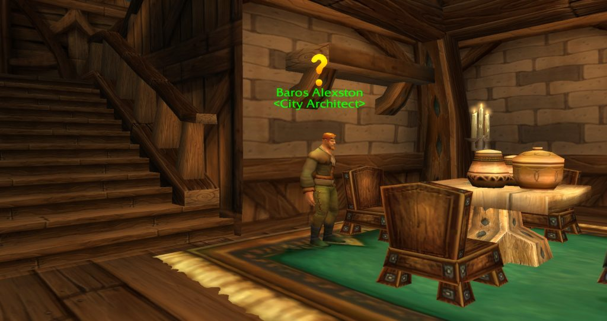

Los Paladins de la Alliance también vienen aquí por <a href="https://www.wowhead.com/forever/quest=1654">The Test of Righteousness</a>, el final de la cadena del Tome of Valor que termina con <a class="wf-wh wf-q3" href="https://www.wowhead.com/forever/item=6953">Verigan's Fist</a>: el Whitestone Oak Lumber lo sueltan los Goblin Woodcarvers cerca del principio. Los Paladins de la Horde tienen un equivalente nuevo en Forever, <a href="https://www.wowhead.com/forever/quest=95036">A Moon-Kissed Blade</a>, escribe Wowhead. La cadena empieza en Bandarion Keep, en Tirisfal Glades; Lumina Windsinger da la misión en la cripta de Silverpine Forest, /way 43 40. Las dos están en la [guía de mazmorras](/es/guides/dungeons/).

## Los jefes y su botín

El botín de cada jefe viene de Wowhead, con las estadísticas de los archivos de la beta.

### Rhahk'Zor

Un ogro élite de nivel 19 con dos Defias Watchmen que atacan a distancia. Marca a los Watchmen y mátalos primero; Rhahk'Zor es un combate sencillo, con un golpe fuerte sobre el tanque.

| Objeto | Nuevo en Forever |
|---|---|
| <a class="wf-wh wf-q3" href="https://www.wowhead.com/forever/item=872">Rockslicer</a> | Azul, extrae Copper, Tin, Silver e Iron sin Mining, 30 cargas |
| <a class="wf-wh wf-q3" href="https://www.wowhead.com/forever/item=5187">Rhahk'Zor's Hammer</a> | Azul en vez de blanco, con Stamina y hasta 7 de daño y sanación con hechizos |

Más sobre el hacha en el [artículo sobre Rockslicer](/es/news/a-deadmines-axe-mines-without-the-tradeskill/).

### Miner Johnson, un raro

Un raro élite de nivel 19 en el cruce tras Rhahk'Zor, a la izquierda. Un combate sencillo sobre el tanque.

| Objeto | Nuevo en Forever |
|---|---|
| <a class="wf-wh wf-q3" href="https://www.wowhead.com/forever/item=5443">Gold-plated Buckler</a> | Absorbe 15 de daño físico del primer golpe tras entrar en combate |
| <a class="wf-wh wf-q3" href="https://www.wowhead.com/forever/item=5444">Miner's Cape</a> | Azul, con Mining +2 y Attack Power, más contra Elementals |

### Sneed's Shredder y Sneed

El Shredder es de nivel 20. Cuando se rompe, Sneed salta fuera con una tabla de amenaza nueva, así que el tanque tiene que recogerlo otra vez. Sneed lanza Disarm. Cualquier miembro del grupo que le quite la atención al tanque sufre Distracting Pain.

| Objeto | Nuevo en Forever |
|---|---|
| <a class="wf-wh wf-q3" href="https://www.wowhead.com/forever/item=1937">Buzz Saw</a> | Azul, Agility y Stamina en vez de Strength |
| <a class="wf-wh wf-q3" href="https://www.wowhead.com/forever/item=2169">Buzzer Blade</a> | Ahora una daga de lanzador: hasta 22 de daño y sanación con hechizos |
| <a class="wf-wh wf-q3" href="https://www.wowhead.com/forever/item=5194">Taskmaster Axe</a> | Un hacha de sanador: hasta 45 de sanación |
| <a class="wf-wh wf-q3" href="https://www.wowhead.com/forever/item=5195">Gold-flecked Gloves</a> | Strength y 5 de Fire Resistance en vez de Intellect |

### Gilnid

Un goblin élite de nivel 20 con un Goblin Craftsman y un Goblin Engineer a su lado. Su Molten Metal reduce la amenaza del tanque, así que el sanador mantiene lleno al tanque mientras dura.

| Objeto | Nuevo en Forever |
|---|---|
| <a class="wf-wh wf-q3" href="https://www.wowhead.com/forever/item=5199">Smelting Pants</a> | Fundir Copper, Tin, Bronze y Silver va un 25% más rápido |
| <a class="wf-wh wf-q3" href="https://www.wowhead.com/forever/item=1156">Lavishly Jeweled Ring</a> | Mismas estadísticas, ahora único equipado |

### Mr. Smite

Un tauren élite de nivel 20 con dos Defias Blackguards en sigilo. El combate tiene tres fases, y cada una empieza con Smite Stomp. En la segunda fase lucha con dos armas y pega mucho más fuerte; es el momento de los cooldowns del tanque.

| Objeto | Nuevo en Forever |
|---|---|
| <a class="wf-wh wf-q3" href="https://www.wowhead.com/forever/item=284715">First Mate Band</a> | Nuevo: la primera mitad del set Partners in Crime, ver abajo |
| <a class="wf-wh wf-q3" href="https://www.wowhead.com/forever/item=5192">Thief's Blade</a> | Aumenta un 1% la probabilidad de Pick Pocket y Distract |
| <a class="wf-wh wf-q3" href="https://www.wowhead.com/forever/item=5196">Smite's Reaver</a> | Azul, Strength y Spirit |
| <a class="wf-wh wf-q3" href="https://www.wowhead.com/forever/item=7230">Smite's Mighty Hammer</a> | Sin cambios |

### Captain Greenskin

Un goblin élite de nivel 20 con un Defias Squallshaper, un Defias Pirate y un Defias Companion. Es fácil atraerlo sin querer desde el barco, así que acércate a su cubierta con cuidado. Mata primero a los dos adds élite.

| Objeto | Nuevo en Forever |
|---|---|
| <a class="wf-wh wf-q3" href="https://www.wowhead.com/forever/item=5200">Impaling Harpoon</a> | Azul, Agility e Intellect, y nivel 17 en vez de 20 |
| <a class="wf-wh wf-q3" href="https://www.wowhead.com/forever/item=5201">Emberstone Staff</a> | Un bastón de lanzador: hasta 24 de daño y sanación con hechizos, y Fire Resistance |
| <a class="wf-wh wf-q3" href="https://www.wowhead.com/forever/item=10403">Blackened Defias Belt</a> | Azul, 18 de Attack Power y sin Strength |

### Edwin VanCleef

Un élite de nivel 21 con dos Blackguards en sigilo. A media vida llama a dos más con VanCleef's Allies. Mata la primera pareja, controla o ignora la segunda y céntrate en VanCleef. Asegúrate de que Captain Greenskin está muerto antes de atraerlo.

| Objeto | Nuevo en Forever |
|---|---|
| <a class="wf-wh wf-q3" href="https://www.wowhead.com/forever/item=10399">Blackened Defias Armor</a> | Bonificaciones de set nuevas, ver abajo |
| <a class="wf-wh wf-q3" href="https://www.wowhead.com/forever/item=5202">Corsair's Overshirt</a> | Hasta 10 de sanación, algo menos de Spirit |
| <a class="wf-wh wf-q3" href="https://www.wowhead.com/forever/item=5193">Cape of the Brotherhood</a> | Casi sin cambios, 1 de Agility menos |
| <a class="wf-wh wf-q3" href="https://www.wowhead.com/forever/item=5191">Cruel Barb</a> | Sin cambios |

### Cookie

Un élite opcional, a la izquierda del barco tras Mr. Smite. Su Cookie's Cooking lo cura y se puede interrumpir.

| Objeto | Nuevo en Forever |
|---|---|
| <a class="wf-wh wf-q3" href="https://www.wowhead.com/forever/item=5198">Cookie's Stirring Rod</a> | Cooking va un 25% más rápido, y 3 de Fire Resistance |
| <a class="wf-wh wf-q3" href="https://www.wowhead.com/forever/item=5197">Cookie's Tenderizer</a> | Azul, Spirit, y probabilidad al golpear de ablandar al objetivo con Tenderize |
| <a class="wf-wh wf-q2" href="https://www.wowhead.com/forever/item=273102">Blueprint: Cookie's Feast</a> | Nuevo: coloca Cookie's Feast en un campamento, Cooking 140 |

The Deadmines también suelta el <a class="wf-wh wf-q2" href="https://www.wowhead.com/forever/item=273087">Blueprint: Journeyman Campfire</a>, uno de los [planos para acampar](/es/guides/camping/).

## Defias Leather

Las cinco piezas de Defias Leather ahora son azules y piden nivel 14 a 17. Las bonificaciones del set son nuevas.

| Piezas | Bonificación |
|---|---|
| 2 | +5 Arcane Resistance |
| 3 | +15 Attack Power contra Humanoids |
| 4 | 5% de probabilidad, con un golpe cuerpo a cuerpo por la espalda, de hacer sangrar al objetivo 68 a 83 de daño físico en 5 segundos |
| 5 | Daggers +1 |

Las piezas: <a class="wf-wh wf-q3" href="https://www.wowhead.com/forever/item=10399">Blackened Defias Armor</a> de VanCleef, <a class="wf-wh wf-q3" href="https://www.wowhead.com/forever/item=10403">Blackened Defias Belt</a> de Greenskin, y <a class="wf-wh wf-q3" href="https://www.wowhead.com/forever/item=10400">Blackened Defias Leggings</a>, <a class="wf-wh wf-q3" href="https://www.wowhead.com/forever/item=10401">Blackened Defias Gloves</a> y <a class="wf-wh wf-q3" href="https://www.wowhead.com/forever/item=10402">Blackened Defias Boots</a>, que sueltan los monstruos de la mazmorra.

## Partners in Crime

<a class="wf-wh wf-q3" href="https://www.wowhead.com/forever/item=284715">First Mate Band</a> es un anillo nuevo de Mr. Smite: 4 de Strength y 5 de Stamina a nivel 17. Es la primera mitad de un set con <a class="wf-wh wf-q4" href="https://www.wowhead.com/forever/item=284716">Band of the Better Half</a>, un anillo épico de nivel 60. Llevar los dos da +22 Strength y una probabilidad, al golpear cuerpo a cuerpo, de ganar 50 de Strength durante 10 segundos. No se sabe dónde cae el segundo anillo. Más en el [artículo sobre el set](/es/news/a-set-pairs-a-deadmines-ring-with-a-level-60-ring/).

Las estadísticas en los archivos de la beta han cambiado desde ese artículo: la First Mate Band pasó de 6 de Strength y 2 de Stamina a 4 y 5, y la bonificación del set de 20 a 22 de Strength.

## Lo que aún no se sabe

- **La probabilidad de botín** de cada jefe.
- **Las recompensas de las misiones** que Wowhead aún no indica.
- **La Band of the Better Half**: dónde cae.
