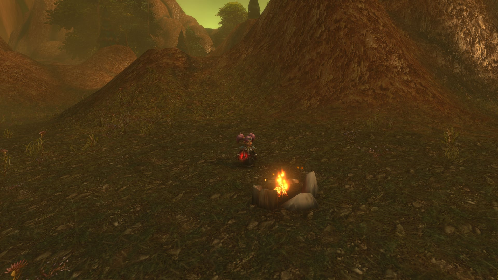
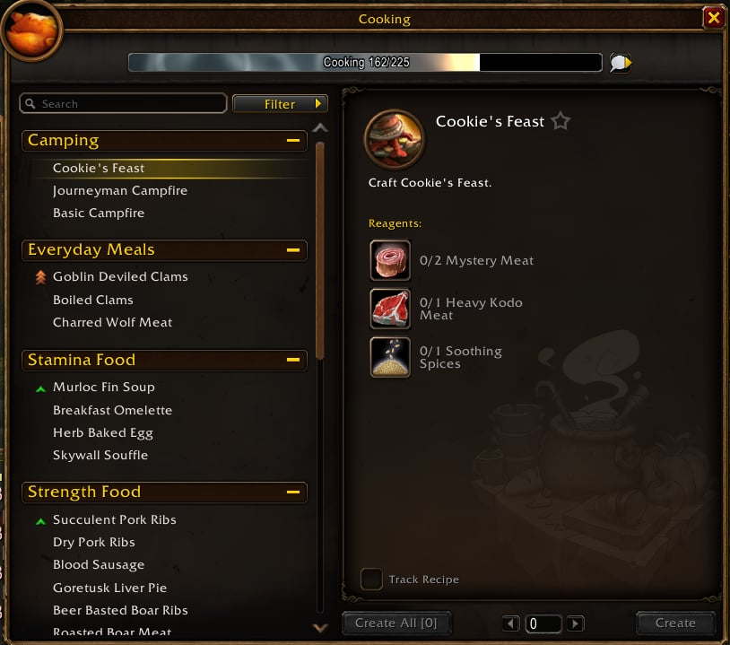

Cooking es una profesión secundaria, así que nunca te cuesta una de tus dos plazas principales. En WoW Forever cuenta desde el nivel 1: la mayoría de los platos dan experiencia extra, y cada campamento empieza con una hoguera de Cooking.

## Qué cambia en Forever

- **Experiencia con la comida.** La mayoría de la comida cocinada da un 5 % más de experiencia por muertes mientras estás Well Fed, escribe Wowhead.
- **Una stat por plato.** Las recetas conocidas se han ajustado para favorecer una sola stat principal, según Warcraft Tavern.
- **Recetas nuevas**, como <a class="wf-wh wf-q1" href="https://www.wowhead.com/forever/item=286152">Plated Armorfish</a> y <a class="wf-wh wf-q1" href="https://www.wowhead.com/forever/item=251525">Savory Whimsyfin Delight</a>.
- **Hogueras.** Cooking enciende el fuego de cada campamento; mira la [guía de camping](/es/guides/camping/).

## Platos antiguos, buffs nuevos

El mismo plato en Forever y en Classic Era, según las descripciones de los dos juegos.

| Plato | Forever | Classic Era |
|---|---|---|
| <a class="wf-wh wf-q1" href="https://www.wowhead.com/forever/item=4593">Bristle Whisker Catfish</a> | 8 de habilidad de Fishing, +5 % de experiencia | Sin buff |
| <a class="wf-wh wf-q1" href="https://www.wowhead.com/forever/item=4592">Longjaw Mud Snapper</a> | 10 de Attack Power, +5 % de experiencia | Sin buff |
| <a class="wf-wh wf-q1" href="https://www.wowhead.com/forever/item=21072">Smoked Sagefish</a> | 4 de Spell Damage, +5 % de experiencia | 3 de maná cada 5 s |
| <a class="wf-wh wf-q1" href="https://www.wowhead.com/forever/item=13935">Baked Salmon</a> | 28 de Spell Damage, +5 % de experiencia | Sin buff |
| <a class="wf-wh wf-q1" href="https://www.wowhead.com/forever/item=13932">Poached Sunscale Salmon</a> | 40 de Attack Power, +5 % de experiencia | 6 de salud cada 5 s |
| <a class="wf-wh wf-q1" href="https://www.wowhead.com/forever/item=286152">Plated Armorfish</a> | 150 de Armor, +5 % de experiencia | Nuevo en Forever |

Cada buff dura 15 minutos y empieza tras 10 segundos comiendo.

## Comida que transforma

<a class="wf-wh wf-q1" href="https://www.wowhead.com/forever/item=251525">Savory Whimsyfin Delight</a> te convierte durante una hora en Murloc o en Ogre, según tu Body Type. La receta pide Cooking 85 y cae en Redridge Mountains; más en la [noticia sobre ello](/es/news/savory-whimsyfin-delight-turns-you-into-a-murloc-or-an-ogre/). <a class="wf-wh wf-q1" href="https://www.wowhead.com/forever/item=6657">Savory Deviate Delight</a>, con su ninja y su pirata, sigue ahí.

## Hogueras y objetos de campamento

| Objeto | Habilidad | Receta de | Qué hace |
|---|---|---|---|
| <a class="wf-wh wf-spell" href="https://www.wowhead.com/forever/spell=1229737">Basic Campfire</a> | 1 | Instructor | Fuego para cocinar, espacio para 3 objetos |
| <a class="wf-wh wf-spell" href="https://www.wowhead.com/forever/spell=1283400">Journeyman Campfire</a> | 140 | <a class="wf-wh wf-q2" href="https://www.wowhead.com/forever/item=273087">Blueprint: Journeyman Campfire</a> | Espacio para 5 objetos |
| <a class="wf-wh wf-spell" href="https://www.wowhead.com/forever/spell=1291341">Expert Campfire</a> | 220 | <a class="wf-wh wf-q2" href="https://www.wowhead.com/forever/item=273101">Blueprint: Expert Campfire</a> | Espacio para 10 objetos |
| <a class="wf-wh wf-spell" href="https://www.wowhead.com/forever/spell=1262978">Cookie's Feast</a> | 140 | <a class="wf-wh wf-q2" href="https://www.wowhead.com/forever/item=273102">Blueprint: Cookie's Feast</a> | Un festín con un buff de Stamina |
| <a class="wf-wh wf-spell" href="https://www.wowhead.com/forever/spell=1263067">Iron Oven</a> | 300 | Desconocida | Taller para algunas recetas |

Cada hoguera pide <a class="wf-wh wf-q1" href="https://www.wowhead.com/forever/item=4471">Flint and Tinder</a>. El blueprint Journeyman cae en The Deadmines y Wailing Caverns, el de Cookie's Feast de Cookie en The Deadmines.

## Cómo funciona

La ventana de Cooking ordena las recetas según la stat que suben, con Camping arriba. El único taller es un fuego, y tu propia hoguera cuenta. La carne sale de las bestias, el pescado de [Fishing](/es/tradeskills/forever/fishing/), las especias de los vendedores de Cooking.

## Recetas por Merchant's Favor

Seis recetas de batidos, de Cooking 25 a 250, las vende <a class="wf-wh wf-plain" href="https://www.wowhead.com/forever/npc=256731">Kalsey Sanden</a> por Merchant's Favor en el campamento de la [Azeroth Commerce Authority](/es/reputations/azeroth-commerce-authority/).

## Talentos de Legacy

| Perk | Efecto |
|---|---|
| <a class="wf-wh wf-spell" href="https://www.wowhead.com/forever/spell=1225451">Working Overtime</a> | Más probabilidad de subir un punto en cualquier profesión |
| <a class="wf-wh wf-spell" href="https://www.wowhead.com/forever/spell=1225469">Dedicated Study</a> | Un punto gratis al día en tu profesión más baja |
| <a class="wf-wh wf-spell" href="https://www.wowhead.com/forever/spell=1225457">Master Chef</a> | Probabilidad de cocinar uno de más |
| <a class="wf-wh wf-spell" href="https://www.wowhead.com/forever/spell=1225499">Gourmand</a> | Los buffs de comida duran más |

Las perks están en la [calculadora de Legacy](/es/talents/legacy/).
