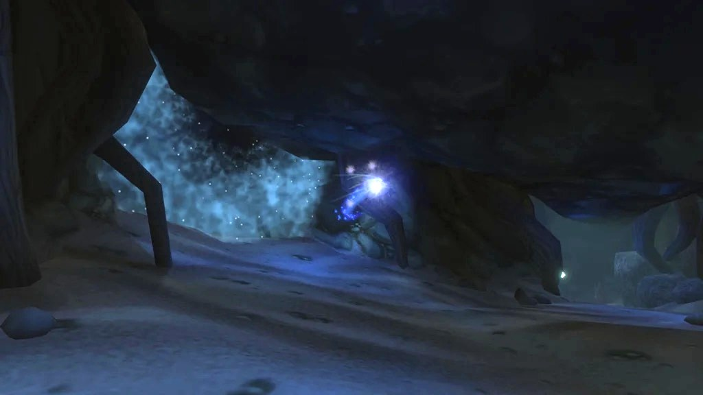

Blackfathom Deeps est un temple englouti d’Elune sur la côte d’Ashenvale. Le Twilight's Hammer et les nagas s’en sont emparés, et au fond attend Aku'mai, une hydre au service des Old Gods. La majeure partie du temple est hors de l’eau ; certaines parties ne s’atteignent qu’à la nage. Le donjon est le même que dans Classic, son butin est en grande partie nouveau dans WoW Forever.

## En bref

| | |
|---|---|
| Niveaux | Boss de 25 à 28 ; difficile à 21, à niveau à 25, facile à 30 |
| Entrée | La Zoram Strand, nord-ouest d’Ashenvale, /way 14.5 14.6 |
| Boss | 8, dont Lorgus Jett et Baron Aquanis pour des quêtes de la Horde |
| Quêtes | 5 pour la Horde, 5 pour l’Alliance |
| Butin | Presque chaque objet de boss est bleu dans Forever |
| Abréviation | BFD |

## Comment s’y rendre

L’entrée se trouve dans les ruines englouties des Night Elves sur la Zoram Strand, dans le coin nord-ouest d’Ashenvale, en /way 14.5 14.6. Plongez dans le bassin au pied des ruines et suivez la grotte étroite et sinueuse qui se trouve derrière. Elle est pleine de nagas élites, venez donc en groupe.

La Horde a Zoram'gar Outpost un peu au sud, où Je'neu Sancrea donne trois des quêtes. L’Alliance rassemble ses quêtes à Darnassus, dans Darkshore et à Ironforge.

## Le parcours

1. **La première caverne.** <a class="wf-wh wf-plain" href="https://www.wowhead.com/forever/npc=4887">Ghamoo-ra</a>, une tortue, attend dans l’eau. Argent Guard Thaelrid et le Lorgalis Manuscript se trouvent dans une alcôve de la même salle.
2. **Les nagas.** <a class="wf-wh wf-plain" href="https://www.wowhead.com/forever/npc=4831">Lady Sarevess</a> se tient plus loin avec deux gardes.
3. **Les murlocs.** <a class="wf-wh wf-plain" href="https://www.wowhead.com/forever/npc=6243">Gelihast</a> garde une salle de murlocs. Nettoyez-la un groupe à la fois. Après le combat, cliquez sur la pierre derrière lui pour la Blessing of Blackfathom.
4. **Le Twilight's Hammer.** <a class="wf-wh wf-plain" href="https://www.wowhead.com/forever/npc=12902">Lorgus Jett</a> circule avec ses fidèles dans le temple. La Fathom Stone qui invoque <a class="wf-wh wf-plain" href="https://www.wowhead.com/forever/npc=12876">Baron Aquanis</a> se trouve sous l’eau.
5. **La chambre cérémonielle.** <a class="wf-wh wf-plain" href="https://www.wowhead.com/forever/npc=4832">Twilight Lord Kelris</a> attend avant la dernière salle. <a class="wf-wh wf-plain" href="https://www.wowhead.com/forever/npc=4830">Old Serra'kis</a> nage en eau profonde et est optionnel.
6. **Aku'mai.** La dernière salle, avec <a class="wf-wh wf-plain" href="https://www.wowhead.com/forever/npc=4829">Aku'mai</a> tout au fond.

## Les quêtes

### Horde

| Quête | Où elle commence | Niveau |
|---|---|---|
| <a href="https://www.wowhead.com/forever/quest=6563">The Essence of Aku'Mai</a> Partageable | Ashenvale, Zoram'gar Outpost : Je'neu Sancrea /way 11 34 <em>Terminez d’abord Trouble in the Deeps de Tsunaman dans les Stonetalon Mountains.</em> | 22 |
| <a href="https://www.wowhead.com/forever/quest=6565">Allegiance to the Old Gods</a> | Ashenvale, hors du donjon : Damp Note, un butin rare des Blackfathom Tide Priestess | 26 |
| <a href="https://www.wowhead.com/forever/quest=6921">Amongst the Ruins</a> Partageable | Ashenvale, Zoram'gar Outpost : Je'neu Sancrea /way 11 34 | 27 |
| <a href="https://www.wowhead.com/forever/quest=6922">Baron Aquanis</a> | Dans le donjon : Strange Water Globe, sur Baron Aquanis | 30 |
| <a href="https://www.wowhead.com/forever/quest=6561">Blackfathom Villainy</a> Partageable | Dans le donjon : Argent Guard Thaelrid | 27 |

### Alliance

| Quête | Où elle commence | Niveau |
|---|---|---|
| <a href="https://www.wowhead.com/forever/quest=1198">In Search of Thaelrid</a> Partageable | Darnassus, Craftsmen's Terrace : Dawnwatcher Shaedlass /way 55 24 | 24 |
| <a href="https://www.wowhead.com/forever/quest=1199">Twilight Falls</a> Partageable | Darnassus, Craftsmen's Terrace : Argent Guard Manados /way 55 24 | 25 |
| <a href="https://www.wowhead.com/forever/quest=971">Knowledge in the Deeps</a> Partageable | Ironforge, The Forlorn Cavern : Gerrig Bonegrip /way 50 5 | 23 |
| <a href="https://www.wowhead.com/forever/quest=1275">Researching the Corruption</a> Partageable | Darkshore, Auberdine : Gershala Nightwhisper /way 38 43 | 24 |
| <a href="https://www.wowhead.com/forever/quest=1200">Blackfathom Villainy</a> Partageable | Dans le donjon : Argent Guard Thaelrid | 27 |

Le niveau est celui de la quête dans les données de la bêta. Les récompenses ont changé dans Forever, écrit Warcraft Tavern, mais on ne sait pas encore quels objets elles donnent.

### Les quêtes de la Horde

**The Essence of Aku'Mai.** Je'neu Sancrea ne la propose qu’après Trouble in the Deeps, une quête de Tsunaman à Sunrock Retreat. Les 20 Sapphires of Aku'Mai poussent en cristaux sur les parois de la grotte qui mène à l’entrée : cette quête se fait donc hors du donjon.

**Allegiance to the Old Gods.** Une Blackfathom Tide Priestess hors du donjon peut lâcher une Damp Note. Apportez-la à Je'neu Sancrea, qui vous envoie tuer <a class="wf-wh wf-plain" href="https://www.wowhead.com/forever/npc=12902">Lorgus Jett</a> à l’intérieur.

**Amongst the Ruins.** Cliquez sur la Fathom Stone sous l’eau dans le donjon. <a class="wf-wh wf-plain" href="https://www.wowhead.com/forever/npc=12876">Baron Aquanis</a> apparaît ; une fois mort, chaque membre du groupe clique de nouveau sur la pierre pour prendre le Fathom Core.

**Baron Aquanis.** Le Baron lâche une Strange Water Globe, qui lance cette quête. Rendez-la à Je'neu Sancrea.

**Blackfathom Villainy.** Argent Guard Thaelrid, dans une alcôve de la salle de Ghamoo-ra, veut la tête de <a class="wf-wh wf-plain" href="https://www.wowhead.com/forever/npc=4832">Twilight Lord Kelris</a>. La Horde la rapporte à Bashana Runetotem à Thunder Bluff.

### Les quêtes de l’Alliance

**In Search of Thaelrid.** Dawnwatcher Shaedlass vous envoie voir Argent Guard Thaelrid dans le donjon. La quête est aussi ouverte à la Horde, écrit Warcraft Tavern, mais elle commence au cœur de Darnassus.

**Twilight Falls.** Argent Guard Manados veut 10 Twilight Pendants. Ils tombent sur les Twilight Acolytes, Aquamancers, Elementalists, Loreseekers, Reavers et Shadowmages du donjon.

**Knowledge in the Deeps.** Gerrig Bonegrip veut le Lorgalis Manuscript, qui se trouve dans une alcôve de la salle de Ghamoo-ra.

**Researching the Corruption.** Gershala Nightwhisper veut 8 Corrupted Brain Stems des satyres et des nagas dans le donjon et autour, Lady Sarevess comprise. The Corruption Abroad, d’Argos Nightwhisper à Stormwind, y mène ; cette quête est optionnelle et rapporte 1 450 points d’expérience et 75 de réputation auprès de Darnassus.

**Blackfathom Villainy.** La même quête de Thaelrid, mais l’Alliance rapporte la tête de Kelris à Dawnwatcher Selgorm à Darnassus.

Les Warlocks viennent aussi ici pour <a href="https://www.wowhead.com/forever/quest=1740">The Orb of Soran'ruk</a>, une quête de classe pour les deux factions. Elle figure dans le [guide des donjons](/fr/guides/dungeons/).

## Les boss et leur butin

Le butin ci-dessous est celui que ces boss lâchaient dans Classic, avec les caractéristiques des fichiers de la bêta. Blizzard n’a pas publié les tables de butin de Forever, un boss peut donc encore lâcher autre chose.

### Ghamoo-ra

Une tortue élite de niveau 25 à l’armure épaisse. Elle piétine un membre du groupe au hasard avec Trample, le soigneur garde donc tout le monde au maximum. Elle peut être étourdie et apeurée.

| Objet | Nouveau dans Forever |
|---|---|
| <a class="wf-wh wf-q3" href="https://www.wowhead.com/forever/item=6907">Tortoise Armor</a> | Moins d’armure, mais 5 dégâts de moins de chaque sort |
| <a class="wf-wh wf-q3" href="https://www.wowhead.com/forever/item=6908">Ghamoo-ra's Bind</a> | Passe au bleu, Stamina et jusqu’à 7 de dégâts et soins des sorts |

### Lady Sarevess

Une naga élite de niveau 25 avec deux gardes. Contrôlez un garde et tuez l’autre d’abord. Son Forked Lightning est un cône frontal qui rebondit de joueur en joueur, alors restez écartés. Il peut être interrompu, mais elle lance alors Frost Nova sur les joueurs proches.

| Objet | Nouveau dans Forever |
|---|---|
| <a class="wf-wh wf-q3" href="https://www.wowhead.com/forever/item=3078">Naga Heartpiercer</a> | Passe au bleu, beaucoup plus de dégâts, et une chance d’infliger 42 dégâts à la cible ; les Naga sont étourdis |
| <a class="wf-wh wf-q3" href="https://www.wowhead.com/forever/item=11121">Darkwater Talwar</a> | Passe au bleu, 6 d’Attack Power, et son trait d’ombre passe de 25 à 28 |
| <a class="wf-wh wf-q3" href="https://www.wowhead.com/forever/item=888">Naga Battle Gloves</a> | Jusqu’à 14 de soins au lieu de Spirit |

### Gelihast

Un murloc élite de niveau 26. Attirez les adds de sa salle un par un, puis attirez-le seul. Son Net immobilise une cible au hasard et réduit sa menace. Après le combat, la pierre derrière lui donne la Blessing of Blackfathom.

| Objet | Nouveau dans Forever |
|---|---|
| <a class="wf-wh wf-q3" href="https://www.wowhead.com/forever/item=6905">Reef Axe</a> | Passe au bleu, Strength et jusqu’à 24 de soins |
| <a class="wf-wh wf-q3" href="https://www.wowhead.com/forever/item=6906">Algae Fists</a> | 4 de Nature Resistance, 2 de Strength en moins |
| <a class="wf-wh wf-q1" href="https://www.wowhead.com/forever/item=1470">Murloc Skin Bag</a> | Pas de changement |

### Lorgus Jett

Un élite de niveau 26 et la cible d’Allegiance to the Old Gods. Il ne lâche pas de butin particulier. Son Lightning Shield blesse les joueurs de mêlée qui le frappent.

### Baron Aquanis

Un élémentaire élite de niveau 28, invoqué à la Fathom Stone pour Amongst the Ruins. Il lâche la Strange Water Globe et aucun autre butin particulier.

### Twilight Lord Kelris

Un orc démoniste élite de niveau 27 dans la chambre cérémonielle. Il lance Sleep et Mind Blast, et aucun des deux ne peut être interrompu. Quand le tank est endormi, le joueur suivant sur la liste de menace prend les coups.

| Objet | Nouveau dans Forever |
|---|---|
| <a class="wf-wh wf-q3" href="https://www.wowhead.com/forever/item=1155">Rod of the Sleepwalker</a> | Jusqu’à 32 de dégâts et soins des sorts au lieu d’Intellect, et 5 % de chances en moins d’être endormi |
| <a class="wf-wh wf-q3" href="https://www.wowhead.com/forever/item=6903">Gaze Dreamer Pants</a> | Passe au bleu, jusqu’à 12 de dégâts et soins des sorts au lieu d’Intellect |

### Old Serra'kis

Un élite optionnel de niveau 26 que l’on combat sous l’eau. Il se soigne en attaquant. Surveillez votre souffle.

| Objet | Nouveau dans Forever |
|---|---|
| <a class="wf-wh wf-q3" href="https://www.wowhead.com/forever/item=6904">Bite of Serra'kis</a> | Le poison frappe plus fort sur une durée plus courte : 14 toutes les 3 secondes pendant 9 secondes |
| <a class="wf-wh wf-q3" href="https://www.wowhead.com/forever/item=6901">Glowing Thresher Cape</a> | Jusqu’à 6 de soins au lieu de Strength |
| <a class="wf-wh wf-q3" href="https://www.wowhead.com/forever/item=6902">Bands of Serra'kis</a> | Passe au bleu, 6 de Strength et 3 de Stamina |

### Aku'mai

Le dernier boss, une hydre élite de niveau 28. Sortez de son Poison Cloud ; il peut être interrompu. Frenzied Rage lui donne 75 % de vitesse d’attaque en plus pendant 5 secondes. Gardez les étourdissements et les temps de recharge du tank pour ce moment.

| Objet | Nouveau dans Forever |
|---|---|
| <a class="wf-wh wf-q3" href="https://www.wowhead.com/forever/item=6909">Strike of the Hydra</a> | Un nouvel effet : 42 dégâts de feu et 14 de givre, ralentissement de 50 % pendant 5 secondes, 50 d’armure en moins et des dégâts de nature sur 12 secondes |
| <a class="wf-wh wf-q3" href="https://www.wowhead.com/forever/item=6910">Leech Pants</a> | 5 de mana et 5 points de vie toutes les 5 secondes au lieu d’Intellect et de Spirit |
| <a class="wf-wh wf-q3" href="https://www.wowhead.com/forever/item=6911">Moss Cinch</a> | Jusqu’à 12 de dégâts des sorts au lieu d’Intellect |

## Les objets bleus des monstres

Plusieurs objets bleus liés quand équipés tombaient dans Classic sur les monstres de Blackfathom Deeps et ailleurs dans le monde. Dans les fichiers de la bêta, certains ont fortement changé :

| Objet | Nouveau dans Forever |
|---|---|
| <a class="wf-wh wf-q3" href="https://www.wowhead.com/forever/item=3416">Martyr's Chain</a> | Mourir inflige 420 dégâts sacrés à tous les ennemis à moins de 15 mètres |
| <a class="wf-wh wf-q3" href="https://www.wowhead.com/forever/item=1486">Tree Bark Jacket</a> | 60 d’armure en plus et jusqu’à 12 de dégâts et soins des sorts au lieu d’Intellect |
| <a class="wf-wh wf-q3" href="https://www.wowhead.com/forever/item=2567">Evocator's Blade</a> | Jusqu’à 28 de dégâts et soins des sorts |
| <a class="wf-wh wf-q3" href="https://www.wowhead.com/forever/item=3414">Crested Scepter</a> | Jusqu’à 32 de dégâts et soins des sorts |
| <a class="wf-wh wf-q3" href="https://www.wowhead.com/forever/item=3415">Staff of the Friar</a> | Jusqu’à 52 de soins |

## Ce qui n’est pas encore connu

- **Les tables de butin de Forever** : quel boss lâche quel objet maintenant, et à quelle fréquence.
- **Les récompenses des quêtes**, qui ont changé selon Warcraft Tavern.
