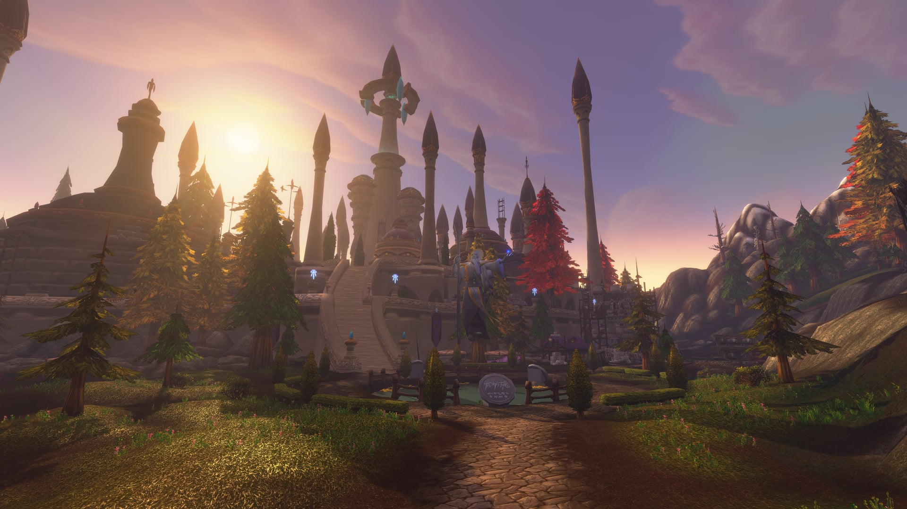

La City of Dalaran è uno dei nuovi dungeon di WoW Forever. La cupola viola intorno alla città ricostruita del Kirin Tor è sparita, e le minacce che l’hanno invasa vanno eliminate. In Classic non si poteva entrare in città. Dentro aspettano sette boss, con la Shade of the Archmage alla fine.

## In breve

| | |
|---|---|
| Livelli | 28-33 secondo Blizzard |
| Ingresso | Le Dalaran Sewers per l’Alliance, un tunnel fuori città per la Horde |
| Boss | 7, di cui Lyn the Ignored è una rara |
| Missioni | Non ancora note |
| Attenzione | Quasi tutti i mostri sono immuni all’Arcane |
| Nome breve | CoD |

La beta arriva al livello 30 dal 1° ottobre. Gli ultimi boss sono più in alto, quindi Wowhead non conosce ancora tutte le loro meccaniche.

## Come arrivarci

**Alliance.** La prima volta è un lungo viaggio da Hillsbrad Foothills alla città. A Dalaran, vai in Cantrips & Crows nelle Dalaran Sewers, apri il cancello e segui il tubo fino al portale. Altro sulla città nell’[articolo su Dalaran nella beta](/it/news/dalaran-opens-on-the-beta-for-the-alliance-only/).

**Horde.** La Horde non è benvenuta in città ed entra da un tunnel esterno, a /way 8.8 59.6, dove l’<a class="wf-wh wf-plain" href="https://www.wowhead.com/forever/npc=269127">Image of Archmage Modera</a> concede l’accesso. Almeno un giocatore deve avere la <a class="wf-wh wf-q2" href="https://www.wowhead.com/forever/item=277507">Dalaran Sewer Key</a> per aprire il cancello. Da The Sepulcher a Silverpine Forest sono pochi minuti a piedi.

## I nemici

- **I Mana Phantoms** lanciano un fastidioso <a class="wf-wh wf-spell" href="https://www.wowhead.com/forever/spell=20817">Mana Burn</a>. Non sono élite: interrompili e uccidili per primi.
- **I Saturated Remnants** lasciano alla morte una zona che ripristina mana a chi ci sta dentro.
- **Immunità all’Arcane.** Quasi tutti i mostri ignorano i danni arcani: Arcane Explosion e Arcane Shot fanno poco e Counterspell non interrompe.

## I boss

### Atrexis the Grave Knight

Presto nel dungeon e facile. Evoca scheletri non élite da uccidere e di tanto in tanto va in furia. È pericoloso solo un forte danno ad area prima che il tank abbia la minaccia.

### Arcane Anomaly

Dopo le fogne. <a class="wf-wh wf-spell" href="https://www.wowhead.com/forever/spell=1241501">Focal Blast</a> è un raggio arcano che spazza la sala in senso antiorario e uccide chiunque colpisca. Resta dentro il cerchio sulla piattaforma: all’inizio dello scontro compaiono piccoli add ai bordi della sala. Il boss lancia anche Arcane Bolt.

### Arcanic Enigma

Due Mana Phantoms aprono lo scontro con lui; uccidili in fretta. <a class="wf-wh wf-spell" href="https://www.wowhead.com/forever/spell=1240869">Manamorph</a> controlla un giocatore per 8 secondi e va dissolto come magia. Il guaritore sta lontano, per il Silence ad area intorno al boss. Continuano a comparire Arcane Manalings da eliminare ad area; non arrivano nuovi Mana Phantoms.

### Unstable Sentinel

<a class="wf-wh wf-spell" href="https://www.wowhead.com/forever/spell=1241329">Malfunction</a> si carica e poi colpisce forte tutti entro 25 metri. Chi attacca a distanza resta alla portata massima, chi è in mischia si allontana durante la carica. Uccidi gli Angry Tomes che escono dagli edifici prima di attirarlo.

### Fel Ancient

Raggiungibile solo quando i boss intorno a lui sono morti e la sua barriera di mana si rompe. Le sue meccaniche non sono ancora note.

### Lyn the Ignored, una rara

Le sue meccaniche non sono ancora note.

### Shade of the Archmage

Il boss finale. Combatte con la sua riserva di mana; quando si esaurisce, lancia Mass Polymorph ed Evocation per riempirla di nuovo. Arcane Bolt colpisce il tank senza sosta, Arcane Explosion tutti entro 20 metri. <a class="wf-wh wf-spell" href="https://www.wowhead.com/forever/spell=1241515">Bounding Mana</a> lancia contro un giocatore un boomerang arcano che ferisce chiunque si trovi sulla sua traiettoria. Distanziatevi, tenete gli incantatori a distanza e nascondetevi dietro il muro durante Mass Polymorph. Non portarlo fuori dalla sua sala: si resetta.

## Cosa non si sa ancora

- **Il bottino** di tutti e sette i boss.
- **Le missioni**: Wowhead non ne indica ancora nessuna.
- **Fel Ancient e Lyn the Ignored**: le loro meccaniche.
- **Dove la Horde ottiene la Dalaran Sewer Key.**
