The Hall of Thanes è il nuovo dungeon sotto Old Ironforge, per i livelli dal 13 al 18, e per la maggior parte dei giocatori dell’Alliance il primo di WoW Forever. È il luogo di riposo dei grandi Dwarves degli Eastern Kingdoms, e i Dark Iron Dwarves vi hanno fatto irruzione. All’interno attendono quattro boss e cinque missioni.

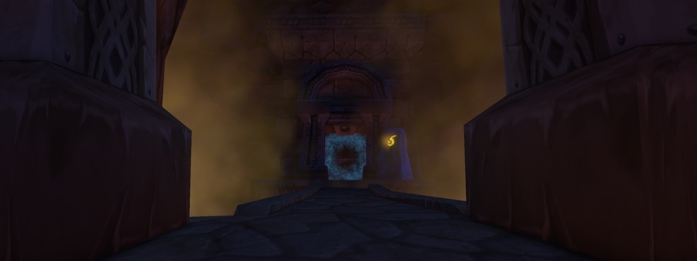

## In breve

| | |
|---|---|
| Livelli | Da 13 a 18 secondo Blizzard; difficile a 11, al livello a 14, facile a 19 |
| Ingresso | Old Ironforge, sotto l’High Seat di Ironforge |
| Boss | 4: Faldrim Anvilmar, Magmatus, Plunder, Durgen Dirgehammer |
| Missioni | 5, tutte dell’Alliance tranne An Ancient Grudge |
| Bottino | Oggetti blu che richiedono il livello 13 |
| Spirit Healer | Appena fuori dalla città |

## Come arrivarci

**Alliance.** Entrate nell’High Seat di Ironforge. La porta di Old Ironforge è subito a sinistra. Seguite il sentiero fino in fondo, al portale.

**Horde.** Il dungeon è la controparte di Ragefire Chasm per l’Alliance, e la strada è lunga. Da Tarren Mill passa per le Arathi Highlands, le Wetlands e Loch Modan fino a Dun Morogh, poi davanti alle guardie di Ironforge. Non è stata trovata una strada più rapida. Toglietevi l’equipaggiamento prima delle guardie, così non perde durabilità quando si muore.

**L’ingresso esatto.** Mettiti alla Great Forge, di fronte alla High Seat, dove siede King Magni Bronzebeard. Nella sua sala, a sinistra si apre un passaggio pieno di ragnatele, a /way 43.5 52.0. Seguilo fino in fondo. Il sentiero passa sopra la lava, e una caduta è mortale.

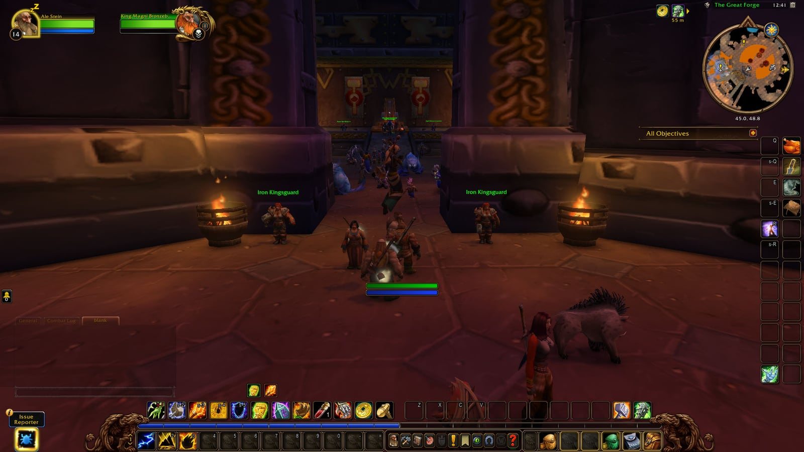

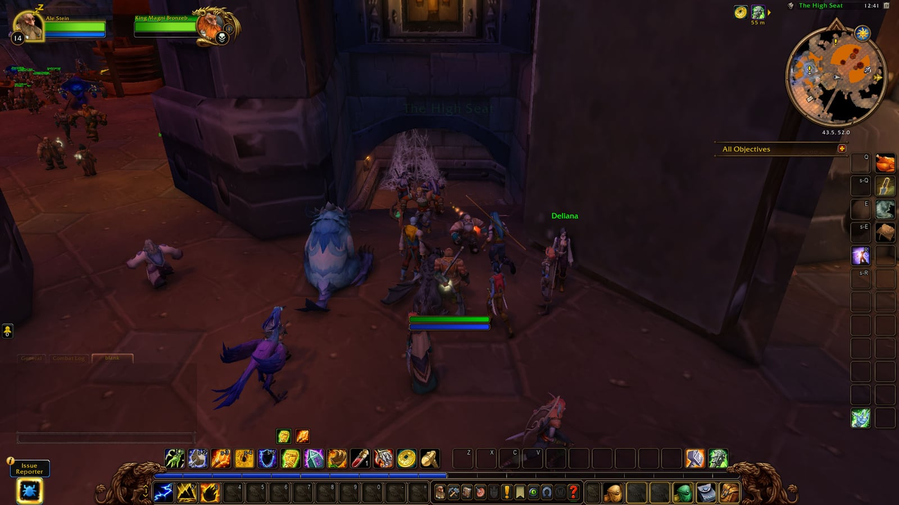

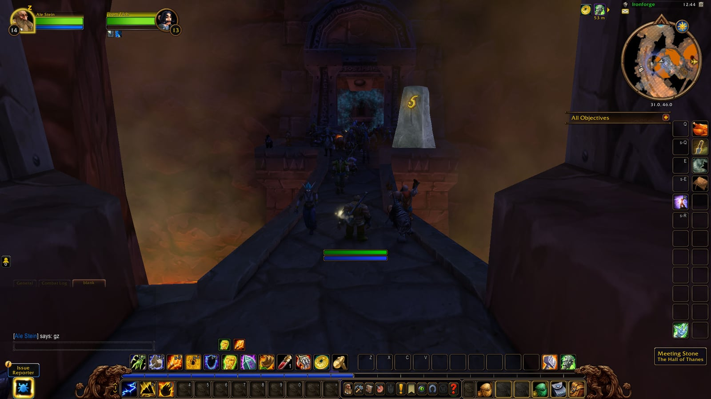

## Le missioni in breve

| Missione | Fazione | Dove inizia | Esperienza |
|---|---|---|---|
| [Important Heirlooms](https://www.wowhead.com/forever/quest=96403) | Alliance | Thom Filch, Old Ironforge, /way 32.6 44.6 | 4.600 |
| [The Restless Dead](https://www.wowhead.com/forever/quest=96394) | Alliance | Afadra Dunwall, Old Ironforge | 3.550 |
| [Old Ironforge Incursion](https://www.wowhead.com/forever/quest=96393) | Alliance | Earthseer Farsen, Dun Morogh, /way 64.8 58.5, dopo una breve catena | 4.950 |
| [An Ancient Grudge](https://www.wowhead.com/forever/quest=96395) | Entrambe | Un Ghostly Attendant, nel dungeon | 3.550 |
| [The Treaty of Understanding](https://www.wowhead.com/forever/quest=98423) | Alliance | Una tavoletta in una cripta della sala del boss finale | 3.900 |

Le missioni sono di livello 15 e 16 e si accettano dal livello 9 o 10. Iniziate dalla catena di Dun Morogh: è l’unica missione che non inizia al dungeon, e chiede il boss finale.

## Prima di partire: la catena di Dun Morogh

Earthseer Farsen si trova a /way 64.8 58.5 a Dun Morogh. Assegna [Nip 'Em in the Bud](https://www.wowhead.com/forever/quest=96390): uccidete 10 Dark Iron Spies, intorno a /way 76.7 60.7. La strada verso Farsen inizia con A Visitor to Dun Morogh, di Beldin Steelgrill a Steelgrill's Depot.

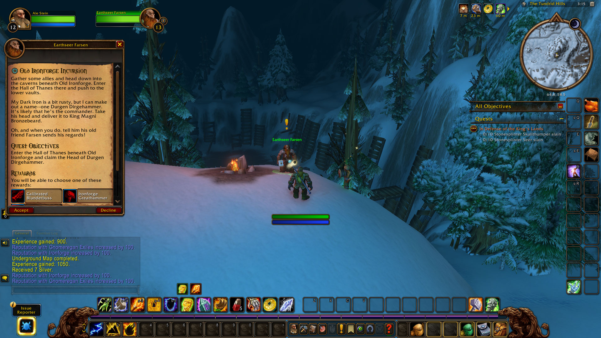

Una delle spie lascia una [Dark Iron Map](https://www.wowhead.com/forever/item=274268). Usatela dalle borse per avviare Underground Map, che vi rimanda da Farsen. Lui assegna allora Old Ironforge Incursion: entrate in The Hall of Thanes e riportate la testa di Durgen Dirgehammer.

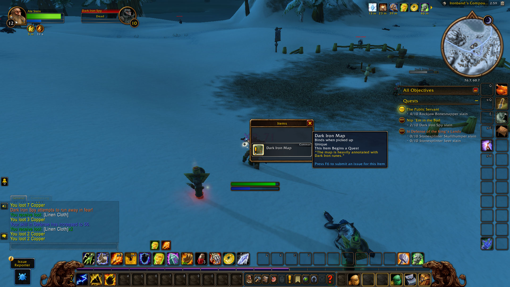

## Le missioni una per una

**Important Heirlooms.** Thom Filch aspetta vicino al ponte che porta in The Hall of Thanes. Chiede 8 [Dwarven Heirlooms](https://www.wowhead.com/forever/item=274289). Si trovano in tutto il dungeon dal primo boss in poi, per lo più su piattaforme rialzate con candele. Non serve contenderseli: le cripte dell’ultima sala, il Reliquary of Kings, ne contengono abbastanza per cinque giocatori. Ricompensa: il Dwarven Tome o i Tomb Robber's Gloves, più 100 di reputazione con Gadgetzan.

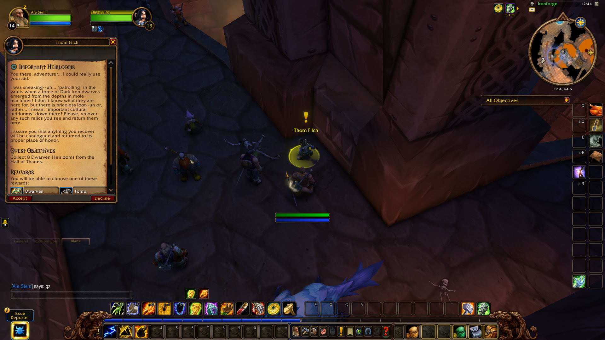

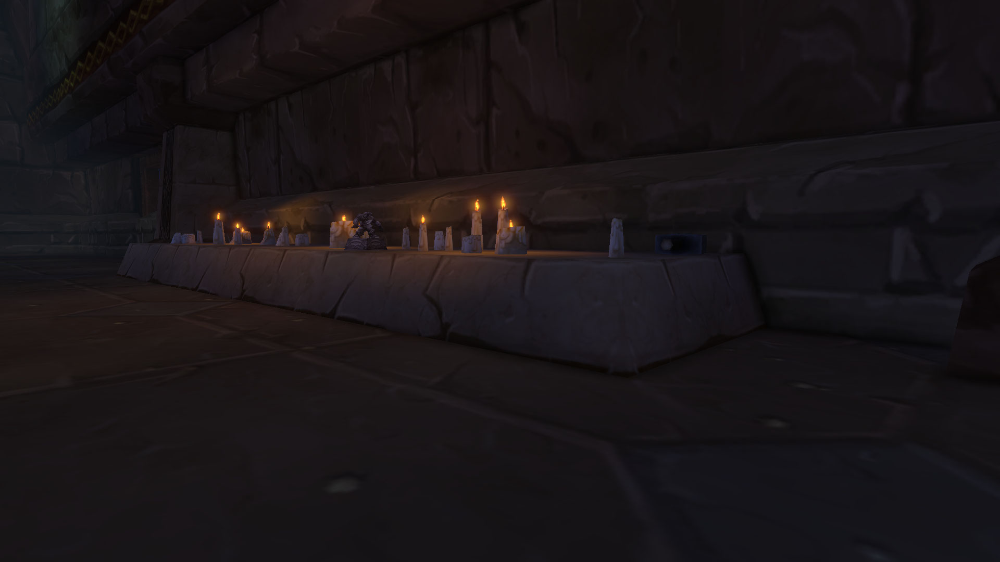

**The Restless Dead.** Afadra Dunwall, una Lorekeeper di Ironforge, sta in cima a una scala sulla strada per l’ingresso. Vuole morti 15 Enraged Apparitions e 10 Tormented Souls, i fantasmi delle prime tre sale. Ricompensa: la Dusty Belt o i Cryptwalker Bracers, più 100 di reputazione con Ironforge.

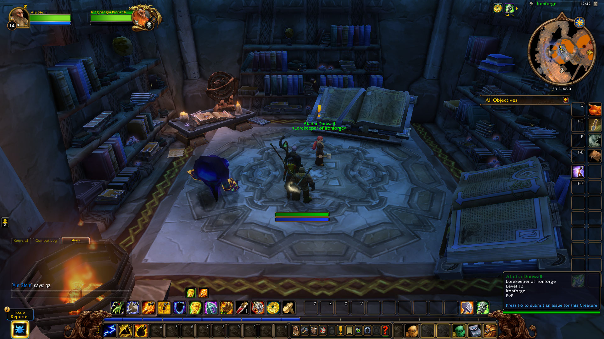

**An Ancient Grudge.** Un Ghostly Attendant aspetta nella seconda sala, Anvilmar's Rest. Chiede di dare pace allo spirito di Faldrim Anvilmar, il primo boss. È l’unica missione che può fare anche la Horde. Chi esce senza Hearthstone le ripassa accanto uscendo, scrive Warcraft Tavern. Ricompensa: la Catacomb Cloak o i Deepgrave Trousers.

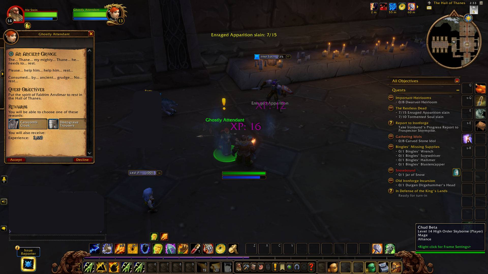

**Old Ironforge Incursion.** Prendete [Durgen Dirgehammer's Head](https://www.wowhead.com/forever/item=274286) dal boss finale e portatela al re Magni Bronzebeard a Ironforge. Ricompensa: a scelta il Calibrated Blunderbuss, l’Ironforge Greathammer o Deepblaze, più 100 di reputazione con Ironforge e con Gnomeregan Exiles.

**The Treaty of Understanding.** Dietro la porta di una cripta del Reliquary of Kings c’è una tavoletta con i sigilli di Madoran Bronzebeard. Avvia una missione senza oggetto in ricompensa, per 3.900 punti esperienza e reputazione con Ironforge e Gnomeregan Exiles: portate anche il trattato a Magni Bronzebeard. Non si può condividere.

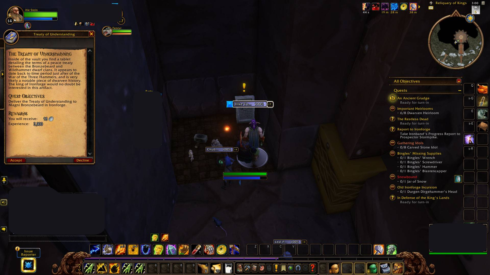

## Ricompense delle missioni

Nell’ordine delle missioni: Old Ironforge Incursion, Important Heirlooms, The Restless Dead e An Ancient Grudge.

<a class="wf-item__name wf-q3" href="https://www.wowhead.com/forever/item=279894">Calibrated Blunderbuss</a>Item Level 18Binds when picked upRangedGun15 - 29 DamageSpeed 2.30(9.57 damage per second)+3 StaminaDurability 50 / 50

<a class="wf-item__name wf-q3" href="https://www.wowhead.com/forever/item=279895">Ironforge Greathammer</a>Item Level 18Binds when picked upTwo-HandMace39 - 60 DamageSpeed 3.10(15.97 damage per second)+4 Strength+7 StaminaDurability 70 / 70

<a class="wf-item__name wf-q3" href="https://www.wowhead.com/forever/item=279896">Deepblaze</a>Item Level 18Binds when picked upRangedWand22 - 41 Fire DamageSpeed 1.70(18.53 damage per second)Durability 45 / 45"The Great Forge burns within it still."

<a class="wf-item__name wf-q3" href="https://www.wowhead.com/forever/item=279898">Dwarven Tome</a>Item Level 17Binds when picked upHeld In Off-hand+2 SpiritEquip: Increases damage and healing done by magical spells and effects by up to 4."Details the history of dwarves long since forgotten."

<a class="wf-item__name wf-q3" href="https://www.wowhead.com/forever/item=280096">Tomb Robber's Gloves</a>Item Level 17Binds when picked upHandsCloth21 Armor+3 Stamina+6 IntellectDurability 20 / 20

<a class="wf-item__name wf-q3" href="https://www.wowhead.com/forever/item=279897">Dusty Belt</a>Item Level 17Binds when picked upWaistLeather45 Armor+5 Agility+4 SpiritDurability 25 / 25

<a class="wf-item__name wf-q3" href="https://www.wowhead.com/forever/item=280095">Cryptwalker Bracers</a>Item Level 17Binds when picked upWristMail76 Armor+4 Strength+3 StaminaDurability 30 / 30

<a class="wf-item__name wf-q3" href="https://www.wowhead.com/forever/item=279899">Catacomb Cloak</a>Item Level 17Binds when picked upBack17 Armor+3 Stamina+6 Attack Power

<a class="wf-item__name wf-q3" href="https://www.wowhead.com/forever/item=279900">Deepgrave Trousers</a>Item Level 17Binds when picked upLegsLeather70 Armor+7 Strength+3 Agility+3 SpiritDurability 60 / 60

## Il percorso nel dungeon

La Hall of Thanes è una linea retta con una deviazione in una grotta. Dal portale:

1. **La prima sala.** Tormented Souls ed Enraged Apparitions, pull facili. Prendi il corridoio a sinistra, verso ovest.
2. **La Ghostly Attendant.** Nella sala successiva dà An Ancient Grudge. Poi viene Anvilmar's Rest, una grande sala con una tomba al centro e Faldrim Anvilmar che ci gira intorno. Elimina prima i fantasmi.
3. **Il lato dei Dark Iron.** Lascia Anvilmar's Rest dal corridoio a sud-est. Da qui comandano i Dark Iron Dwarves. Lungo la strada ci sono barili di Seaforium Blasting Powder: sparaci da lontano e fanno saltare il gruppo intorno.
4. **La grotta.** Le tombe lasciano il posto a una caverna naturale, dove Magmatus sta tra i Dark Iron Dwarves.
5. **Di nuovo nelle sale.** In cima al tunnel aspetta un gruppo di quattro con due barili accanto. Spara a entrambi i barili insieme prima del pull.
6. **Plunder** pattuglia il corridoio subito dopo.
7. **La Reliquary of Kings.** A nord, oltre un ponte sorvegliato da Lesser Stone Golems, c’è l’ultima sala, con Durgen Dirgehammer. Dietro una delle porte delle cripte c’è il Treaty of Understanding.

Uscendo, consegna An Ancient Grudge alla Ghostly Attendant.

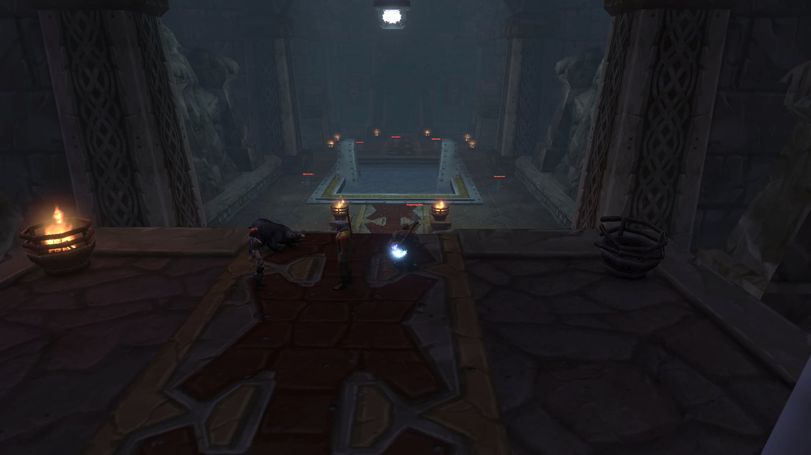

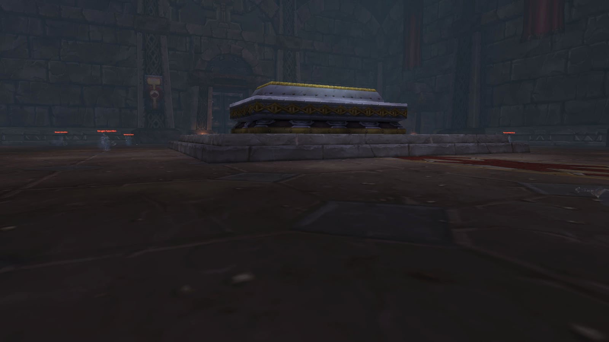

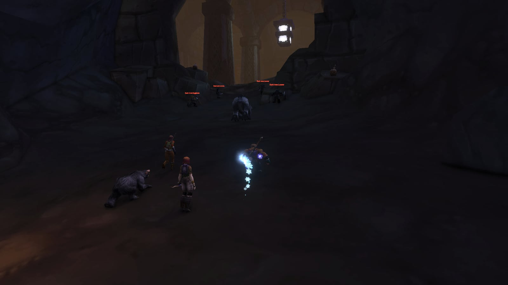

## I quattro boss

### Faldrim Anvilmar

Un fantasma che pattuglia il centro di Anvilmar's Rest. Ripulite un lato della sala, aspettate che venga verso di voi e tiratelo lì, lontano dal trash. Lancia [Mind Blast](https://www.wowhead.com/forever/spell=26048) e mette [Anvilmar's Curse](https://www.wowhead.com/forever/spell=1292602) sul tank per 10 minuti: velocità di attacco e di lancio ridotta del 20%, ma immunità a veleni e sanguinamenti. Un giocatore che rimuove le maledizioni semplifica lo scontro.

<a class="wf-item__name wf-q3" href="https://www.wowhead.com/forever/item=271097">Spiritwraith Drape</a>Item Level 18Binds when picked upBack17 Armor+4 Agility+3 SpiritRequires Level 13

<a class="wf-item__name wf-q3" href="https://www.wowhead.com/forever/item=270227">Ephemeral Choker</a>Item Level 18Binds when picked upNeck+4 Stamina+2 SpiritRequires Level 13

<a class="wf-item__name wf-q3" href="https://www.wowhead.com/forever/item=271096">Aetherwisp Bracers</a>Item Level 18Binds when picked upWristCloth15 Armor+3 StaminaDurability 20 / 20Requires Level 13Equip: Increases damage and healing done by magical spells and effects by up to 3.

Faldrim non si porta dietro i fantasmi intorno a lui, scrive Warcraft Tavern, ma fai comunque spazio prima del pull.

### Magmatus

Un elementale di fuoco con un Dark Iron Summoner al suo fianco. Il tank allontana Magmatus dal gruppo e il gruppo uccide prima il Summoner, perché il boss rilascia ogni tanto una nova di fuoco. [Combust](https://www.wowhead.com/forever/spell=1293228) incendia un giocatore a caso per 12 secondi. Un Summoner che pattuglia lì vicino va eliminato prima del pull.

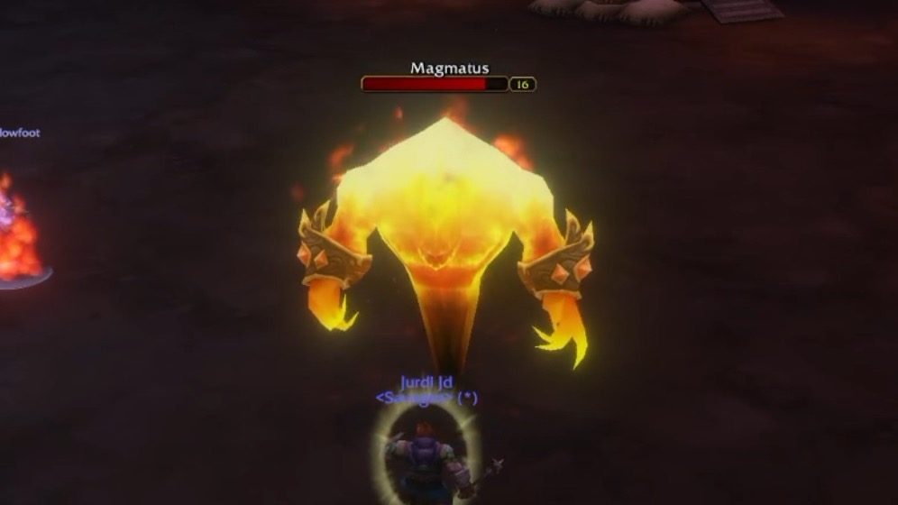

<a class="wf-item__name wf-q3" href="https://www.wowhead.com/forever/item=270230">Kindlegem Girdle</a>Item Level 18Binds when picked upWaistMail100 Armor+4 Strength+4 StaminaDurability 30 / 30Requires Level 13

<a class="wf-item__name wf-q3" href="https://www.wowhead.com/forever/item=270231">Flamefist Grips</a>Item Level 18Binds when picked upHandsLeather51 Armor+2 Strength+4 Agility+4 SpiritDurability 25 / 25Requires Level 13

<a class="wf-item__name wf-q3" href="https://www.wowhead.com/forever/item=271095">Fang of Magmatus</a>Item Level 18Binds when picked upMain HandDagger9 - 18 DamageSpeed 1.70(7.94 damage per second)+4 IntellectDurability 45 / 45Requires Level 13Equip: Increases damage and healing done by magical spells and effects by up to 18.

### Plunder

Un golem che pattuglia un corridoio, con una sola abilità: [Knock Away](https://www.wowhead.com/forever/spell=10101), che scaglia lontano un giocatore. Tiratelo in un punto dove nessuno finisca nel trash, con il gruppo contro un muro o in un angolo.

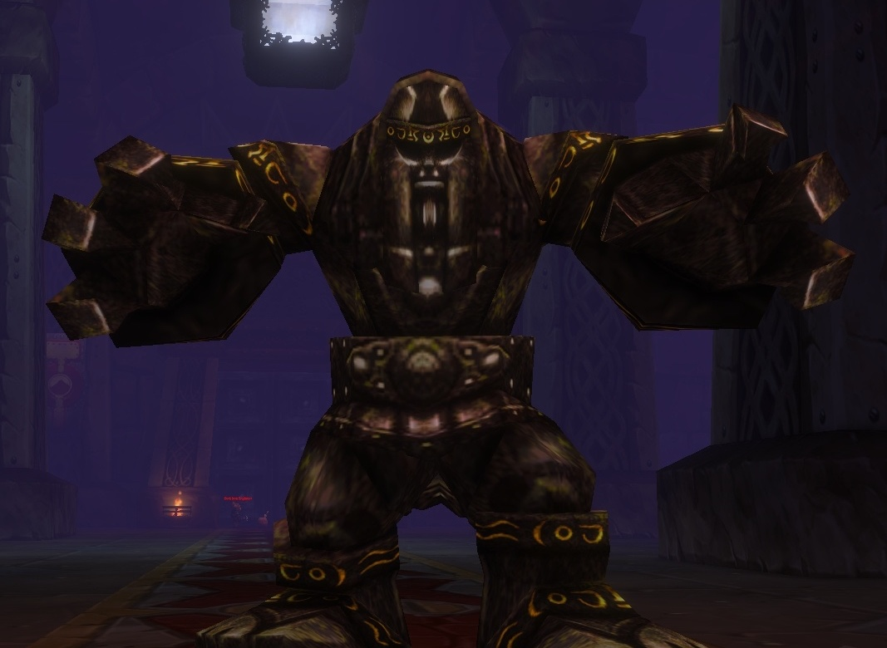

<a class="wf-item__name wf-q3" href="https://www.wowhead.com/forever/item=270228">Golemheart Stave</a>Item Level 18Binds when picked upTwo-HandStaff30 - 46 DamageSpeed 3.20(11.88 damage per second)+3 Stamina+6 Intellect+5 SpiritDurability 70 / 70Requires Level 13Equip: Increases damage and healing done by magical spells and effects by up to 18.

<a class="wf-item__name wf-q3" href="https://www.wowhead.com/forever/item=271098">Golemguard Chest</a>Item Level 18Binds when picked upChestMail178 Armor+4 Strength+6 Stamina+4 SpiritDurability 95 / 95Requires Level 13

<a class="wf-item__name wf-q3" href="https://www.wowhead.com/forever/item=270229">Treads of the Protector Golem</a>Item Level 18Binds when picked upFeetMail122 Armor+5 Strength+4 SpiritDurability 45 / 45Requires Level 13

### Durgen Dirgehammer

Il boss finale, nel Reliquary of Kings, con due Lesser Stone Golems al suo fianco e Dark Iron Looters lungo le pareti. Ripulite prima i Looters: il suo [Fear](https://www.wowhead.com/forever/spell=26070) manda i giocatori verso di loro. Mette anche [Rend](https://www.wowhead.com/forever/spell=12054) sul tank. Uccidete i Golems uno alla volta; un Golem ucciso prima di un wipe non torna, quindi ogni tentativo successivo è più facile. Dopo lo scontro una leva nella cripta sul fondo apre le porte chiuse, e l’uscita è breve.

<a class="wf-item__name wf-q3" href="https://www.wowhead.com/forever/item=270256">Durgen's Crescent Axe</a>Item Level 18Binds when picked upMain HandAxe20 - 39 DamageSpeed 2.40(12.29 damage per second)+2 Strength+1 Agility+1 SpiritDurability 65 / 65Requires Level 13

<a class="wf-item__name wf-q3" href="https://www.wowhead.com/forever/item=270260">Direhammer Leggings</a>Item Level 18Binds when picked upLegsLeather72 Armor+4 Agility+7 StaminaDurability 60 / 60Requires Level 13

<a class="wf-item__name wf-q3" href="https://www.wowhead.com/forever/item=270261">Robes of the Disgraced Thane</a>Item Level 18Binds when picked upChestCloth35 Armor+5 Intellect+7 SpiritDurability 65 / 65Requires Level 13

Uno Shaman che piazza un [Tremor Totem](https://www.wowhead.com/forever/spell=8143) prima del pull rende innocua la paura.

## Trash

Le prime sale sono facili; il lato dei Dark Iron no.

**Dark Iron Looters ed Engineers.** I Looters attaccano veloci con i pugnali e svuotano il tank se ne arrivano diversi insieme, quindi uccideteli per primi. Gli Engineers lanciano bombe su un punto a terra, e quel danno si evita del tutto.

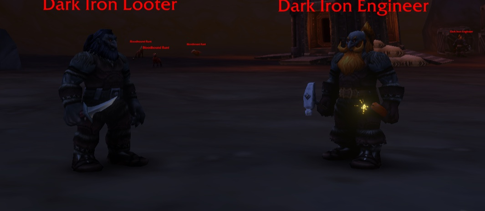

**Dark Iron Summoners.** Lanciano Fireball ed evocano un Fiery Assistant per 30 secondi. Tirateli dietro un pilastro o un muro, fuori vista, così devono avvicinarsi.

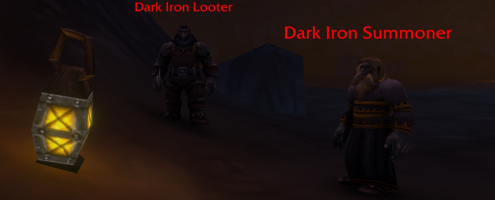

**Lesser Stone Golems.** Colpiscono più forte di tutti e si muovono veloci. Tirateli uno alla volta se possibile, e finitene uno prima del successivo. L’ultimo gruppo prima del boss finale unisce un Summoner, un Looter e un Golem: [Polymorph](https://www.wowhead.com/forever/spell=118) su uno di loro e stordimenti come [Hammer of Justice](https://www.wowhead.com/forever/spell=853) aiutano. I guaritori attirano molta minaccia a questi livelli.

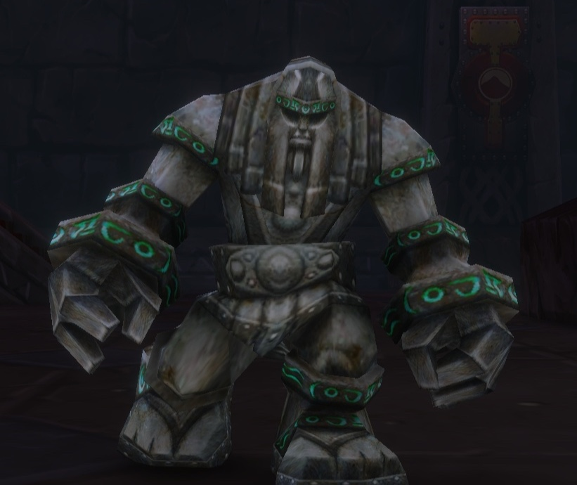

**Bloodhound Runts.** Il loro morso lascia Infected Wounds per 5 minuti: più danni fisici subiti. Senza una classe che rimuove le malattie, un Simple Poultice di First Aid o la razziale [Stoneform](https://www.wowhead.com/forever/spell=20594) del Dwarf la cura.

**Barili di Seaforium.** Accanto a diversi gruppi Dark Iron ci sono barili di Seaforium Blasting Powder. Un giocatore a distanza ci spara e il gruppo subisce l’esplosione.

## Cosa non si sa ancora

- Se la Horde avrà una strada più rapida per Ironforge prima del lancio del 4 novembre.
- Se ricompense e livelli cambieranno ancora prima del lancio.

Il resoconto del dungeon con il video di Jurdi è nell’articolo [The Hall of Thanes conta quattro boss e cinque missioni](/it/news/the-hall-of-thanes-has-four-bosses-and-five-quests/). Tutti i dungeon sono nella [guida ai dungeon](/it/guides/dungeons/).
