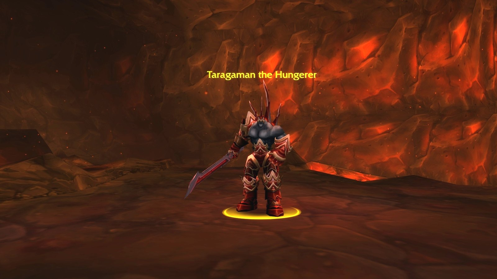
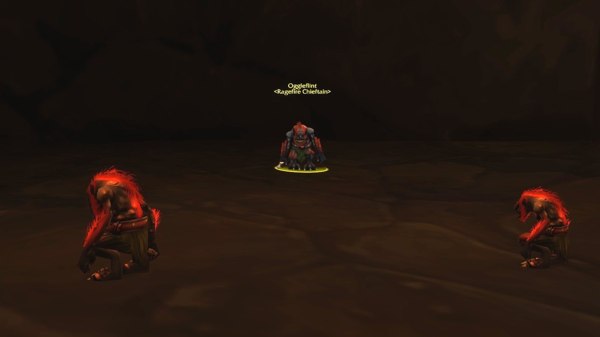
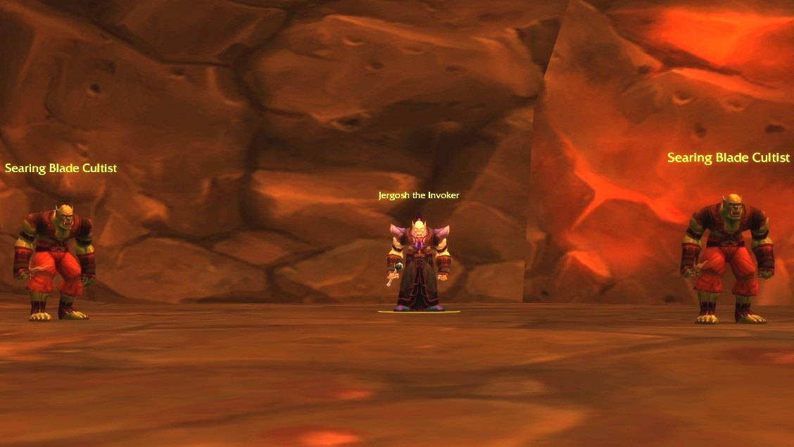
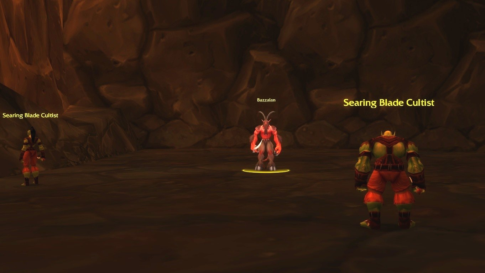

Ragefire Chasm è una rete di grotte vulcaniche sotto Orgrimmar, dove il culto della Burning Blade si nasconde alla Horde. Per la maggior parte dei giocatori della Horde è il primo dungeon di WoW Forever: breve, lineare e con scontri semplici. Dentro aspettano quattro boss e sei missioni.

## In breve

| | |
|---|---|
| Livelli | 9-19, boss di livello 16 |
| Ingresso | La Cleft of Shadow a Orgrimmar |
| Boss | 4: Oggleflint, Taragaman the Hungerer, Jergosh the Invoker, Bazzalan |
| Missioni | 6, tutte della Horde |
| Bottino | I sei oggetti dei boss sono blu in Forever |
| Nome breve | RFC |

## Come arrivarci

**Horde.** Entra nella Cleft of Shadow di Orgrimmar e cerca il portale in fondo.

**Alliance.** Ragefire Chasm è nel cuore di una capitale della Horde. Prendi la nave per Ratchet e raggiungi la punta nord-est di The Barrens, dove l’ingresso ovest di Orgrimmar è più tranquillo. Togli l’equipaggiamento e fai una corsa da fantasma fino alla Cleft of Shadow, finché non puoi entrare nell’istanza.

Dopo un wipe, lo Spirit Healer è a Durotar, fuori dalla città.

## Le missioni

| Missione | Dove inizia | Livello | Ricompensa |
|---|---|---|---|
| <a href="https://www.wowhead.com/forever/quest=5761">Slaying the Beast</a> | Orgrimmar, The Drag: Neeru Fireblade /way 49 50 | 9 | Esperienza e denaro |
| <a href="https://www.wowhead.com/forever/quest=5725">The Power to Destroy...</a> | Undercity, Royal Quarter: Varimathras /way 56 92 | 9 | <a class="wf-wh wf-q3" href="https://www.wowhead.com/forever/item=15449">Ghastly Trousers</a>, <a class="wf-wh wf-q3" href="https://www.wowhead.com/forever/item=15450">Dredgemire Leggings</a> o <a class="wf-wh wf-q3" href="https://www.wowhead.com/forever/item=15451">Gargoyle Leggings</a> |
| <a href="https://www.wowhead.com/forever/quest=5723">Testing an Enemy's Strength</a> | Thunder Bluff, Elder Rise: Rahauro /way 70 30 | 9 | Esperienza e denaro |
| <a href="https://www.wowhead.com/forever/quest=5722">Searching for the Lost Satchel</a> | Thunder Bluff, Elder Rise: Rahauro /way 70 30 <em>Prosegue con <a href="https://www.wowhead.com/forever/quest=5724">Returning the Lost Satchel</a>.</em> | 9 | <a class="wf-wh wf-q3" href="https://www.wowhead.com/forever/item=15452">Featherbead Bracers</a>, <a class="wf-wh wf-q3" href="https://www.wowhead.com/forever/item=15453">Savannah Bracers</a> o <a class="wf-wh wf-q3" href="https://www.wowhead.com/forever/item=270003">Garrison Cuffs</a> |
| <a href="https://www.wowhead.com/forever/quest=5728">Hidden Enemies</a> | Orgrimmar, Valley of Wisdom: Thrall /way 31 37 <em>Completa prima 3 missioni, a partire da Hidden Enemies.</em> | 9 | <a class="wf-wh wf-q3" href="https://www.wowhead.com/forever/item=15443">Kris of Orgrimmar</a>, <a class="wf-wh wf-q3" href="https://www.wowhead.com/forever/item=15445">Hammer of Orgrimmar</a>, <a class="wf-wh wf-q3" href="https://www.wowhead.com/forever/item=15424">Axe of Orgrimmar</a> o <a class="wf-wh wf-q3" href="https://www.wowhead.com/forever/item=15444">Staff of Orgrimmar</a> |

Il livello è il minimo per accettare la missione, secondo Wowhead.

- **Slaying the Beast.** Porta Taragaman the Hungerer's Heart da <a class="wf-wh wf-plain" href="https://www.wowhead.com/forever/npc=11520">Taragaman the Hungerer</a>. Si trova al centro del sentiero a croce prima dell’ultima sala.
- **The Power to Destroy...** Recupera Spells of Shadow e Incantations from the Nether. Li lasciano i Searing Blade Cultists e i Searing Blade Warlocks nella seconda metà del dungeon.
- **Testing an Enemy's Strength.** Uccidi 8 Ragefire Troggs e 8 Ragefire Shamans, nella prima grande sala e nei tunnel intorno.
- **Searching for the Lost Satchel.** <a class="wf-wh wf-plain" href="https://www.wowhead.com/forever/npc=11834">Maur Grimtotem</a> si nasconde in una piccola grotta a destra della prima sala dei trogg, sorvegliato da <a class="wf-wh wf-plain" href="https://www.wowhead.com/forever/npc=11517">Oggleflint</a> e due trogg élite. Maur ti dà Returning the Lost Satchel, da riportare a Rahauro.
- **Hidden Enemies.** Una catena di Thrall. Prima un Lieutenant's Insignia dalla Burning Blade a Skull Rock, a est di Orgrimmar, poi un colloquio con Neeru Fireblade. L’ultimo passo chiede di uccidere <a class="wf-wh wf-plain" href="https://www.wowhead.com/forever/npc=11519">Bazzalan</a> e <a class="wf-wh wf-plain" href="https://www.wowhead.com/forever/npc=11518">Jergosh the Invoker</a> all’interno.

## I boss e il loro bottino

Il bottino di ogni boss viene da Wowhead, con le statistiche dei file della beta.

### Oggleflint

Un capo trogg con due trogg al suo fianco. Controllane uno, uccidi prima l’altro e gira Oggleflint lontano dal gruppo per il suo Cleave. Nessun bottino speciale.

### Taragaman the Hungerer

Si trova su una piattaforma circondata dalla lava. Allontanalo dal bordo perché il suo Uppercut non butti nessuno nella lava, e tieni chi attacca a distanza alla portata massima per Fire Nova.

| Oggetto | Nuovo in Forever |
|---|---|
| <a class="wf-wh wf-q3" href="https://www.wowhead.com/forever/item=14145">Cursed Felblade</a> | Blu, più danno, e il suo effetto riduce il potere d’attacco di 24 invece di 15 |
| <a class="wf-wh wf-q3" href="https://www.wowhead.com/forever/item=14149">Subterranean Cape</a> | Blu, Strength e 5 di salute ogni 5 secondi |
| <a class="wf-wh wf-q3" href="https://www.wowhead.com/forever/item=14148">Crystalline Cuffs</a> | Blu, Stamina e Spirit invece di Intellect |

### Jergosh the Invoker

Nell’ultima sala, con due add che si possono controllare entrambi. Lancia Immolate e Curse of Weakness, che rende più difficile al tank tenere la minaccia.

| Oggetto | Nuovo in Forever |
|---|---|
| <a class="wf-wh wf-q3" href="https://www.wowhead.com/forever/item=14150">Robe of Evocation</a> | Blu, più Stamina e 4 di Spirit |
| <a class="wf-wh wf-q3" href="https://www.wowhead.com/forever/item=14151">Chanting Blade</a> | Blu, più danno, Agility e Stamina |
| <a class="wf-wh wf-q3" href="https://www.wowhead.com/forever/item=14147">Cavedweller Bracers</a> | Blu, Spirit invece di Stamina |

### Bazzalan

In cima alla rampa di destra prima di Jergosh. L’add di destra si può attirare senza di lui. Bazzalan colpisce forte con Sinister Strike e Deadly Poison, quindi uccidilo in fretta. Nessun bottino speciale.

## Cosa non si sa ancora

- **Le probabilità di drop** del bottino dei boss.
- **Le ricompense delle missioni** possono ancora cambiare durante la beta.
