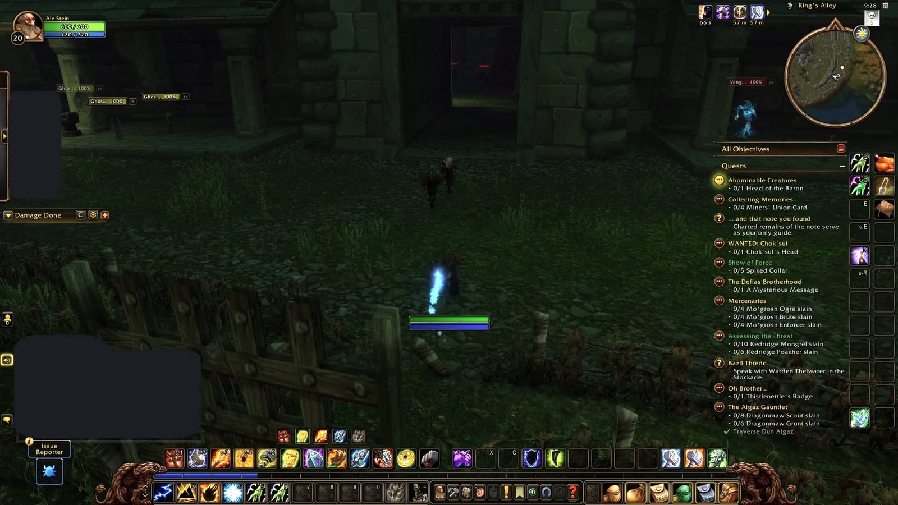
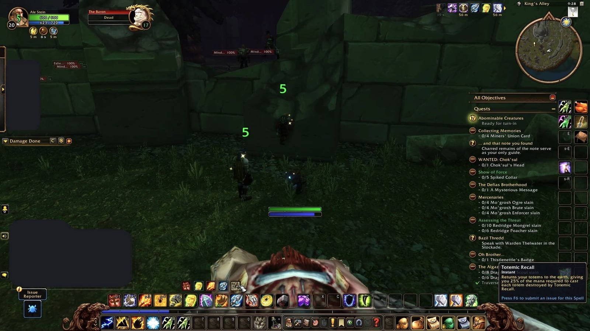
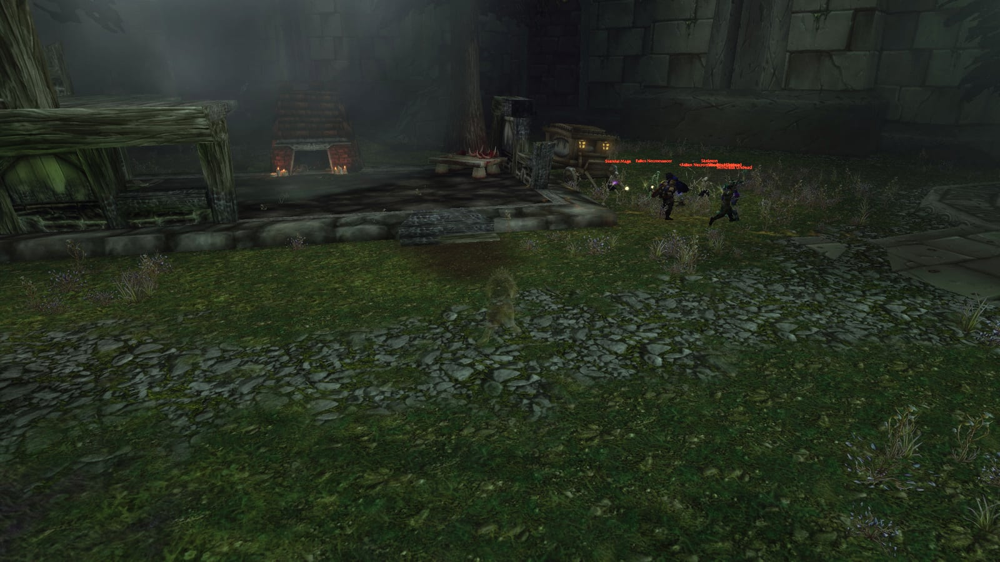
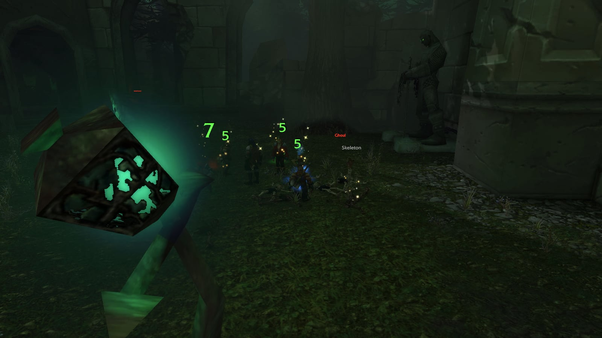
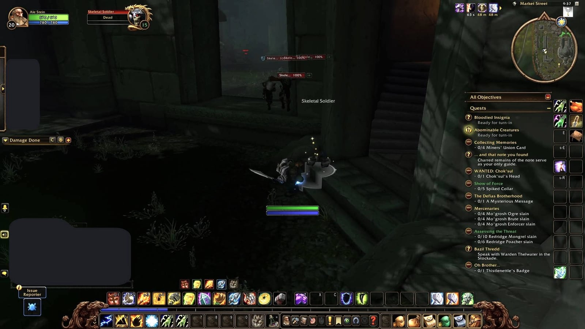
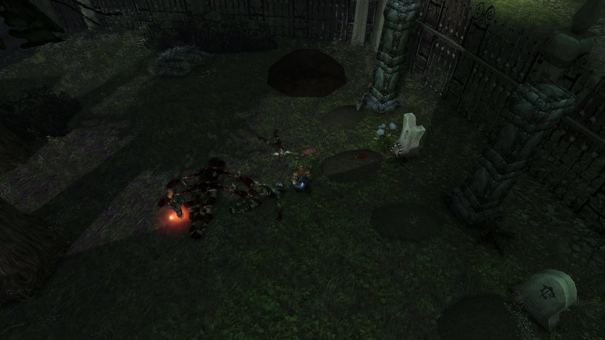
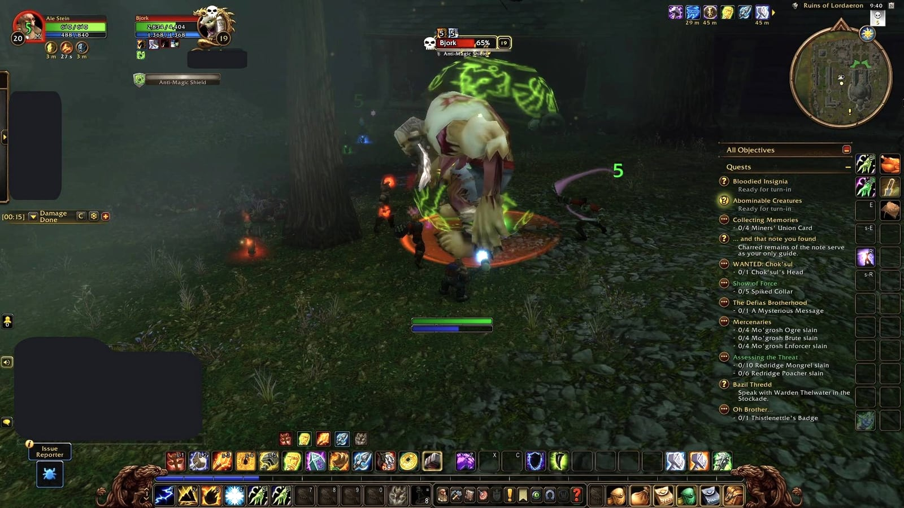

Le Ruins of Lordaeron sono un nuovo dungeon nella capitale in rovina sopra la Undercity, per i livelli dal 15 al 20. Lo Scourge tiene ancora le strade, e i Forsaken le rivogliono. Sei boss attendono in qualsiasi ordine, con sei missioni per la Horde e quattro per l’Alliance.

## In breve

| | |
|---|---|
| Livelli | Da 15 a 20 secondo Blizzard, da 16 a 22 consigliato |
| Ingresso | Le rovine all’aperto di Lordaeron sopra la Undercity, Tirisfal Glades |
| Boss | 6, in qualsiasi ordine |
| Missioni | 6 per la Horde, 4 per l’Alliance |
| Bottino | Oggetti blu che richiedono il livello da 15 a 19 |
| Spirit Healer | Appena fuori dall’ingresso |

Il dungeon non è lineare. Viktor the Vile e il Crest of Lordaeron sono facili da perdere, e una seconda run dà molta meno esperienza dai mostri, quindi conviene fare tutto in una volta.

## Come arrivarci

**Horde.** Andate a piedi da Brill alla Undercity ed entrate nelle rovine di Lordaeron sopra la città, senza scendere con gli ascensori. Il portale è subito a sinistra dopo il cancello.

**Alliance.** Una lunga strada:

1. Prendete la nave da Stormwind Harbor ad Auberdine.
2. Ad Auberdine prendete la nave per Menethil Harbor e restate a bordo fino a Southshore, in Hillsbrad Foothills.
3. Seguite la strada verso nord da Southshore, oltre Hillsbrad Fields e attorno a Dalaran.
4. Nuotate verso nord attraverso Lordamere Lake, in Silverpine Forest, fino a Tirisfal Glades.
5. Seguite la strada fino alle rovine di Lordaeron.

Gli Skyborne dalla parte dell’Alliance possono prendere un portale dalla Mage Tower di Stormwind a Dalaran e partire dal passo 3.

**Il punto esatto.** Passa il portone delle rovine e guarda a sinistra prima della rocca: il portale è in cima a una scala, a /way 72.4 11.6. Chi muore dentro torna come fantasma nel cortile, lì vicino. Fuori, sul lungo viaggio dell’Alleanza, gli Spirit Healers sono lontani tra loro, e su un ruleset PvP la strada attraversa molto territorio dell’Orda.

## Le missioni in breve

| Missione | Fazione | Dove inizia | Esperienza |
|---|---|---|---|
| [The Wrath of Rath'mael](https://www.wowhead.com/forever/quest=92422) | Horde | Deathguard Kristof, Tirisfal Glades, /way 65.2 60.2 | non indicata |
| [A Frightened Request](https://www.wowhead.com/forever/quest=92401) | Horde | Tabitha Heartweaver, The Sepulcher, Silverpine Forest, /way 44.6 42.8 | 7.050 |
| [Light's Justice](https://www.wowhead.com/forever/quest=92421) | Horde | Morbin Lightbane, Undercity, /way 57.8 89.8 | 7.050 |
| [The New Plague](https://www.wowhead.com/forever/quest=95216) | Horde | Theodore Griffs, l’Apothecarium, Undercity, /way 47.0 72.6 | 8.300 |
| [Unending Torment](https://www.wowhead.com/forever/quest=97288) | Horde | L’Abominable Head, lasciata da The Baron | 5.300 per il primo passo |
| [Crest of Lordaeron](https://www.wowhead.com/forever/quest=95204) | Horde | Il Crest of Lordaeron, all’interno | 8.300 |
| [Abominable Creatures](https://www.wowhead.com/forever/quest=95250) | Alliance | Captain Truman, vicino all’ingresso | 6.200 |
| [Bloodied Insignia](https://www.wowhead.com/forever/quest=95195) | Alliance | Bloodied Insignias, lasciate dai non morti | 9.750 |
| [Crest of Lordaeron](https://www.wowhead.com/forever/quest=95189) | Alliance | Il Crest of Lordaeron, all’interno | 9.750 |
| [Remember That I Love You](https://www.wowhead.com/forever/quest=92415) | Alliance | La Blood-Stained Letter, vicino a Rath'mael | 9.750 |

Tutte le missioni richiedono il livello 15 o 16, ma le missioni stesse sono di livello 21 e 22. Per questo sono rosse al livello 17, anche se il dungeon si completa a quel livello.

## Missioni della Horde

Prendete le quattro missioni esterne prima del primo pull. Sono di strada: Brill, la Undercity e una deviazione verso Silverpine Forest.

**The Wrath of Rath'mael.** Deathguard Kristof sta alla carovana tra Brill e la Undercity. Vuole Rath'mael morto. Gli esploratori segnalano una nebbia empia in Lordamere Overlook, nelle strade e nel cimitero. Ricompensa: la Forsaken Greataxe o il Gnarled Necromancer's Staff, più 150 di reputazione con Undercity.

**A Frightened Request.** Tabitha Heartweaver, a The Sepulcher, cerca il marito Edward, andato al cimitero di Lordaeron e mai tornato. Lo trovate accanto a Rath'mael. Ricompensa: Edward's Knife o Tabitha's Cuffs, più 150 di reputazione con Undercity.

**Light's Justice.** Morbin Lightbane, un Paladin Forsaken nel Royal Quarter della Undercity, chiede 25 Intact Limbs dallo Scourge del dungeon. Ricompensa: The Stitcher o Spare Part Bindings, più 150 di reputazione con Undercity.

**The New Plague.** Theodore Griffs, nell’Apothecarium, vuole la Highly Toxic Strain di Witherfang. Ricompensa: Plaguefang o Blight Gloves.

**Unending Torment.** Quando The Baron cade, la testa si stacca: l’Abominable Head avvia una catena di cinque passi nella Undercity. Portate la testa a Master Apothecary Faranell, poi al corpo di Othmar, fate rapporto, raccogliete un Toxic Skullcap, del Blisterweed e dell’Essence of Agony in città, e iniettate l’Hissing Serum sopra il corpo di Othmar. Il primo passo dà 5.300 punti esperienza, l’ultimo 1.650. La catena porta anche a Slain Baron's Signet; a quale passo non si sa.

**Crest of Lordaeron.** Il crest si trova in uno di diversi punti del dungeon. Portatelo a Oran Snakewrithe nella Undercity. Ricompensa: un Small Sack of Gems.

## Missioni dell’Alliance

L’Alliance trova tutte e quattro le missioni all’interno. Tre si consegnano a Stormwind, quindi una Hearthstone impostata su Stormwind risparmia il lungo ritorno.

**Abominable Creatures.** Captain Truman, amichevole con l’Alliance e ostile alla Horde, aspetta vicino all’ingresso. Vuole la Head of the Baron. Ricompensa: a scelta il Monstrous Cleaver, il Grave Shroud o Slain Baron's Signet.

**Bloodied Insignia.** I non morti del dungeon lasciano cadere vecchie insegne dell’Alliance, dei soldati di Lordaeron. Portatene 10 al General Marcus Jonathan a Stormwind. Ricompensa: Duty Bound Leggings o Remembrance Armor.

**Crest of Lordaeron.** Lo stesso crest della Horde, ma va a Lady Dena Kennedy a Stormwind. Ricompensa: un Small Sack of Gems.

**Remember That I Love You.** Vicino a Rath'mael c’è una Blood-Stained Letter. Parla di un figlio scomparso della famiglia Heartweaver; portatela a Orphan Matron Nightingale a Stormwind. È il primo di due passi e non si può condividere. La ricompensa della catena è il Tarnished Locket.

## Ricompense delle missioni

Per la Horde, nell’ordine delle missioni qui sopra:

<a class="wf-item__name wf-q3" href="https://www.wowhead.com/forever/item=251485">Edward's Knife</a>Item Level 24Binds when picked upOne-HandDagger17 - 33 DamageSpeed 1.60(15.63 damage per second)+4 Agility+4 StaminaDurability 50 / 50

<a class="wf-item__name wf-q3" href="https://www.wowhead.com/forever/item=251486">Tabitha's Cuffs</a>Item Level 24Binds when picked upWristCloth18 Armor+3 Stamina+6 IntellectDurability 20 / 20

<a class="wf-item__name wf-q3" href="https://www.wowhead.com/forever/item=251533">Forsaken Greataxe</a>Item Level 24Binds when picked upTwo-HandAxe49 - 74 DamageSpeed 3.00(20.50 damage per second)+8 Strength+4 StaminaDurability 90 / 90Equip: Movement speed increased by 2% in Silverpine Forest and Hillsbrad Foothills.

<a class="wf-item__name wf-q3" href="https://www.wowhead.com/forever/item=251534">Gnarled Necromancer's Staff</a>Item Level 24Binds when picked upTwo-HandStaff34 - 51 DamageSpeed 2.80(15.18 damage per second)+10 IntellectDurability 90 / 90Equip: Increases damage and healing done by magical spells and effects by up to 26.Equip: Movement speed increased by 2% in Silverpine Forest and Hillsbrad Foothills.

<a class="wf-item__name wf-q3" href="https://www.wowhead.com/forever/item=279876">Plaguefang</a>Item Level 24Binds when picked upUnique-EquippedOne-HandSword23 - 43 DamageSpeed 2.10(15.71 damage per second)Durability 75 / 75Chance on hit: Poisons target for 4 Nature damage every 1 sec for 10 sec.

<a class="wf-item__name wf-q3" href="https://www.wowhead.com/forever/item=279877">Blight Gloves</a>Item Level 24Binds when picked upHandsCloth26 Armor+7 Intellect+5 Spirit+3 Nature ResistanceDurability 20 / 20

<a class="wf-item__name wf-q3" href="https://www.wowhead.com/forever/item=279874">The Stitcher</a>Item Level 24Binds when picked upMain HandMace17 - 33 DamageSpeed 2.40(10.42 damage per second)+6 StaminaDurability 75 / 75Equip: Increases healing done by up to 48 and damage done by up to 16 for all magical spells and effects.

<a class="wf-item__name wf-q3" href="https://www.wowhead.com/forever/item=279875">Spare Part Bindings</a>Item Level 24Binds when picked upWristLeather40 Armor+3 Agility+5 Stamina+3 SpiritDurability 30 / 30

Per l’Alliance: le tre scelte di Abominable Creatures, le due di Bloodied Insignia e il medaglione.

<a class="wf-item__name wf-q3" href="https://www.wowhead.com/forever/item=279864">Monstrous Cleaver</a>Item Level 23Binds when picked upTwo-HandSword52 - 78 DamageSpeed 3.30(19.70 damage per second)+9 Stamina+10 Attack PowerDurability 80 / 80

<a class="wf-item__name wf-q3" href="https://www.wowhead.com/forever/item=279865">Grave Shroud</a>Item Level 23Binds when picked upBack20 Armor+3 Strength+2 Agility+5 Stamina

<a class="wf-item__name wf-q3" href="https://www.wowhead.com/forever/item=279867">Slain Baron's Signet</a>Item Level 23Binds when picked upFinger+5 StaminaEquip: Increases defense skill by 2.

<a class="wf-item__name wf-q3" href="https://www.wowhead.com/forever/item=279868">Duty Bound Leggings</a>Item Level 24Binds when picked upLegsLeather81 Armor+6 Agility+9 Stamina+6 IntellectDurability 70 / 70

<a class="wf-item__name wf-q3" href="https://www.wowhead.com/forever/item=279869">Remembrance Armor</a>Item Level 24Binds when picked upChestMail198 Armor+5 Strength+9 Stamina+6 SpiritDurability 105 / 105

<a class="wf-item__name wf-q3" href="https://www.wowhead.com/forever/item=279870">Tarnished Locket</a>Item Level 24Binds when picked upNeck+5 Stamina+4 Spirit"Some memories are best forgotten."

## Il percorso nel dungeon

Il dungeon sembra aperto e confuso, ma il percorso è una U. La vera sfida è la densità: i gruppi sono vicini, le pattuglie si incrociano e il guaritore resta presto senza mana. Dal portale:

1. **Captain Truman.** L’Alliance gira a sinistra per Abominable Creatures. Poi scendi le scale verso est.
2. **La finestra.** Salta il grande cancello coperto di ragnatele e passa dalla finestra a destra. Così eviti alcuni gruppi.
3. **Witherfang** pattuglia il vicolo. Elimina i piccoli gruppi di ragni, poi il boss.
4. **Verso sud, lungo il muro di sinistra**, per combattere il meno possibile. Presso tre Ghostly Citizens, gira a destra in un passaggio verso ovest: lì c’è The Baron.
5. **Oltre il muro.** Dietro The Baron, una colonna spezzata poggia su un muretto. Salici sopra e salta dall’altra parte. Hunter e Warlock congedano prima il famiglio.
6. **Lungo il cimitero.** Davanti c’è un cimitero dietro una cancellata, con un cerchio di evocazione: Rath'mael viene per ultimo. Tieni la destra e giraci intorno.
7. **Viktor the Vile.** Subito dopo un corridoio verso un cortile c’è una casa bruciata con un camino. Pulisci la zona, aspetta di avere tutto il mana e clicca sul fuoco.
8. **The Abandoned.** Nel cortile oltre il cimitero c’è una statua con gli occhi luminosi. Cliccala per le ondate; The Abandoned esce dalla statua.
9. **La finestra verso Bjork.** Lascia il cortile dalla zona con la scala stretta, gira a destra in fondo e salta da una grande finestra. Lì pattuglia Bjork.
10. **Rath'mael.** Vai dritto a sud fino al cimitero. Lì c’è anche il corpo di Edward, necessario a entrambe le fazioni.

L’Alliance esce a piedi invece di usare la Hearthstone: la Head of the Baron va a Captain Truman, all’ingresso.

## I sei boss

Va bene qualsiasi ordine. Ogni boss lascia oggetti blu; dalla beta se ne conoscono tre per boss.

### Witherfang

Un grande ragno che pattuglia King's Alley con due ragni più piccoli. Ripulite prima il trash sul suo percorso, così arriva da solo, e uccidete in fretta i ragni piccoli. Il suo [Leech Poison](https://www.wowhead.com/forever/spell=3358) toglie 15 punti vita ogni 5 secondi per 40 secondi; un giocatore che rimuove i veleni lo toglie dal tank. Witherfang lascia anche la Highly Toxic Strain per The New Plague.

<a class="wf-item__name wf-q3" href="https://www.wowhead.com/forever/item=271201">Atrophic Girdle</a>Item Level 20Binds when picked upWaistMail104 Armor+5 Strength+5 StaminaDurability 35 / 35Requires Level 15

<a class="wf-item__name wf-q3" href="https://www.wowhead.com/forever/item=271203">Segmented Spider Leg</a>Item Level 20Binds when picked upTwo-HandStaff50 - 76 DamageSpeed 3.60(17.50 damage per second)+5 Strength+9 AgilityDurability 75 / 75Requires Level 15

<a class="wf-item__name wf-q3" href="https://www.wowhead.com/forever/item=271202">Witherbite Bracers</a>Item Level 20Binds when picked upWristLeather37 Armor+4 Agility+3 Intellect+3 SpiritDurability 30 / 30Requires Level 15

Non si porta dietro la sua pattuglia, scrive Warcraft Tavern: un pull a distanza la porta da sola.

### The Baron

Un’abominazione con una sola abilità che conta: [Knockout](https://www.wowhead.com/forever/spell=17307), molti danni istantanei che respingono il bersaglio, lo stordiscono e ne riducono la minaccia. Un tank che non è a vita piena può morirne. Storditelo il più spesso possibile. Lascia la Head of the Baron per l’Alliance e l’Abominable Head per la Horde.

<a class="wf-item__name wf-q3" href="https://www.wowhead.com/forever/item=271204">Meathook Slicer</a>Item Level 20Binds when picked upOne-HandDagger17 - 32 DamageSpeed 1.80(13.61 damage per second)+4 Agility+3 StaminaDurability 45 / 45Requires Level 15

<a class="wf-item__name wf-q3" href="https://www.wowhead.com/forever/item=271205">Abomination Bones</a>Item Level 20Binds when picked upChestMail184 Armor+9 Strength+2 Stamina+4 IntellectDurability 95 / 95Requires Level 15

<a class="wf-item__name wf-q3" href="https://www.wowhead.com/forever/item=271206">Leftover Abomination Skin</a>Item Level 20Binds when picked upChestCloth37 Armor+7 SpiritDurability 70 / 70Requires Level 15Equip: Increases damage and healing done by magical spells and effects by up to 7.

Tankalo con la schiena contro un muro. Colpisce anche tutti quelli in mischia intorno a lui: il melee sta dietro, chi è a distanza si tiene lontano da lui e dagli altri, così lo stordimento del tank non lo manda in un gruppo.

### Viktor the Vile

Il boss che la maggior parte dei gruppi perde. Accendete la Kindled Flame nel camino di un edificio a sud-ovest di Lordamere Overlook, vicino al cimitero. Seguono cinque ondate di add prima che arrivi Viktor. Colpisce forte e ha lo stesso Leech Poison di Witherfang, quindi lasciate che il tank prenda l’aggro per primo. Nella beta a volte Viktor non compare.

<a class="wf-item__name wf-q3" href="https://www.wowhead.com/forever/item=271218">Vileblood Scimitar</a>Item Level 22Binds when picked upOne-HandSword26 - 50 DamageSpeed 2.60(14.62 damage per second)+4 Strength+2 AgilityDurability 70 / 70Requires Level 17

<a class="wf-item__name wf-q3" href="https://www.wowhead.com/forever/item=271212">Bloodied Chestwraps</a>Item Level 22Binds when picked upChestLeather89 Armor+9 Agility+4 Stamina+4 IntellectDurability 90 / 90Requires Level 17

<a class="wf-item__name wf-q3" href="https://www.wowhead.com/forever/item=271211">Vilewalkers</a>Item Level 22Binds when picked upFeetMail131 Armor+7 Strength+5 StaminaDurability 50 / 50Requires Level 17

Le ondate sfiancano il gruppo più di Viktor stesso, quindi inizia solo con tutto il mana.

### The Abandoned

Aspetta in Market Street, arrivando da Lordamere Overlook. Una statua lì avvia tre ondate di add, poi esce lui. Lancia [Frost Nova](https://www.wowhead.com/forever/spell=1220855), rallenta chi lo colpisce in mischia e prosciuga il tank con [Life Drain](https://www.wowhead.com/forever/spell=1266011), un lancio di 2 secondi. Uno stordimento prima della fine del lancio lo blocca.

<a class="wf-item__name wf-q3" href="https://www.wowhead.com/forever/item=271216">Scepter of the Abandoned</a>Item Level 22Binds when picked upMain HandMace17 - 33 DamageSpeed 2.60(9.62 damage per second)Durability 70 / 70Requires Level 17Equip: Increases damage and healing done by magical spells and effects by up to 24.

<a class="wf-item__name wf-q3" href="https://www.wowhead.com/forever/item=271208">Grip of Fear</a>Item Level 22Binds when picked upHandsMail119 Armor+5 Strength+4 Agility+5 StaminaDurability 35 / 35Requires Level 17

<a class="wf-item__name wf-q3" href="https://www.wowhead.com/forever/item=271207">Rotmender's Leggings</a>Item Level 22Binds when picked upLegsCloth35 Armor+5 Stamina+8 Intellect+5 SpiritDurability 50 / 50Requires Level 17Rotmender's Raiment (0/5)(2) Set: +10 Intellect.(3) Set: Reduces all threat generated by 5%.(4) Set: When your Mana falls below 15% restore 600 Mana over 15 sec. This effect can only trigger once every 5 min. (5m cooldown)(5) Set: Grant your healing spells a chance to apply Rotmending, restoring 40 Health every 3 sec for 15 sec. (Proc chance: 10%)

La sua Frost Armor non si può dissipare. Durante le ondate, a volte i non morti restano incastrati nei corridoi e l’evento si blocca: vai a prenderli.

### Bjork

Un combattimento rapido. La sua unica abilità è un breve [Anti-Magic Shield](https://www.wowhead.com/forever/spell=1301635), che lo rende immune alla magia per 3 secondi. Gli incantatori aspettano che finisca.

<a class="wf-item__name wf-q3" href="https://www.wowhead.com/forever/item=271217">Corpse Chopper</a>Item Level 21Binds when picked upTwo-HandAxe52 - 79 DamageSpeed 3.60(18.19 damage per second)+11 StrengthDurability 75 / 75Requires Level 16

<a class="wf-item__name wf-q3" href="https://www.wowhead.com/forever/item=271209">Bonerust Leggings</a>Item Level 21Binds when picked upLegsMail164 Armor+7 Strength+6 Agility+3 SpiritDurability 75 / 75Requires Level 16

<a class="wf-item__name wf-q3" href="https://www.wowhead.com/forever/item=271210">Tuskwrap Belt</a>Item Level 21Binds when picked upWaistCloth22 Armor+5 Stamina+5 IntellectDurability 20 / 20Requires Level 16

### Rath'mael

Rath'mael sta nel cimitero, con Edward Heartweaver e la Blood-Stained Letter lì vicino. La sua unica abilità è [Flamestrike](https://www.wowhead.com/forever/spell=1279983), sempre nel punto dove stava il tank all’inizio del lancio. Uscitene e continuate altrove, oppure storditelo prima che lanci. Il suo bottino richiede il livello 19, il più alto del dungeon.

<a class="wf-item__name wf-q3" href="https://www.wowhead.com/forever/item=271213">Mirror of Rath'mael</a>Item Level 24Binds when picked upOff HandShield547 Armor11 Block+4 Strength+4 Stamina+3 IntellectDurability 90 / 90Requires Level 19

<a class="wf-item__name wf-q3" href="https://www.wowhead.com/forever/item=271215">Coldspire Staff</a>Item Level 24Binds when picked upTwo-HandStaff43 - 66 DamageSpeed 3.60(15.14 damage per second)Durability 90 / 90Requires Level 19Equip: Increases damage and healing done by magical spells and effects by up to 26.

<a class="wf-item__name wf-q3" href="https://www.wowhead.com/forever/item=271214">Rotmender's Treads</a>Item Level 24Binds when picked upFeetCloth29 Armor+7 Stamina+4 Intellect+4 SpiritDurability 35 / 35Requires Level 19Rotmender's Raiment (0/5)(2) Set: +10 Intellect.(3) Set: Reduces all threat generated by 5%.(4) Set: When your Mana falls below 15% restore 600 Mana over 15 sec. This effect can only trigger once every 5 min. (5m cooldown)(5) Set: Grant your healing spells a chance to apply Rotmending, restoring 40 Health every 3 sec for 15 sec. (Proc chance: 10%)

Il lancio si può interrompere, e questo risparmia i giocatori in mischia.

## Rotmender's Raiment

Le Rotmender's Leggings di The Abandoned e le Rotmender's Treads di Rath'mael fanno parte di un nuovo set di stoffa da cinque pezzi. Due pezzi danno +10 Intellect, tre riducono la minaccia del 5%, quattro restituiscono 600 mana quando il mana scende sotto il 15%, e cinque danno agli incantesimi di cura una probabilità di curare nel tempo. Le Robes, la Sash e i Gloves si vincolano quando indossati; dove cadono non si sa ancora.

## Trash

Il trash colpisce meno forte che nella Hall of Thanes, ma i gruppi di mostri stanno vicini e alcuni pattugliano. Tirarne due insieme è il pericolo principale. Il controllo della folla e gli stordimenti come [Hammer of Justice](https://www.wowhead.com/forever/spell=853) aiutano, e i Paladin vanno bene dal livello 20 con [Exorcism](https://www.wowhead.com/forever/spell=879), che colpisce forte i non morti.

**Ragni.** Venom Lurkers, Spiders e Tarantulas all’inizio. Non forti da soli, ma alcuni gruppi pattugliano. Portateli in un punto già ripulito.

**Skeletal Soldiers e Shrieking Banshees.** Vicino a The Baron. I soldati colpiscono forte in grandi gruppi e le banshee silenziano.

**Flesh Golems.** Pattugliano Lordamere Overlook, fanno molti danni e usano Knock Away, che riduce la minaccia. Fate attenzione a dove atterra il tank, così nessuno vola in un altro gruppo.

**Ghouls e Ragged Ghouls.** Gruppi di tre o quattro con colpi in mischia potenti, vicini ad altri gruppi.

**Deep Widows e Broodlings.** Anche all’inizio, con attacchi velenosi. Innocue finché non ne attiri troppe insieme.

**Skeletal Mages.** Si lanciano Frost Armor; dissipala e cadono prima.

**Wailing Banshees.** Una maledizione che abbassa la probabilità di colpire del bersaglio.

**Stone Watchers.** Gargoyle ai piani alti che fingono di essere statue finché non ti avvicini. In combattimento tornano di pietra: immuni ai danni fisici e rigenerano salute. Colpiscile con la magia in quella fase.

## Un raro: il Lordaeron Captain

Un raro con una piccola probabilità di comparire sul lato ovest del dungeon. L’Alliance non può ucciderlo; per l’Orda è ostile. Un combattimento semplice: basta non attirare add rimasti.

## Cosa non si sa ancora

- Quale boss conti come boss finale. Il boss di livello 20 non ha un posto fisso nell’ordine; Warcraft Tavern chiude il suo percorso con Rath'mael.
- Se Viktor the Vile comparirà sempre al lancio. Nella beta a volte no.
- Dove cade il resto del Rotmender's Raiment, e a quale passo Unending Torment dà Slain Baron's Signet.
- Quanta esperienza dia The Wrath of Rath'mael

La notizia sul dungeon è nell’articolo [Sei boss attendono in qualsiasi ordine nelle Ruins of Lordaeron](/it/news/six-bosses-in-any-order-in-the-ruins-of-lordaeron/). Tutti i dungeon sono nella [guida ai dungeon](/it/guides/dungeons/).
