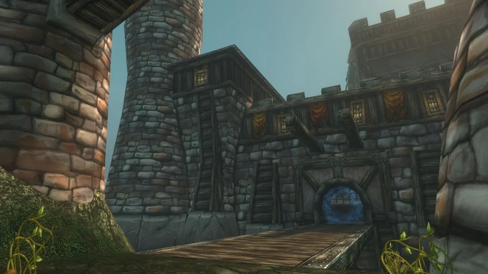

Shadowfang Keep era il castello del Baron Silverlaine a Silverpine Forest. L’Archmage Arugal vi evocò dei worgen per difendere Dalaran, e questi travolsero il castello. Arugal ora vive nella torre più alta, con i worgen come suo branco. Il dungeon è lo stesso di Classic; il suo bottino è in gran parte nuovo in WoW Forever.

## In breve

| | |
|---|---|
| Livelli | Boss dal 20 al 26; difficile al 18, al giusto livello al 23, facile al 28 |
| Ingresso | Silverpine Forest, a nord di Pyrewood Village, /way 44.5 68.0 |
| Boss | 9, di cui il Deathsworn Captain è un raro |
| Missioni | 3, tutte della Horde |
| Bottino | Quasi ogni oggetto dei boss è blu in Forever |
| Nome breve | SFK |

## Come arrivarci

Il castello sorge sulle montagne appena a nord di Pyrewood Village, a Silverpine Forest, a /way 44.5 68.0. Per la Horde, il Sepulcher con tutti e tre i datori di missione è a breve distanza.

Per l’Alliance, Silverpine Forest a questo livello è un viaggio lungo e pericoloso. I personaggi Skyborne sono avvantaggiati: raggiungono la zona abbastanza in fretta da Dalaran, scrive Warcraft Tavern.

## Il percorso

1. **Le celle.** <a class="wf-wh wf-plain" href="https://www.wowhead.com/forever/npc=3914">Rethilgore</a> sorveglia i prigionieri all’inizio. Uccidilo per aprire la porta del cortile; il prigioniero della tua fazione, <a class="wf-wh wf-plain" href="https://www.wowhead.com/forever/npc=3849">Deathstalker Adamant</a> per la Horde o <a class="wf-wh wf-plain" href="https://www.wowhead.com/forever/npc=3850">Sorcerer Ashcrombe</a> per l’Alliance, la apre.
2. **Il cortile e la cucina.** <a class="wf-wh wf-plain" href="https://www.wowhead.com/forever/npc=3886">Razorclaw the Butcher</a> è in cucina con qualche add.
3. **La sala da pranzo.** Il fantasma di <a class="wf-wh wf-plain" href="https://www.wowhead.com/forever/npc=3887">Baron Silverlaine</a> la infesta, circondato da una sala piena di add.
4. **La sala superiore.** <a class="wf-wh wf-plain" href="https://www.wowhead.com/forever/npc=4278">Commander Springvale</a> aspetta in una sala di Wailing Guardsmen. Attirali a piccoli gruppi. Il raro <a class="wf-wh wf-plain" href="https://www.wowhead.com/forever/npc=3872">Deathsworn Captain</a> non compare sempre.
5. **I bastioni.** <a class="wf-wh wf-plain" href="https://www.wowhead.com/forever/npc=4279">Odo the Blindwatcher</a> e i suoi Vile Bats, poi <a class="wf-wh wf-plain" href="https://www.wowhead.com/forever/npc=4274">Fenrus the Devourer</a> nella stanza di The Book of Ur.
6. **La torre.** <a class="wf-wh wf-plain" href="https://www.wowhead.com/forever/npc=3927">Wolf Master Nandos</a> sorveglia con i suoi lupi la porta di Arugal. <a class="wf-wh wf-plain" href="https://www.wowhead.com/forever/npc=4275">Archmage Arugal</a> aspetta in cima con tre worgen.

## Le missioni

| Missione | Dove inizia | Livello |
|---|---|---|
| <a href="https://www.wowhead.com/forever/quest=1013">The Book of Ur</a> Condivisibile | Undercity, The Apothecarium: Keeper Bel'dugur /way 53 54 | 26 |
| <a href="https://www.wowhead.com/forever/quest=1098">Deathstalkers in Shadowfang</a> Condivisibile | Silverpine Forest, Sepulcher: High Executor Hadrec /way 43 41 | 25 |
| <a href="https://www.wowhead.com/forever/quest=1014">Arugal Must Die</a> Condivisibile | Silverpine Forest, Sepulcher: Dalar Dawnweaver /way 44 39 | 27 |

Il livello è quello della missione nei dati della beta. Nessuna delle tre richiede una missione precedente, quindi un gruppo della Horde può prenderle tutte insieme e condividerle. Le ricompense sono cambiate in Forever, scrive Warcraft Tavern, ma non si sa ancora quali oggetti diano ora.

### Deathstalkers in Shadowfang

High Executor Hadrec ti manda a cercare Deathstalker Adamant e <a class="wf-wh wf-plain" href="https://www.wowhead.com/forever/npc=4444">Deathstalker Vincent</a>. Il corpo di Vincent si trova subito dopo Rethilgore, a destra delle scale che portano al cortile. La missione si completa e si consegna dentro il dungeon.

### The Book of Ur

Keeper Bel'dugur, a The Apothecarium, vuole The Book of Ur. Si trova su uno scaffale nella stanza di Fenrus the Devourer, verso la fine del dungeon. Nel mezzo di uno scontro lo si dimentica facilmente, quindi cercalo prima di proseguire.

### Arugal Must Die

Dalar Dawnweaver, al Sepulcher, vuole la Head of Arugal, dal boss finale.

Anche due missioni di classe portano qui: <a href="https://www.wowhead.com/forever/quest=1740">The Orb of Soran'ruk</a> per i Warlock di entrambe le fazioni, e <a href="https://www.wowhead.com/forever/quest=1654">The Test of Righteousness</a> per i Paladin dell’Alliance. Entrambe sono nella [guida ai dungeon](/it/guides/dungeons/).

## I boss e il loro bottino

Il bottino qui sotto è quello che questi boss lasciavano in Classic, con le statistiche dei file della beta. Blizzard non ha pubblicato le tabelle del bottino di Forever, quindi un boss può ancora lasciare altro.

### Rethilgore

Un worgen élite di livello 20 con due Bleak Worgs e uno Shadowfang Whitescalp. I worg lanciano Wavering Will, che rallenta incantesimi e attacchi, e il Soul Drain di Rethilgore fa male. Uccidi prima gli add.

| Oggetto | Nuovo in Forever |
|---|---|
| <a class="wf-wh wf-q3" href="https://www.wowhead.com/forever/item=5254">Rugged Spaulders</a> | Blu invece che bianco: armatura extra e 2 a ogni resistenza |

### Razorclaw the Butcher

Un élite di livello 22 in cucina, con add da segnare e uccidere per primi. Il suo Butcher Drain colpisce il tank per tutto lo scontro.

| Oggetto | Nuovo in Forever |
|---|---|
| <a class="wf-wh wf-q3" href="https://www.wowhead.com/forever/item=6226">Bloody Apron</a> | Blu, 7 di salute ogni 5 secondi e fino a 13 di cure |
| <a class="wf-wh wf-q3" href="https://www.wowhead.com/forever/item=1292">Butcher's Cleaver</a> | Danno minimo più basso, massimo più alto |
| <a class="wf-wh wf-q2" href="https://www.wowhead.com/forever/item=273096">Blueprint: Tanning Rack</a> | Nuovo: piazza un Tanning Rack in un accampamento, Leatherworking 140 |

### Baron Silverlaine

Un fantasma élite di livello 24. Ripulisci prima la sua sala. Il suo Veil of Shadow riduce del 75% le cure ricevute dal tank; si può interrompere e dissolvere.

| Oggetto | Nuovo in Forever |
|---|---|
| <a class="wf-wh wf-q3" href="https://www.wowhead.com/forever/item=6323">Baron's Scepter</a> | I membri del gruppo entro 30 metri rigenerano 4 di salute ogni 5 secondi |
| <a class="wf-wh wf-q3" href="https://www.wowhead.com/forever/item=6321">Silverlaine's Family Seal</a> | Il 2% più veloce a Tirisfal Glades, Silverpine Forest e Shadowfang Keep, ma meno Strength |

### Commander Springvale

Un élite di livello 24 in una sala piena di add. I Wailing Guardsmen lanciano Screams of the Past, quindi attirali a piccoli gruppi. Al 30% di vita, Springvale lancia Divine Shield e poi Holy Light; interrompi l’Holy Light.

| Oggetto | Nuovo in Forever |
|---|---|
| <a class="wf-wh wf-q3" href="https://www.wowhead.com/forever/item=3191">Arced War Axe</a> | Blu, 9 di Strength e 9 di Stamina |
| <a class="wf-wh wf-q3" href="https://www.wowhead.com/forever/item=6320">Commander's Crest</a> | 4 di salute ogni 5 secondi invece di Spirit, richiede il livello 21 invece del 23 |

### Odo the Blindwatcher

Un worgen élite di livello 24 con uno stormo di Vile Bats. Il suo Howling Rage gli dà più potere d’attacco man mano che la sua vita cala. Uccidi prima i pipistrelli e tieni i cooldown di danno per quando scende sotto la metà.

| Oggetto | Nuovo in Forever |
|---|---|
| <a class="wf-wh wf-q3" href="https://www.wowhead.com/forever/item=6318">Odo's Ley Staff</a> | Un bastone da guaritore: fino a 52 di cure |
| <a class="wf-wh wf-q3" href="https://www.wowhead.com/forever/item=6319">Girdle of the Blindwatcher</a> | Fino a 6 di danni e cure magiche, e un migliore rilevamento della furtività |

### Deathsworn Captain, un raro

Un raro élite di livello 25 che non compare sempre. Usa Cleave, quindi il tank lo gira lontano dal gruppo.

| Oggetto | Nuovo in Forever |
|---|---|
| <a class="wf-wh wf-q3" href="https://www.wowhead.com/forever/item=6641">Haunting Blade</a> | Niente Spirit, fino a 33 di cure |
| <a class="wf-wh wf-q3" href="https://www.wowhead.com/forever/item=6642">Phantom Armor</a> | Blu, quasi le stesse statistiche |

### Fenrus the Devourer

Un lupo élite di livello 25 senza add, che sorveglia la strada verso Arugal. Una semplice gara di danno, ma colpisce forte il tank.

| Oggetto | Nuovo in Forever |
|---|---|
| <a class="wf-wh wf-q3" href="https://www.wowhead.com/forever/item=3230">Black Wolf Bracers</a> | Blu, armatura extra e 4 di Attack Power |
| <a class="wf-wh wf-q3" href="https://www.wowhead.com/forever/item=6340">Fenrus' Hide</a> | Blu, 6 di Agility e 3 di Stamina |

### Wolf Master Nandos

Un worgen élite di livello 25 che sorveglia la porta di Arugal. All’80% di vita chiama il suo branco di quattro lupi; il tank deve riprenderli in fretta.

| Oggetto | Nuovo in Forever |
|---|---|
| <a class="wf-wh wf-q3" href="https://www.wowhead.com/forever/item=6314">Wolfmaster Cape</a> | Attack Power invece di Agility, di più contro le Beasts |
| <a class="wf-wh wf-q3" href="https://www.wowhead.com/forever/item=3748">Feline Mantle</a> | Fino a 3 di danni e cure magiche, e meno danni da caduta |

### Archmage Arugal

Il boss finale, un élite di livello 26. Uccidi prima i tre worgen della sua stanza. Arugal si teletrasporta per la stanza, controlla i giocatori e lancia Void Bolt, che non si può interrompere. Arugal's Curse non si può dissolvere; controlla un giocatore maledetto invece di attaccarlo. La Shadow Resistance aiuta.

| Oggetto | Nuovo in Forever |
|---|---|
| <a class="wf-wh wf-q3" href="https://www.wowhead.com/forever/item=6324">Robes of Arugal</a> | Fino a 18 di cure e 8 di Shadow Resistance, meno Intellect e Spirit |
| <a class="wf-wh wf-q3" href="https://www.wowhead.com/forever/item=6392">Belt of Arugal</a> | Fino a 9 di danni e cure magiche, meno Intellect |
| <a class="wf-wh wf-q3" href="https://www.wowhead.com/forever/item=6220">Meteor Shard</a> | La sua esplosione di fuoco passa da 35 a 42 danni |

## Cosa non si sa ancora

- **Le tabelle del bottino di Forever**: quale boss lascia ora quale oggetto, e con che frequenza.
- **Le ricompense delle missioni**, cambiate secondo Warcraft Tavern.
- **La strada per l’Alliance**: quanto sia davvero veloce per gli Skyborne da Dalaran.
