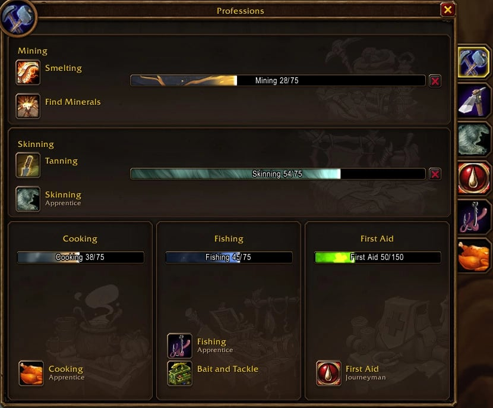
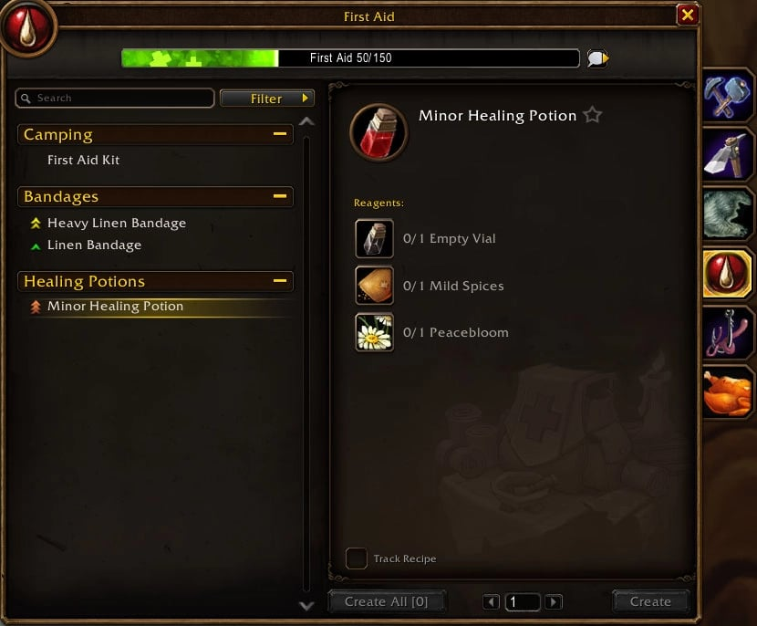

First Aid è una professione secondaria, quindi non occupa mai uno dei tuoi due posti principali. In WoW Forever fa molto più delle bende: ora crea le pozioni di cura, e rimedi contro veleno, malattia e sanguinamento.

## Cosa cambia in Forever

- **Le pozioni di cura** passano da Alchemy a First Aid. Funzionano in combattimento, quindi First Aid conviene anche ai guaritori.
- **Rimedi** contro malattia e sanguinamento si aggiungono agli antiveleni. I nuovi non si usano in combattimento, scrive Warcraft Tavern.
- **Oggetti da campo:** un First Aid Kit per la Stamina, e due postazioni con pozioni all’accampamento.
- **Le bende** di Classic ci sono ancora tutte.

## Gradi e dove impararli

| Grado | Abilità | Come |
|---|---|---|
| Apprentice | da 1 a 75 | Un istruttore di First Aid |
| Journeyman | da 75 a 150 | Un istruttore di First Aid |
| Expert | da 150 a 225 | Il libro <a class="wf-wh wf-q1" href="https://www.wowhead.com/forever/item=16084">Expert First Aid - Under Wraps</a> |
| Artisan | da 225 a 300 | La missione Triage, dal livello 35 |

**Il libro Expert** è venduto da <a class="wf-wh wf-plain" href="https://www.wowhead.com/forever/npc=2805">Deneb Walker</a> a Stromgarde Keep, Arathi Highlands (/way 27.0 58.8), per l’Alleanza, e da <a class="wf-wh wf-plain" href="https://www.wowhead.com/forever/npc=13476">Balai Lok'Wein</a> a Brackenwall Village, Dustwallow Marsh (/way 36.4 30.4), per l’Orda. Non è vincolato, quindi si trova anche alla casa d’aste.

**Artisan** arriva dalla missione Triage. L’Alleanza riceve <a href="https://www.wowhead.com/forever/quest=6624">Triage</a> da <a class="wf-wh wf-plain" href="https://www.wowhead.com/forever/npc=12939">Doctor Gustaf VanHowzen</a> a Theramore Isle (/way 67.6 48.8), l’Orda <a href="https://www.wowhead.com/forever/quest=6622">Triage</a> da <a class="wf-wh wf-plain" href="https://www.wowhead.com/forever/npc=12920">Doctor Gregory Victor</a> a Hammerfall (/way 73.4 36.8). Le missioni introduttive <a href="https://www.wowhead.com/forever/quest=6625">Alliance Trauma</a> e <a href="https://www.wowhead.com/forever/quest=6623">Horde Trauma</a> partono dagli istruttori di Ironforge e Orgrimmar, ma si possono saltare.

## Istruttori

| Fazione | Istruttore | Dove | /way |
|---|---|---|---|
| Alliance | <a class="wf-wh wf-plain" href="https://www.wowhead.com/forever/npc=4211">Dannelor</a> | Craftsmen's Terrace, Darnassus | 51.6 12.6 |
| Alliance | <a class="wf-wh wf-plain" href="https://www.wowhead.com/forever/npc=2327">Shaina Fuller</a> | Cathedral of Light, Stormwind City | 42.8 26.6 |
| Alliance | <a class="wf-wh wf-plain" href="https://www.wowhead.com/forever/npc=5150">Nissa Firestone</a> | Great Forge, Ironforge | 54.8 58.6 |
| Alliance | <a class="wf-wh wf-plain" href="https://www.wowhead.com/forever/npc=6094">Byancie</a> | Dolanaar, Teldrassil | 55.2 56.8 |
| Alliance | <a class="wf-wh wf-plain" href="https://www.wowhead.com/forever/npc=2329">Michelle Belle</a> | Goldshire, Elwynn Forest | 43.4 65.6 |
| Alliance | <a class="wf-wh wf-plain" href="https://www.wowhead.com/forever/npc=2326">Thamner Pol</a> | Kharanos, Dun Morogh | 47.2 52.6 |
| Alliance | <a class="wf-wh wf-plain" href="https://www.wowhead.com/forever/npc=3181">Fremal Doohickey</a> | Menethil Harbor, Wetlands | 10.8 61.2 |
| Alliance | <a class="wf-wh wf-plain" href="https://www.wowhead.com/forever/npc=251977">Angelique Butler</a> | Dalaran, Alterac Mountains | 17.2 61.0 |
| Horde | <a class="wf-wh wf-plain" href="https://www.wowhead.com/forever/npc=3373">Arnok</a> | Valley of Spirits, Orgrimmar | 34.0 84.4 |
| Horde | <a class="wf-wh wf-plain" href="https://www.wowhead.com/forever/npc=4591">Mary Edras</a> | Rogues' Quarter, Undercity | 73.6 55.6 |
| Horde | <a class="wf-wh wf-plain" href="https://www.wowhead.com/forever/npc=2798">Pand Stonebinder</a> | Spirit Rise, Thunder Bluff | 29.6 21.4 |
| Horde | <a class="wf-wh wf-plain" href="https://www.wowhead.com/forever/npc=5943">Rawrk</a> | Razor Hill, Durotar | 54.0 42.0 |
| Horde | <a class="wf-wh wf-plain" href="https://www.wowhead.com/forever/npc=5759">Nurse Neela</a> | Brill, Tirisfal Glades | 61.8 52.8 |
| Horde | <a class="wf-wh wf-plain" href="https://www.wowhead.com/forever/npc=5939">Vira Younghoof</a> | Bloodhoof Village, Mulgore | 46.8 60.8 |
| Entrambe | <a class="wf-wh wf-plain" href="https://www.wowhead.com/forever/npc=257018">Naleeia Tattermend</a> | Shen'dar Village, Zephras Isle | 43.0 46.2 |
| Entrambe | <a class="wf-wh wf-plain" href="https://www.wowhead.com/forever/npc=257007">Melasa Fairmend</a> | Valanaar, Zephras Isle | 63.0 72.6 |

## Pozioni di cura

| Pozione | Abilità | Ricetta da | Erba |
|---|---|---|---|
| <a class="wf-wh wf-q1" href="https://www.wowhead.com/forever/item=118">Minor Healing Potion</a> | 1 | Istruttore | <a class="wf-wh wf-q1" href="https://www.wowhead.com/forever/item=2447">Peacebloom</a> |
| <a class="wf-wh wf-q1" href="https://www.wowhead.com/forever/item=858">Lesser Healing Potion</a> | 55 | Istruttore | <a class="wf-wh wf-q1" href="https://www.wowhead.com/forever/item=2450">Briarthorn</a> |
| <a class="wf-wh wf-q1" href="https://www.wowhead.com/forever/item=929">Healing Potion</a> | 110 | Istruttore | <a class="wf-wh wf-q1" href="https://www.wowhead.com/forever/item=2453">Bruiseweed</a> |
| <a class="wf-wh wf-q1" href="https://www.wowhead.com/forever/item=1710">Greater Healing Potion</a> | 155 | <a class="wf-wh wf-q2" href="https://www.wowhead.com/forever/item=255723">Manual: Greater Healing Potion</a> | |
| <a class="wf-wh wf-q1" href="https://www.wowhead.com/forever/item=3928">Superior Healing Potion</a> | 215 | <a class="wf-wh wf-q2" href="https://www.wowhead.com/forever/item=255725">Manual: Superior Healing Potion</a> | |
| <a class="wf-wh wf-q1" href="https://www.wowhead.com/forever/item=13446">Major Healing Potion</a> | 275 | <a class="wf-wh wf-q2" href="https://www.wowhead.com/forever/item=255729">Manual: Major Healing Potion</a> | |

Oltre all’erba, una pozione richiede una fiala e spezie da un venditore di professioni. Le erbe delle pozioni superiori non sono ancora nelle guide.

## Rimedi

| Contro | Rimedio | Abilità | Ricetta da |
|---|---|---|---|
| Veleno | <a class="wf-wh wf-q1" href="https://www.wowhead.com/forever/item=6452">Anti-Venom</a> | 80 | Istruttore |
| Veleno | <a class="wf-wh wf-q1" href="https://www.wowhead.com/forever/item=6453">Strong Anti-Venom</a> | 130 | Istruttore |
| Veleno | <a class="wf-wh wf-spell" href="https://www.wowhead.com/forever/spell=1259341">Potent Anti-Venom</a> | 215 | <a class="wf-wh wf-q2" href="https://www.wowhead.com/forever/item=255728">Manual: Potent Anti-Venom</a> |
| Malattia | <a class="wf-wh wf-q1" href="https://www.wowhead.com/forever/item=255716">Simple Poultice</a> | 90 | Istruttore |
| Malattia | <a class="wf-wh wf-spell" href="https://www.wowhead.com/forever/spell=1259343">Clever Poultice</a> | 140 | <a class="wf-wh wf-q2" href="https://www.wowhead.com/forever/item=255724">Manual: Clever Poultice</a> |
| Malattia | <a class="wf-wh wf-spell" href="https://www.wowhead.com/forever/spell=1259344">Superior Poultice</a> | 210 | <a class="wf-wh wf-q2" href="https://www.wowhead.com/forever/item=255727">Manual: Superior Poultice</a> |
| Malattia | <a class="wf-wh wf-spell" href="https://www.wowhead.com/forever/spell=1259345">Powerful Poultice</a> | 280 | <a class="wf-wh wf-q2" href="https://www.wowhead.com/forever/item=255731">Manual: Powerful Poultice</a> |
| Sanguinamento | <a class="wf-wh wf-q1" href="https://www.wowhead.com/forever/item=255720">Woolen Tourniquet</a> | 120 | Istruttore |
| Sanguinamento | <a class="wf-wh wf-spell" href="https://www.wowhead.com/forever/spell=1259348">Leather Tourniquet</a> | 200 | <a class="wf-wh wf-q2" href="https://www.wowhead.com/forever/item=255726">Manual: Leather Tourniquet</a> |
| Sanguinamento | <a class="wf-wh wf-spell" href="https://www.wowhead.com/forever/spell=1259349">Surgical Tourniquet</a> | 265 | <a class="wf-wh wf-q2" href="https://www.wowhead.com/forever/item=255730">Manual: Surgical Tourniquet</a> |

I due antiveleni sono le ricette di Classic, con l’abilità che avevano lì. Dove cadano i manuali, le guide non lo dicono ancora.

## Oggetti da campo

| Oggetto | Abilità | Ricetta da | Cosa fa |
|---|---|---|---|
| <a class="wf-wh wf-spell" href="https://www.wowhead.com/forever/spell=1230117">First Aid Kit</a> | 20 | Istruttore | Fino a 56 Stamina all’accampamento |
| <a class="wf-wh wf-spell" href="https://www.wowhead.com/forever/spell=1262996">Toxin Study</a> | 140 | <a class="wf-wh wf-q2" href="https://www.wowhead.com/forever/item=273105">Blueprint: Toxin Study</a> | Pozioni di cura e antiveleno |
| <a class="wf-wh wf-spell" href="https://www.wowhead.com/forever/spell=1263001">Plague Doctor's Laboratory</a> | 300 | <a class="wf-wh wf-q2" href="https://www.wowhead.com/forever/item=273118">Blueprint: Plague Doctor's Laboratory</a> | Pozioni di cura e impiastri |

Come funziona un accampamento è nella [guida al camping](/it/guides/camping/).

## Salire di livello

Gran parte dell’abilità viene dalle bende, fatte con la stoffa che lasciano gli umanoidi. Wowhead ha pubblicato per ora solo la parte centrale del suo percorso.

| Stoffa | Cade da mostri di livello |
|---|---|
| <a class="wf-wh wf-q1" href="https://www.wowhead.com/forever/item=2589">Linen Cloth</a> | da 1 a 19 |
| <a class="wf-wh wf-q1" href="https://www.wowhead.com/forever/item=2592">Wool Cloth</a> | da 15 a 30 |
| <a class="wf-wh wf-q1" href="https://www.wowhead.com/forever/item=4306">Silk Cloth</a> | da 26 a 40 |
| <a class="wf-wh wf-q1" href="https://www.wowhead.com/forever/item=4338">Mageweave Cloth</a> | da 41 a 50 |
| <a class="wf-wh wf-q1" href="https://www.wowhead.com/forever/item=14047">Runecloth</a> | da 51 a 60 |
| <a class="wf-wh wf-q1" href="https://www.wowhead.com/forever/item=14256">Felcloth</a> | da 50 a 60, demoni |

| Abilità | Crea | Stoffa |
|---|---|---|
| da 150 a 180 | 50 <a class="wf-wh wf-q1" href="https://www.wowhead.com/forever/item=6450">Silk Bandage</a> | 50 <a class="wf-wh wf-q1" href="https://www.wowhead.com/forever/item=4306">Silk Cloth</a> |
| da 180 a 210 | 50 <a class="wf-wh wf-q1" href="https://www.wowhead.com/forever/item=6451">Heavy Silk Bandage</a> | 100 <a class="wf-wh wf-q1" href="https://www.wowhead.com/forever/item=4306">Silk Cloth</a> |
| da 210 a 225 | 25 <a class="wf-wh wf-q1" href="https://www.wowhead.com/forever/item=8544">Mageweave Bandage</a> | 25 <a class="wf-wh wf-q1" href="https://www.wowhead.com/forever/item=4338">Mageweave Cloth</a> |

Fino a 150 il percorso di bende di Classic funziona ancora, vedi la [guida per Classic Era](/it/tradeskills/classic/first-aid/). Se le pozioni facciano salire più in fretta, non si sa ancora.

## Talenti Legacy

| Perk | Effetto |
|---|---|
| <a class="wf-wh wf-spell" href="https://www.wowhead.com/forever/spell=1225451">Working Overtime</a> | Più probabilità di un punto in qualunque professione |
| <a class="wf-wh wf-spell" href="https://www.wowhead.com/forever/spell=1225469">Dedicated Study</a> | Un punto gratis al giorno nella professione più bassa |
| <a class="wf-wh wf-spell" href="https://www.wowhead.com/forever/spell=1225475">Field Medicine</a> | Recently Bandaged più breve, solo nel mondo aperto |

I perk sono nel [calcolatore Legacy](/it/talents/legacy/).
