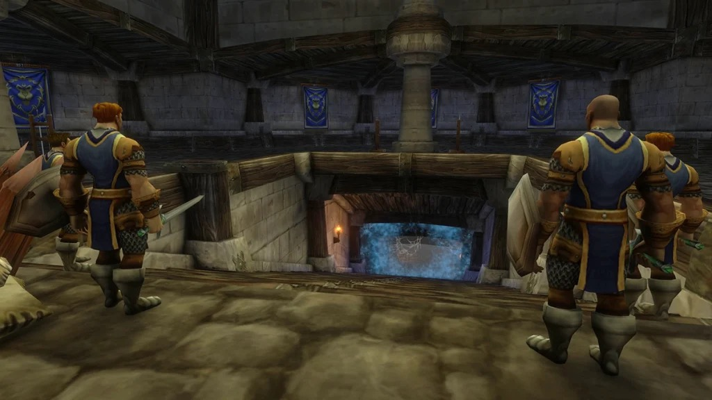

The Stockade is de gevangenis van Stormwind, diep onder de kanalen van de stad. De gevangenen zijn uit hun cellen gebroken en niemand bewaakt ze nog. Een groep van de Alliance gaat naar binnen om het oproer neer te slaan. De dungeon is dezelfde als in Classic, op de loot na.

## In het kort

| | |
|---|---|
| Levels | Bazen van 24 tot 29; moeilijk op 22, op level op 26, makkelijk op 30 |
| Ingang | The Canals van Stormwind City, bij The Mage Quarter, /way 42 58 |
| Bazen | 6, waarvan Bruegal Ironknuckle een rare is |
| Quests | 6, allemaal Alliance |
| Indeling | Een T: één gang en twee vleugels |
| Korte naam | Stocks |

## De weg erheen

De ingang ligt in The Canals van Stormwind City, bij The Mage Quarter, op /way 42 58. Warden Thelwater staat er vlak buiten en geeft twee van de quests. Voor de Horde is een gevangenis midden in Stormwind op dit level zo goed als onbereikbaar.

## De indeling

Het cellenblok is een T. Een gang loopt rechtdoor, en aan het eind ervan takken twee vleugels af naar links en naar rechts. De vleugels kun je in elke volgorde opruimen.

1. **De gang.** <a class="wf-wh wf-plain" href="https://www.wowhead.com/forever/npc=1696">Targorr the Dread</a> is meestal de eerste baas die je tegenkomt. Elite Defias in de buurt doen vaak mee.
2. **De vleugels.** <a class="wf-wh wf-plain" href="https://www.wowhead.com/forever/npc=1666">Kam Deepfury</a>, <a class="wf-wh wf-plain" href="https://www.wowhead.com/forever/npc=1717">Hamhock</a>, <a class="wf-wh wf-plain" href="https://www.wowhead.com/forever/npc=1663">Dextren Ward</a> en <a class="wf-wh wf-plain" href="https://www.wowhead.com/forever/npc=1716">Bazil Thredd</a> zitten verspreid over de twee vleugels, elk met Defias rondom. De rare <a class="wf-wh wf-plain" href="https://www.wowhead.com/forever/npc=1720">Bruegal Ironknuckle</a> verschijnt niet altijd.

## De quests

| Quest | Waar hij begint | Level |
|---|---|---|
| <a href="https://www.wowhead.com/forever/quest=387">Quell the Uprising</a> Deelbaar | Stormwind, buiten The Stockade: Warden Thelwater /way 41 58 | 26 |
| <a href="https://www.wowhead.com/forever/quest=388">The Color of Blood</a> Deelbaar | Stormwind, Old Town: Nikova Raskol, die rondloopt | 26 |
| <a href="https://www.wowhead.com/forever/quest=377">Crime and Punishment</a> Deelbaar | Duskwood, Darkshire: Councilman Millstipe /way 42 47 | 26 |
| <a href="https://www.wowhead.com/forever/quest=386">What Comes Around...</a> Deelbaar | Redridge Mountains, Lakeshire: Guard Berton /way 26 46 | 25 |
| <a href="https://www.wowhead.com/forever/quest=378">The Fury Runs Deep</a> | Wetlands, Dun Modr: Motley Garmason /way 49 18 <em>Doe eerst <a href="https://www.wowhead.com/forever/quest=303">The Dark Iron War</a>.</em> | 27 |
| <a href="https://www.wowhead.com/forever/quest=391">The Stockade Riots</a> | Stormwind, buiten The Stockade: Warden Thelwater /way 41 58 <em>Doe eerst de reeks die begint met The Unsent Letter in The Deadmines.</em> | 29 |

Het level is het level van de quest in de data van de beta. De beloningen zijn veranderd in Forever, schrijft Warcraft Tavern, maar welke items ze nu geven, is nog niet bekend.

- **Quell the Uprising.** Dood 10 Defias Prisoners, 8 Defias Convicts en 8 Defias Insurgents.
- **The Color of Blood.** Nikova Raskol wil 10 Red Wool Bandanas. Ze vallen bij de Defias Captives, Convicts, Inmates, Insurgents en Prisoners, en bij Bazil Thredd, Bruegal Ironknuckle en Dextren Ward.
- **Crime and Punishment.** Breng de Hand of Dextren Ward naar Councilman Millstipe in Darkshire.
- **What Comes Around...** Breng de Head of Targorr naar Guard Berton in Lakeshire.
- **The Fury Runs Deep.** Breng de Head of Deepfury naar Motley Garmason in Dun Modr. Daarvoor komt The Dark Iron War voor dezelfde NPC: 25 silver, 2.450 experience en 100 reputatie bij Ironforge, schrijft Warcraft Tavern.
- **The Stockade Riots.** Breng de Head of Bazil Thredd naar Warden Thelwater. De weg erheen begint met An Unsent Letter van Edwin VanCleef in [The Deadmines](/nl/guides/dungeons/the-deadmines/). Baros Alexston in Stormwind stuurt je door naar de Warden met <a href="https://www.wowhead.com/forever/quest=389">Bazil Thredd</a>. Na deze quest gaat de reeks verder in Stormwind, met meer reputatie bij Stormwind.

## De bazen en hun loot

### Targorr the Dread

Een elite Blackrock-orc van level 24. Een eenvoudig gevecht op de tank. Dood eerst de Defias die meedoen.

### Kam Deepfury

Een elite Dark Iron-dwerg van level 27. Hij slaat hard en stunt zijn doelwit met Shield Slam. Een vroege stun maakt het de tank moeilijk om threat vast te houden, en de healer moet de piek opvangen.

### Hamhock

Een elite ogre-magiër van level 28 met twee Defias. Dood eerst de Defias. Zijn Chain Lightning is te onderbreken, en zijn Bloodlust kan een Shaman of een Priest wegnemen met purge.

### Dextren Ward

Een elite mens van level 26. Hij slaat hard en werpt Intimidating Shout, waardoor de groep wegrent. De healer moet binnen bereik van de tank staan als het voorbij is.

### Bazil Thredd

Een elite van level 29 en de sterkste van de gevangenen, met adds om zich heen. Ruim de zaal op voor je hem pullt. Hij slaat de tank hard.

### Bruegal Ironknuckle, een rare

Een rare elite van level 26 die niet altijd verschijnt. Hij is de enige baas met echte loot, drie blauwe items die in de bestanden van de beta alle drie beter werden:

| Item | Nieuw in Forever |
|---|---|
| <a class="wf-wh wf-q3" href="https://www.wowhead.com/forever/item=2942">Iron Knuckles</a> | De onderbrekende klap gaat van 4 naar 25 schade |
| <a class="wf-wh wf-q3" href="https://www.wowhead.com/forever/item=2941">Prison Shank</a> | Iets meer schade en Agility |
| <a class="wf-wh wf-q3" href="https://www.wowhead.com/forever/item=3228">Jimmied Handcuffs</a> | 1 Stamina meer |

Alle drie vragen nu level 23 in plaats van 21.

<a class="wf-wh wf-q3" href="https://www.wowhead.com/forever/item=2280">Kam's Walking Stick</a> was in Classic een item dat bindt bij het aandoen. In de bestanden van de beta bindt hij bij het oppakken, met 10 Agility, tot 32 spell damage en healing, en 10% kortere vertragende effecten. Waar hij in Forever valt, is niet bekend.

## Wat nog niet bekend is

- **De droptabellen van Forever**: of de bazen zonder loot er nu wel krijgen.
- **Kam's Walking Stick**: welk monster hem nu laat vallen.
- **De beloningen van de quests**, die volgens Warcraft Tavern veranderd zijn.
