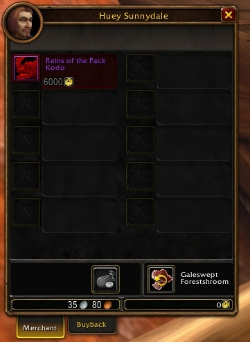

L’Azeroth Commerce Authority è la fazione di rifornimento dell’Alleanza in WoW Forever. Raccogli casse nel mondo, le riempi e le consegni al suo accampamento in cambio di Merchant's Favor. Quella valuta compra ricette, una cavalcatura, una mascotte, un giocattolo e titoli di professione. L’equivalente dell’Orda è [Durotar Supply and Logistics](/it/reputations/durotar-supply-and-logistics/).

## L’accampamento di Three Corners

L’accampamento si trova a Three Corners, nelle Redridge Mountains, appena fuori dal paese dove si incontrano Elwynn Forest, Duskwood e Redridge (/way 10.5 72.7). Le casse vanno a <a class="wf-wh wf-plain" href="https://www.wowhead.com/forever/npc=256390">Marcy Baker</a>.

| PNG | Cosa | /way |
|---|---|---|
| <a class="wf-wh wf-plain" href="https://www.wowhead.com/forever/npc=256390">Marcy Baker</a> | Prende le casse | 9.6 71.0 |
| <a class="wf-wh wf-plain" href="https://www.wowhead.com/forever/npc=256389">Tamelyn Aldridge</a> | Supply Officer: giocattolo, mascotte e tabarda | 10.6 71.4 |
| <a class="wf-wh wf-plain" href="https://www.wowhead.com/forever/npc=256736">Huey Sunnydale</a> | Il Pack Kodo | 8.5 72.0 |
| <a class="wf-wh wf-plain" href="https://www.wowhead.com/forever/npc=256732">Alynsia</a> | Enchanting | 11.2 71.6 |
| <a class="wf-wh wf-plain" href="https://www.wowhead.com/forever/npc=256729">Nina Surefire</a> | Alchemy | 11.0 72.3 |
| <a class="wf-wh wf-plain" href="https://www.wowhead.com/forever/npc=256731">Kalsey Sanden</a> | Cooking | 10.8 72.7 |
| <a class="wf-wh wf-plain" href="https://www.wowhead.com/forever/npc=256733">Fritz Fizzle</a> | Engineering | 10.5 74.3 |
| <a class="wf-wh wf-plain" href="https://www.wowhead.com/forever/npc=256730">Stondry Darkhammer</a> | Blacksmithing | 10.4 74.7 |
| <a class="wf-wh wf-plain" href="https://www.wowhead.com/forever/npc=256735">Mivin Shadowweave</a> | Tailoring | 10.0 73.0 |
| <a class="wf-wh wf-plain" href="https://www.wowhead.com/forever/npc=256734">Daniel Stitchsong</a> | Leatherworking | 10.0 72.9 |
| <a class="wf-wh wf-plain" href="https://www.wowhead.com/forever/npc=258878">Auctioneer Quickcoin</a> | Una casa d’aste, collegata alle capitali dell’Alleanza | 9.7 72.0 |

Il nome ricorda Season of Discovery, dove l’Azeroth Commerce Exchange funzionava in modo simile. In Forever la fazione è più grande e legata alle professioni.

## Cosa compra il Merchant's Favor

| Ricompensa | Prezzo | Requisito |
|---|---|---|
| <a class="wf-wh wf-q4" href="https://www.wowhead.com/forever/item=262766">Reins of the Pack Kodo</a> | 6000 | Livello 60 e Journeyman Riding, per tutto l’account |
| <a class="wf-wh wf-q2" href="https://www.wowhead.com/forever/item=284664">Packmule Treat</a> | 1500 | Insegna la mascotte [Minimule](/it/guides/pets/minimule/) |
| <a class="wf-wh wf-q3" href="https://www.wowhead.com/forever/item=270888">Advertising License Application</a> | 1200 | Honored; avvia la missione del giocattolo Dwarven Tradeskill Sign |
| <a class="wf-wh wf-q1" href="https://www.wowhead.com/forever/item=262765">Azeroth Commerce Authority Tabard</a> | | Exalted |
| <a class="wf-wh wf-q1" href="https://www.wowhead.com/forever/item=280449">Skyborne Tabard</a> | | Exalted, secondo l’oggetto stesso |

## Ricette per professione

Ogni venditore di professione vende ricette per Merchant's Favor. Le liste complete sono nella [guida di Wowhead](https://www.wowhead.com/forever/guide/azeroth-commerce-authority-reputation-professions).

| Professione | Venditore | Ricette | Abilità | Merchant's Favor |
|---|---|---|---|---|
| Enchanting | <a class="wf-wh wf-plain" href="https://www.wowhead.com/forever/npc=256732">Alynsia</a> | 39 | da 130 a 300 | da 45 a 240 |
| Alchemy | <a class="wf-wh wf-plain" href="https://www.wowhead.com/forever/npc=256729">Nina Surefire</a> | 29 | da 65 a 300 | da 45 a 240 |
| Cooking | <a class="wf-wh wf-plain" href="https://www.wowhead.com/forever/npc=256731">Kalsey Sanden</a> | 6 frullati | da 25 a 250 | da 30 a 90 |
| Engineering | <a class="wf-wh wf-plain" href="https://www.wowhead.com/forever/npc=256733">Fritz Fizzle</a> | 28 | da 25 a 300 | da 45 a 360 |
| Blacksmithing | <a class="wf-wh wf-plain" href="https://www.wowhead.com/forever/npc=256730">Stondry Darkhammer</a> | 60 | da 45 a 300 | da 30 a 120 |
| Tailoring | <a class="wf-wh wf-plain" href="https://www.wowhead.com/forever/npc=256735">Mivin Shadowweave</a> | 67 | da 60 a 235 | da 30 a 90 |
| Leatherworking | <a class="wf-wh wf-plain" href="https://www.wowhead.com/forever/npc=256734">Daniel Stitchsong</a> | 81 | da 60 a 235 | da 30 a 90 |

Qualche esempio: <a class="wf-wh wf-q2" href="https://www.wowhead.com/forever/item=249479">Formula: Enchant Weapon - Insight</a> e <a class="wf-wh wf-q3" href="https://www.wowhead.com/forever/item=274401">Formula: Enchant Bracer - Greater Spellpower</a> per Enchanting, <a class="wf-wh wf-q1" href="https://www.wowhead.com/forever/item=250374">Recipe: Elixir of Sages</a> e <a class="wf-wh wf-q1" href="https://www.wowhead.com/forever/item=250384">Recipe: Elixir of the Whale</a> per Alchemy, <a class="wf-wh wf-q1" href="https://www.wowhead.com/forever/item=264235">Schematic: Ultralight Goblin Glider</a> e <a class="wf-wh wf-q1" href="https://www.wowhead.com/forever/item=264222">Schematic: Loot-A-Rang</a> per Engineering.

## Titoli con la professione a 300

Con 300 di abilità, un venditore offre una certificazione. Sblocca il titolo per ogni personaggio dell’account; un personaggio lo mostra solo con 300 in quella professione.

| Certificazione | Titolo | Merchant's Favor |
|---|---|---|
| <a class="wf-wh wf-q2" href="https://www.wowhead.com/forever/item=271621">Alchemy Certification</a> | the Alchemist | 1000 |
| <a class="wf-wh wf-q2" href="https://www.wowhead.com/forever/item=271622">Blacksmithing Certification</a> | the Blacksmith | 1000 |
| <a class="wf-wh wf-q2" href="https://www.wowhead.com/forever/item=271624">Enchanting Certification</a> | the Enchanter | 240 |
| <a class="wf-wh wf-q2" href="https://www.wowhead.com/forever/item=271625">Engineering Certification</a> | the Engineer | 1000 |
| <a class="wf-wh wf-q2" href="https://www.wowhead.com/forever/item=271626">Leatherworking Certification</a> | the Leatherworker | 1000 |
| <a class="wf-wh wf-q2" href="https://www.wowhead.com/forever/item=271627">Tailoring Certification</a> | the Tailor | 1000 |

L’Enchanting Certification costa 240 nella lista di Wowhead, un quarto delle altre. Se sia corretto, non si sa.

## I livelli

La scala è quella solita, quindi da Neutral a Exalted servono 42.000 di reputazione.

| Livello | Reputazione nel livello | Necessaria dal fondo di Neutral |
|---|---|---|
| Neutral | 3.000 | 0 |
| Friendly | 6.000 | 3.000 |
| Honored | 12.000 | 9.000 |
| Revered | 21.000 | 30.000 |
| Exalted | | 42.000 |

Sotto Neutral la scala segue anch'essa l'abitudine: Hated è largo 36.000, Hostile e Unfriendly 3.000 ciascuno.

## Da dove viene la reputazione

**Le casse.** Una cassa come la <a class="wf-wh wf-q2" href="https://www.wowhead.com/forever/item=248549">Waylaid Crate</a> si raccoglie nel mondo, si riempie e si consegna a Marcy Baker. Il perk Legacy Performance Bonus dà il 5, 10 o 15% di probabilità di Merchant's Favor doppio per cassa; vedi il [calcolatore Legacy](/it/talents/legacy/).

**I Craftsman's Writs** esistono anche, forse dal livello 10, scrive Wowhead. Cosa chiedano e se Marcy Baker li accetti, non si sa ancora.

## Cosa non si sa ancora

- **Quanta reputazione dà una cassa**, e se c’è un limite giornaliero o settimanale.
- **Da dove parte un nuovo personaggio.** Neutral è qui un’ipotesi, non un valore confermato.
- **Quale cassa va con quale professione**, e quante se ne possono portare.
